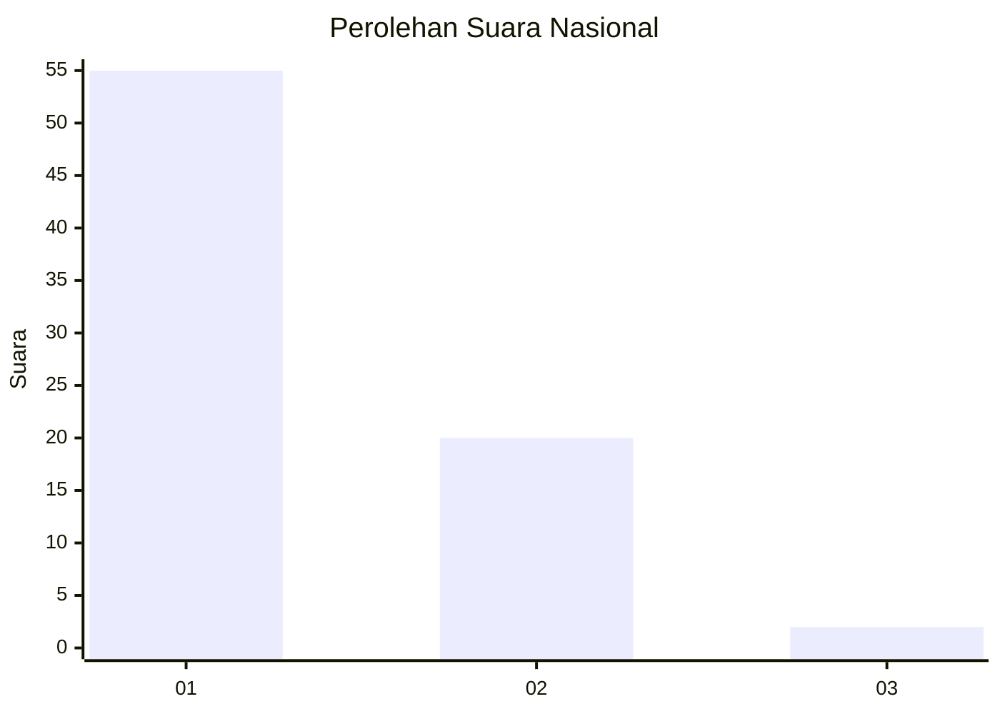
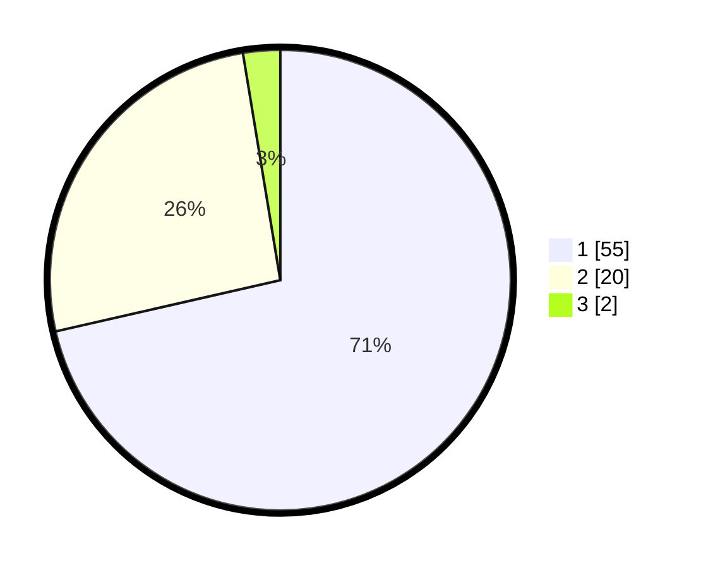

# Hasil

## Grafik

## Tabel

| No. | Nama Paslon    | Suara | Suara (raw) | Persentase |
|:--- |:-------------- | -----:| -----------:| ----------:|
| 1   | ANIES MUHAIMIN | 55    | [55][p-1]   | 71,43      |
| 2   | PRABOWO GIBRAN | 20    | [20][p-2]   | 25,97      |
| 3   | GANJAR MAHFUD  | 2     | [2][p-3]    | 2,60       |

[p-1]: https://github.com/gigit-pemilu/pemilu-2024/blob/main/pilpres/hitung-suara/sub/13-sumatera-barat/sub/05-padang-pariaman/sub/08-sungai-limau/sub/2001-kuranji-hilir/sub/020-tps/sub/paslon-1.txt
[p-2]: https://github.com/gigit-pemilu/pemilu-2024/blob/main/pilpres/hitung-suara/sub/13-sumatera-barat/sub/05-padang-pariaman/sub/08-sungai-limau/sub/2001-kuranji-hilir/sub/020-tps/sub/paslon-2.txt
[p-3]: https://github.com/gigit-pemilu/pemilu-2024/blob/main/pilpres/hitung-suara/sub/13-sumatera-barat/sub/05-padang-pariaman/sub/08-sungai-limau/sub/2001-kuranji-hilir/sub/020-tps/sub/paslon-3.txt

## Foto C Plano

https://sirekap-obj-formc.kpu.go.id/e397/pemilu/ppwp/13/05/08/20/01/1305082001020-20240226-234920--337c1ca3-eb75-4e39-b51a-2eecaf1083d5.jpg

https://sirekap-obj-formc.kpu.go.id/e397/pemilu/ppwp/13/05/08/20/01/1305082001020-20240226-235008--ac7f8e9c-cd1d-49d4-b347-9e1a1ddcb636.jpg

https://sirekap-obj-formc.kpu.go.id/e397/pemilu/ppwp/13/05/08/20/01/1305082001020-20240226-234848--6b77b98b-2fe1-4e03-a510-dc7e493ad27a.jpg

## Metadata

| Key        | Value               |
| ---------- | ------------------- |
| Time Stamp | 2024-02-27 00:00:00 |

## DATA PEMILIH TETAP

Jumlah pemilih dalam DPT: **655**.
 * L: **839**.
 * P: **886**.

## DATA PENGGUNA HAK PILIH

Jumlah pengguna hak pilih dalam DPT: **97**.
 * L: **838**.
 * P: **859**.

Jumlah pengguna hak pilih dalam DPTb: **882**.
 * L: **880**.
 * P: **886**.

Jumlah pengguna hak pilih dalam DPK: **882**.
 * L: **82**.
 * P: **888**.

Jumlah pengguna hak pilih: **100**.
 * L: **840**.
 * P: **850**.

## JUMLAH SUARA SAH DAN TIDAK SAH

JUMLAH SELURUH SUARA SAH: **98**.

JUMLAH SUARA TIDAK SAH: **2**.

JUMLAH SELURUH SUARA SAH DAN SUARA TIDAK SAH: **600**.

