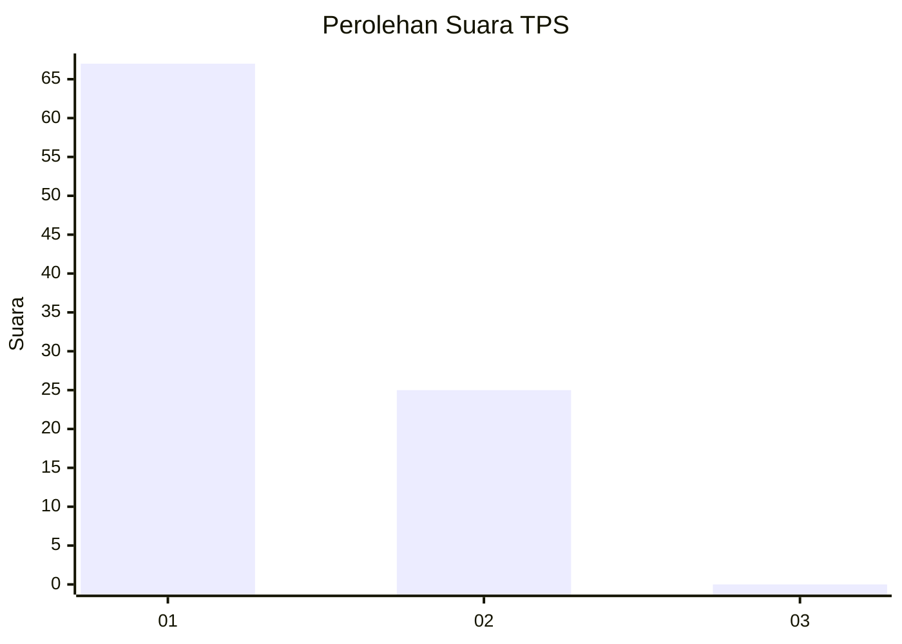
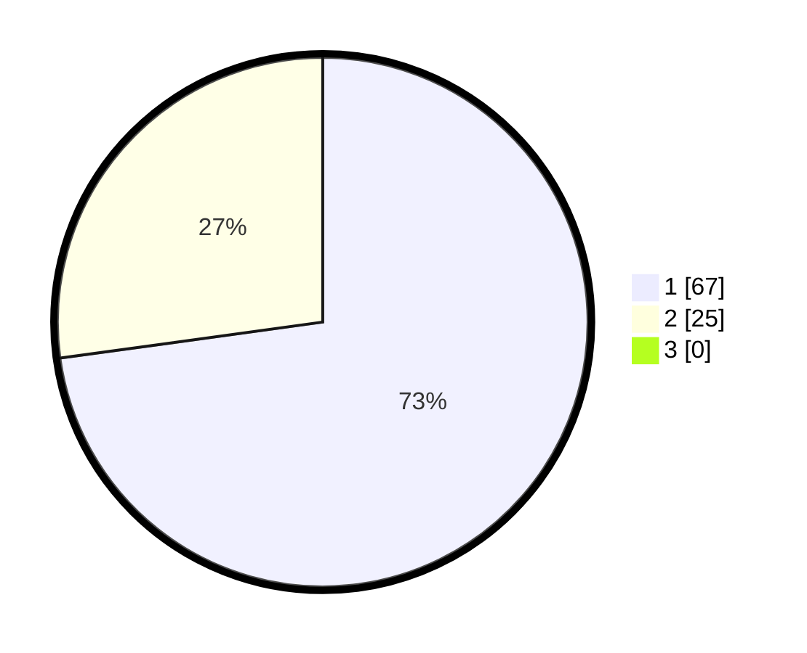

# Hasil

## Grafik

## Tabel

| No. | Nama Paslon    | Suara | Suara (raw) | Persentase |
|:--- |:-------------- | -----:| -----------:| ----------:|
| 1   | ANIES MUHAIMIN | 67    | [67][p-1]   | 72,83      |
| 2   | PRABOWO GIBRAN | 25    | [25][p-2]   | 27,17      |
| 3   | GANJAR MAHFUD  | 0     | [0][p-3]    | 0,00       |

[p-1]: https://github.com/gigit-pemilu/pemilu-2024-13-sumatera-barat/blob/main/pilpres/hitung-suara/sub/13-sumatera-barat/sub/05-padang-pariaman/sub/08-sungai-limau/sub/2001-kuranji-hilir/sub/022-tps/sub/paslon-1.txt
[p-2]: https://github.com/gigit-pemilu/pemilu-2024-13-sumatera-barat/blob/main/pilpres/hitung-suara/sub/13-sumatera-barat/sub/05-padang-pariaman/sub/08-sungai-limau/sub/2001-kuranji-hilir/sub/022-tps/sub/paslon-2.txt
[p-3]: https://github.com/gigit-pemilu/pemilu-2024-13-sumatera-barat/blob/main/pilpres/hitung-suara/sub/13-sumatera-barat/sub/05-padang-pariaman/sub/08-sungai-limau/sub/2001-kuranji-hilir/sub/022-tps/sub/paslon-3.txt

## Foto C Plano

https://sirekap-obj-formc.kpu.go.id/7b7a/pemilu/ppwp/13/05/08/20/01/1305082001022-20240227-004927--e4bdb6a2-9b14-4bbe-acca-6c7f528b978a.jpg

https://sirekap-obj-formc.kpu.go.id/7b7a/pemilu/ppwp/13/05/08/20/01/1305082001022-20240227-005030--a151bb8c-579b-436d-8410-ba73480c5687.jpg

https://sirekap-obj-formc.kpu.go.id/7b7a/pemilu/ppwp/13/05/08/20/01/1305082001022-20240227-005224--1a0fa744-4f4d-42fe-8a40-acd110a818e9.jpg

## Metadata

| Key        | Value               |
| ---------- | ------------------- |
| Time Stamp | 2024-02-27 22:00:00 |

## DATA PEMILIH TETAP

Jumlah pemilih dalam DPT: **131**.
 * L: **855**.
 * P: **26**.

## DATA PENGGUNA HAK PILIH

Jumlah pengguna hak pilih dalam DPT: **83**.
 * L: **30**.
 * P: **853**.

Jumlah pengguna hak pilih dalam DPTb: **85**.
 * L: **83**.
 * P: **882**.

Jumlah pengguna hak pilih dalam DPK: **85**.
 * L: **882**.
 * P: **883**.

Jumlah pengguna hak pilih: **833**.
 * L: **835**.
 * P: **858**.

## JUMLAH SUARA SAH DAN TIDAK SAH

JUMLAH SELURUH SUARA SAH: **92**.

JUMLAH SUARA TIDAK SAH: **1**.

JUMLAH SELURUH SUARA SAH DAN SUARA TIDAK SAH: **93**.

