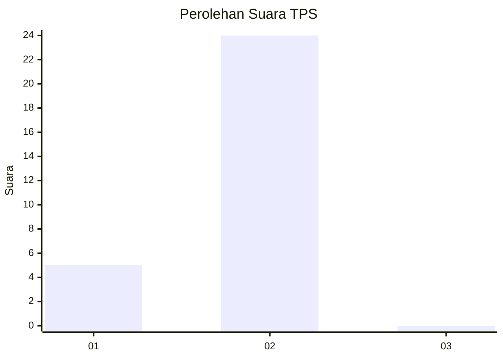
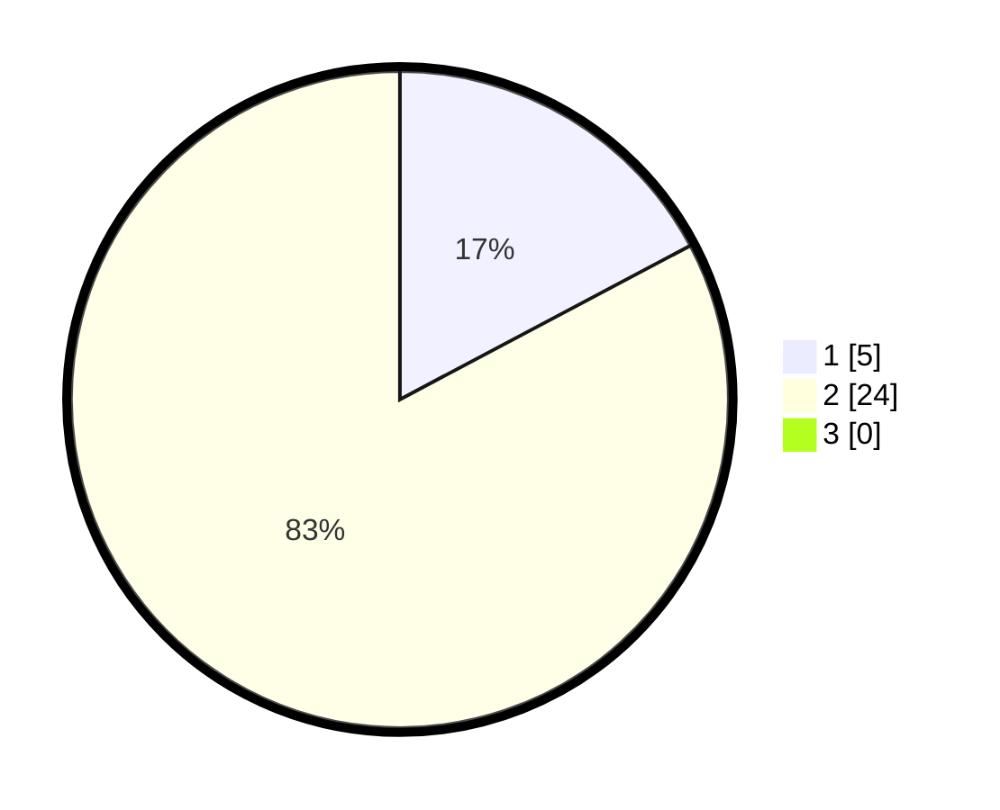

# Hasil

## Grafik

## Tabel

| No. | Nama Paslon    | Suara | Suara (raw) | Persentase |
|:--- |:-------------- | -----:| -----------:| ----------:|
| 1   | ANIES MUHAIMIN | 5     | [5][p-1]    | 17,24      |
| 2   | PRABOWO GIBRAN | 24    | [24][p-2]   | 82,76      |
| 3   | GANJAR MAHFUD  | 0     | [0][p-3]    | 0,00       |

[p-1]: https://github.com/gigit-pemilu/pemilu-2024-13-sumatera-barat/blob/main/pilpres/hitung-suara/sub/13-sumatera-barat/sub/05-padang-pariaman/sub/08-sungai-limau/sub/2001-kuranji-hilir/sub/023-tps/sub/paslon-1.txt
[p-2]: https://github.com/gigit-pemilu/pemilu-2024-13-sumatera-barat/blob/main/pilpres/hitung-suara/sub/13-sumatera-barat/sub/05-padang-pariaman/sub/08-sungai-limau/sub/2001-kuranji-hilir/sub/023-tps/sub/paslon-2.txt
[p-3]: https://github.com/gigit-pemilu/pemilu-2024-13-sumatera-barat/blob/main/pilpres/hitung-suara/sub/13-sumatera-barat/sub/05-padang-pariaman/sub/08-sungai-limau/sub/2001-kuranji-hilir/sub/023-tps/sub/paslon-3.txt

## Foto C Plano

https://sirekap-obj-formc.kpu.go.id/1693/pemilu/ppwp/13/05/08/20/01/1305082001023-20240227-025108--51090190-a23d-48a0-ba58-6fa036ce3773.jpg

https://sirekap-obj-formc.kpu.go.id/1693/pemilu/ppwp/13/05/08/20/01/1305082001023-20240227-025252--1ecd8161-9b12-4165-8eb3-18a55b3a3dc1.jpg

https://sirekap-obj-formc.kpu.go.id/1693/pemilu/ppwp/13/05/08/20/01/1305082001023-20240227-025855--34a57d8c-1b74-46da-a1a2-cb6d49d77929.jpg

## Metadata

| Key        | Value               |
| ---------- | ------------------- |
| Time Stamp | 2024-02-27 03:00:00 |

## DATA PEMILIH TETAP

Jumlah pemilih dalam DPT: **299**.
 * L: **99**.
 * P: **200**.

## DATA PENGGUNA HAK PILIH

Jumlah pengguna hak pilih dalam DPT: **337**.
 * L: **59**.
 * P: **72**.

Jumlah pengguna hak pilih dalam DPTb: **693**.
 * L: **6**.
 * P: **63**.

Jumlah pengguna hak pilih dalam DPK: **92**.
 * L: **0**.
 * P: **950**.

Jumlah pengguna hak pilih: **335**.
 * L: **59**.
 * P: **976**.

## JUMLAH SUARA SAH DAN TIDAK SAH

JUMLAH SELURUH SUARA SAH: **34**.

JUMLAH SUARA TIDAK SAH: **1**.

JUMLAH SELURUH SUARA SAH DAN SUARA TIDAK SAH: **35**.

