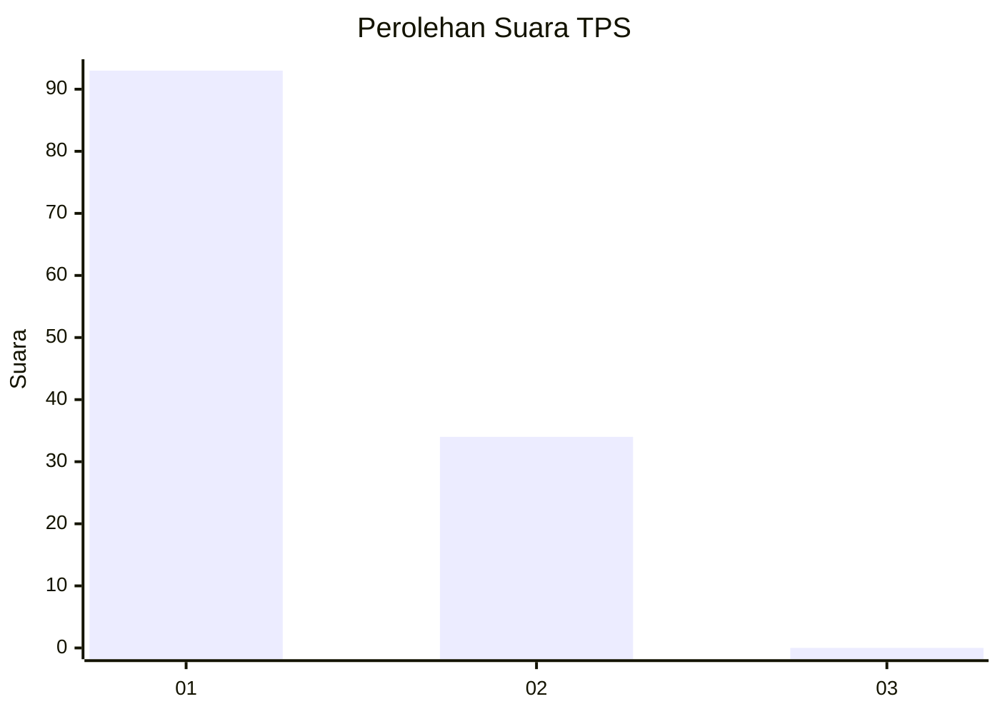
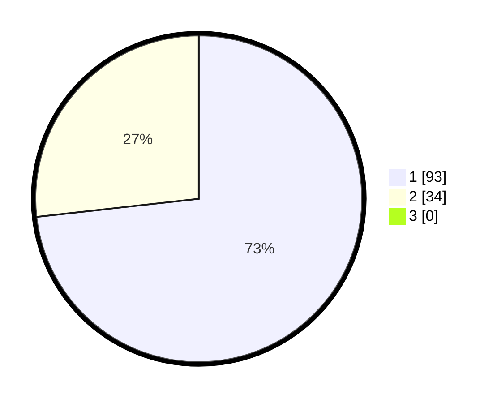

# Hasil

## Grafik

## Tabel

| No. | Nama Paslon    | Suara | Suara (raw) | Persentase |
|:--- |:-------------- | -----:| -----------:| ----------:|
| 1   | ANIES MUHAIMIN | 93    | [93][p-1]   | 73,23      |
| 2   | PRABOWO GIBRAN | 34    | [34][p-2]   | 26,77      |
| 3   | GANJAR MAHFUD  | 0     | [0][p-3]    | 0,00       |

[p-1]: https://github.com/gigit-pemilu/pemilu-2024-13-sumatera-barat/blob/main/pilpres/hitung-suara/sub/13-sumatera-barat/sub/05-padang-pariaman/sub/08-sungai-limau/sub/2001-kuranji-hilir/sub/026-tps/sub/paslon-1.txt
[p-2]: https://github.com/gigit-pemilu/pemilu-2024-13-sumatera-barat/blob/main/pilpres/hitung-suara/sub/13-sumatera-barat/sub/05-padang-pariaman/sub/08-sungai-limau/sub/2001-kuranji-hilir/sub/026-tps/sub/paslon-2.txt
[p-3]: https://github.com/gigit-pemilu/pemilu-2024-13-sumatera-barat/blob/main/pilpres/hitung-suara/sub/13-sumatera-barat/sub/05-padang-pariaman/sub/08-sungai-limau/sub/2001-kuranji-hilir/sub/026-tps/sub/paslon-3.txt

## Foto C Plano

https://sirekap-obj-formc.kpu.go.id/e6db/pemilu/ppwp/13/05/08/20/01/1305082001026-20240227-032019--99cd7b53-b23f-4490-a802-d7026386307e.jpg

https://sirekap-obj-formc.kpu.go.id/e6db/pemilu/ppwp/13/05/08/20/01/1305082001026-20240227-032212--ac4e9487-8a35-4273-8beb-3c198b5479c4.jpg

https://sirekap-obj-formc.kpu.go.id/e6db/pemilu/ppwp/13/05/08/20/01/1305082001026-20240227-032345--205a6f9a-5358-4608-8e3c-f0190c08593a.jpg

## Metadata

| Key        | Value               |
| ---------- | ------------------- |
| Time Stamp | 2024-02-28 18:00:00 |

## DATA PEMILIH TETAP

Jumlah pemilih dalam DPT: **196**.
 * L: **94**.
 * P: **492**.

## DATA PENGGUNA HAK PILIH

Jumlah pengguna hak pilih dalam DPT: **125**.
 * L: **56**.
 * P: **663**.

Jumlah pengguna hak pilih dalam DPTb: **552**.
 * L: **82**.
 * P: **0**.

Jumlah pengguna hak pilih dalam DPK: **723**.
 * L: **82**.
 * P: **823**.

Jumlah pengguna hak pilih: **629**.
 * L: **59**.
 * P: **870**.

## JUMLAH SUARA SAH DAN TIDAK SAH

JUMLAH SELURUH SUARA SAH: **127**.

JUMLAH SUARA TIDAK SAH: **2**.

JUMLAH SELURUH SUARA SAH DAN SUARA TIDAK SAH: **129**.

