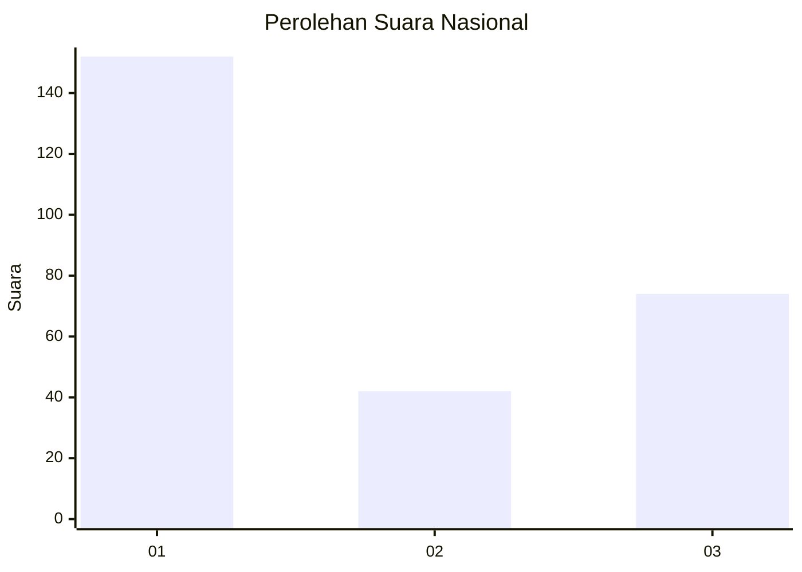
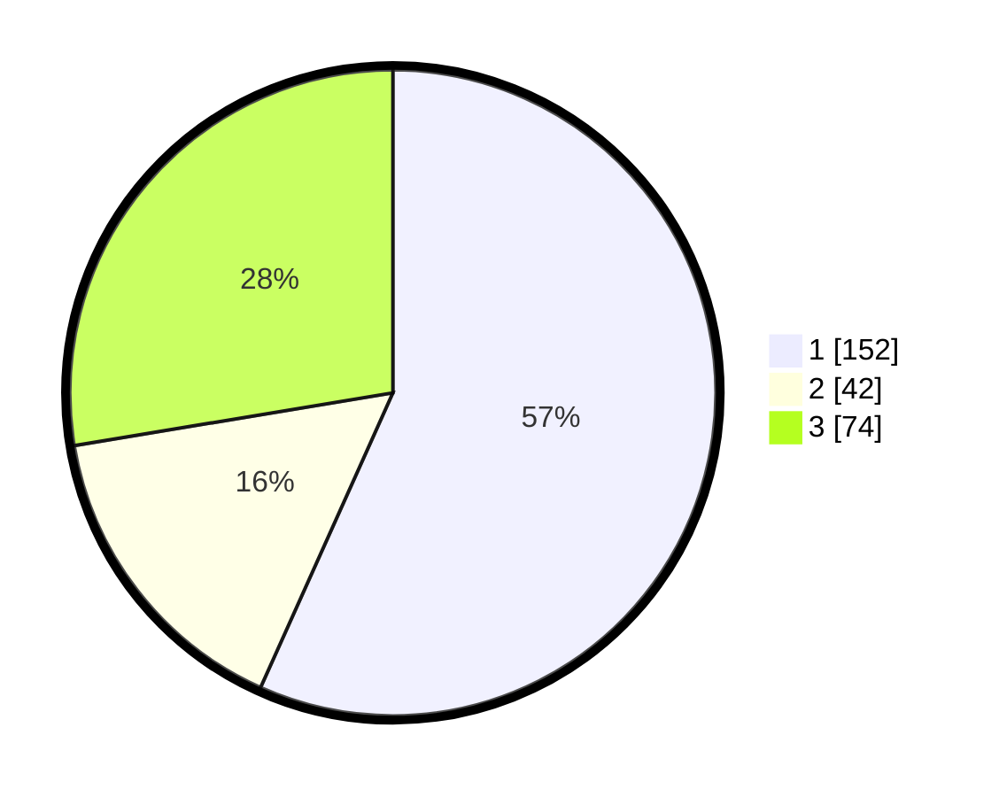

# Hasil

## Grafik

## Tabel

| No. | Nama Paslon    | Suara | Suara (raw) | Persentase |
|:--- |:-------------- | -----:| -----------:| ----------:|
| 1   | ANIES MUHAIMIN | 152   | [152][p-1]  | 56,72      |
| 2   | PRABOWO GIBRAN | 42    | [42][p-2]   | 15,67      |
| 3   | GANJAR MAHFUD  | 74    | [74][p-3]   | 27,61      |

[p-1]: https://github.com/gigit-pemilu/pemilu-2024/blob/main/pilpres/hitung-suara/sub/13-sumatera-barat/sub/05-padang-pariaman/sub/08-sungai-limau/sub/2002-pilubang/sub/006-tps/sub/paslon-1.txt
[p-2]: https://github.com/gigit-pemilu/pemilu-2024/blob/main/pilpres/hitung-suara/sub/13-sumatera-barat/sub/05-padang-pariaman/sub/08-sungai-limau/sub/2002-pilubang/sub/006-tps/sub/paslon-2.txt
[p-3]: https://github.com/gigit-pemilu/pemilu-2024/blob/main/pilpres/hitung-suara/sub/13-sumatera-barat/sub/05-padang-pariaman/sub/08-sungai-limau/sub/2002-pilubang/sub/006-tps/sub/paslon-3.txt

## Foto C Plano

https://sirekap-obj-formc.kpu.go.id/81f8/pemilu/ppwp/13/05/08/20/02/1305082002006-20240226-204509--bfa0aa54-ce80-4e68-8c1e-ad405d32a084.jpg

https://sirekap-obj-formc.kpu.go.id/81f8/pemilu/ppwp/13/05/08/20/02/1305082002006-20240226-202858--750366a3-47d0-45c1-bbbb-fb52d504f6cc.jpg

https://sirekap-obj-formc.kpu.go.id/81f8/pemilu/ppwp/13/05/08/20/02/1305082002006-20240226-203324--feb12eaa-32e2-45f3-8f99-d9feb09f42c6.jpg

## Metadata

| Key        | Value               |
| ---------- | ------------------- |
| Time Stamp | 2024-02-26 21:00:00 |

## DATA PEMILIH TETAP

Jumlah pemilih dalam DPT: **252**.
 * L: **224**.
 * P: **328**.

## DATA PENGGUNA HAK PILIH

Jumlah pengguna hak pilih dalam DPT: **295**.
 * L: **91**.
 * P: **704**.

Jumlah pengguna hak pilih dalam DPTb: **87**.
 * L: **882**.
 * P: **81**.

Jumlah pengguna hak pilih dalam DPK: **882**.
 * L: **2**.
 * P: **0**.

Jumlah pengguna hak pilih: **299**.
 * L: **894**.
 * P: **205**.

## JUMLAH SUARA SAH DAN TIDAK SAH

JUMLAH SELURUH SUARA SAH: **198**.

JUMLAH SUARA TIDAK SAH: **1**.

JUMLAH SELURUH SUARA SAH DAN SUARA TIDAK SAH: **199**.

