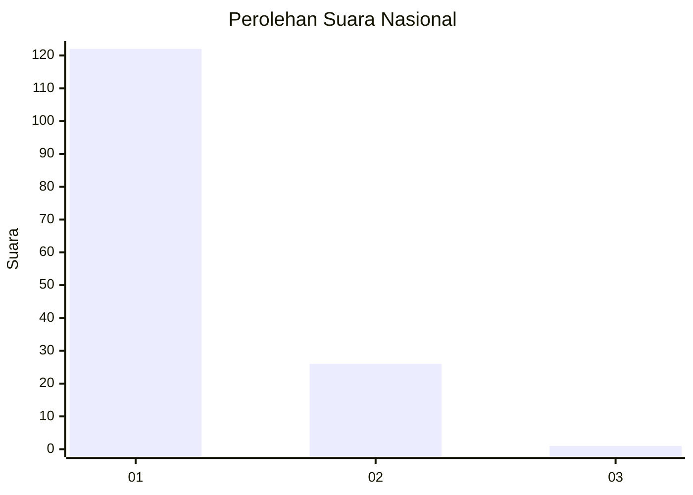
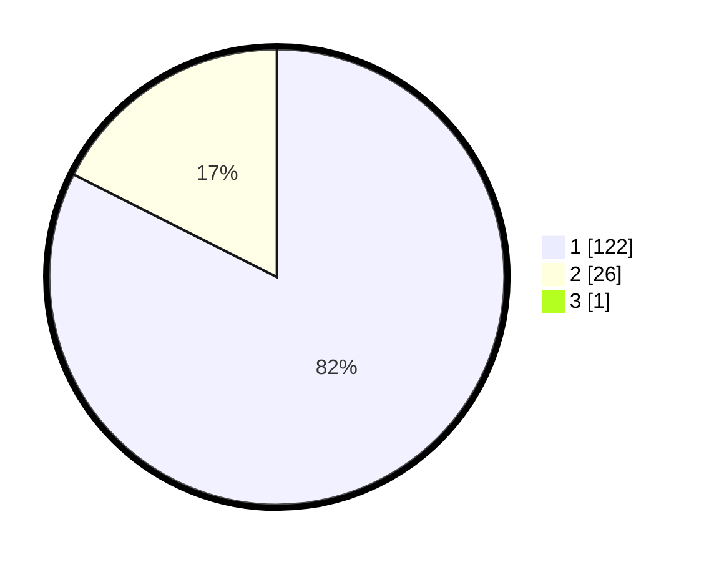

# Hasil

## Grafik

## Tabel

| No. | Nama Paslon    | Suara | Suara (raw) | Persentase |
|:--- |:-------------- | -----:| -----------:| ----------:|
| 1   | ANIES MUHAIMIN | 122   | [122][p-1]  | 81,88      |
| 2   | PRABOWO GIBRAN | 26    | [26][p-2]   | 17,45      |
| 3   | GANJAR MAHFUD  | 1     | [1][p-3]    | 0,67       |

[p-1]: https://github.com/gigit-pemilu/pemilu-2024/blob/main/pilpres/hitung-suara/sub/13-sumatera-barat/sub/05-padang-pariaman/sub/08-sungai-limau/sub/2002-pilubang/sub/049-tps/sub/paslon-1.txt
[p-2]: https://github.com/gigit-pemilu/pemilu-2024/blob/main/pilpres/hitung-suara/sub/13-sumatera-barat/sub/05-padang-pariaman/sub/08-sungai-limau/sub/2002-pilubang/sub/049-tps/sub/paslon-2.txt
[p-3]: https://github.com/gigit-pemilu/pemilu-2024/blob/main/pilpres/hitung-suara/sub/13-sumatera-barat/sub/05-padang-pariaman/sub/08-sungai-limau/sub/2002-pilubang/sub/049-tps/sub/paslon-3.txt

## Foto C Plano

https://sirekap-obj-formc.kpu.go.id/2fce/pemilu/ppwp/13/05/08/20/02/1305082002049-20240226-182031--ab8f4bd1-9423-4b97-b72a-6b8ad0fbc8a2.jpg

https://sirekap-obj-formc.kpu.go.id/2fce/pemilu/ppwp/13/05/08/20/02/1305082002049-20240226-182110--6a5b0f40-6de1-4a89-a99f-f90a5b6fd028.jpg

https://sirekap-obj-formc.kpu.go.id/2fce/pemilu/ppwp/13/05/08/20/02/1305082002049-20240226-182147--12faca55-294b-4df0-811b-8eb8ddfa9a99.jpg

## Metadata

| Key        | Value               |
| ---------- | ------------------- |
| Time Stamp | 2024-02-26 19:00:00 |

## DATA PEMILIH TETAP

Jumlah pemilih dalam DPT: **256**.
 * L: **128**.
 * P: **127**.

## DATA PENGGUNA HAK PILIH

Jumlah pengguna hak pilih dalam DPT: **159**.
 * L: **71**.
 * P: **8**.

Jumlah pengguna hak pilih dalam DPTb: **81**.
 * L: **80**.
 * P: **81**.

Jumlah pengguna hak pilih dalam DPK: **881**.
 * L: **81**.
 * P: **888**.

Jumlah pengguna hak pilih: **168**.
 * L: **72**.
 * P: **9**.

## JUMLAH SUARA SAH DAN TIDAK SAH

JUMLAH SELURUH SUARA SAH: **160**.

JUMLAH SUARA TIDAK SAH: **801**.

JUMLAH SELURUH SUARA SAH DAN SUARA TIDAK SAH: **161**.

