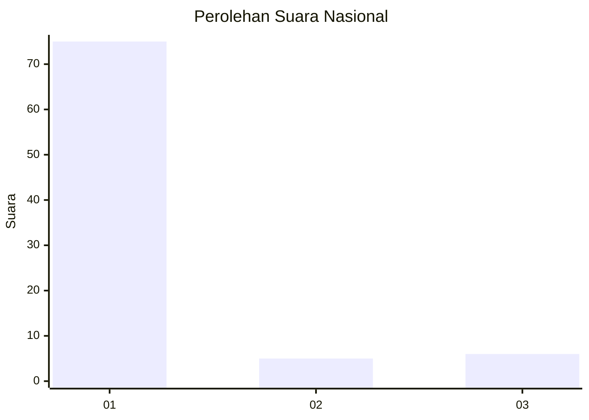
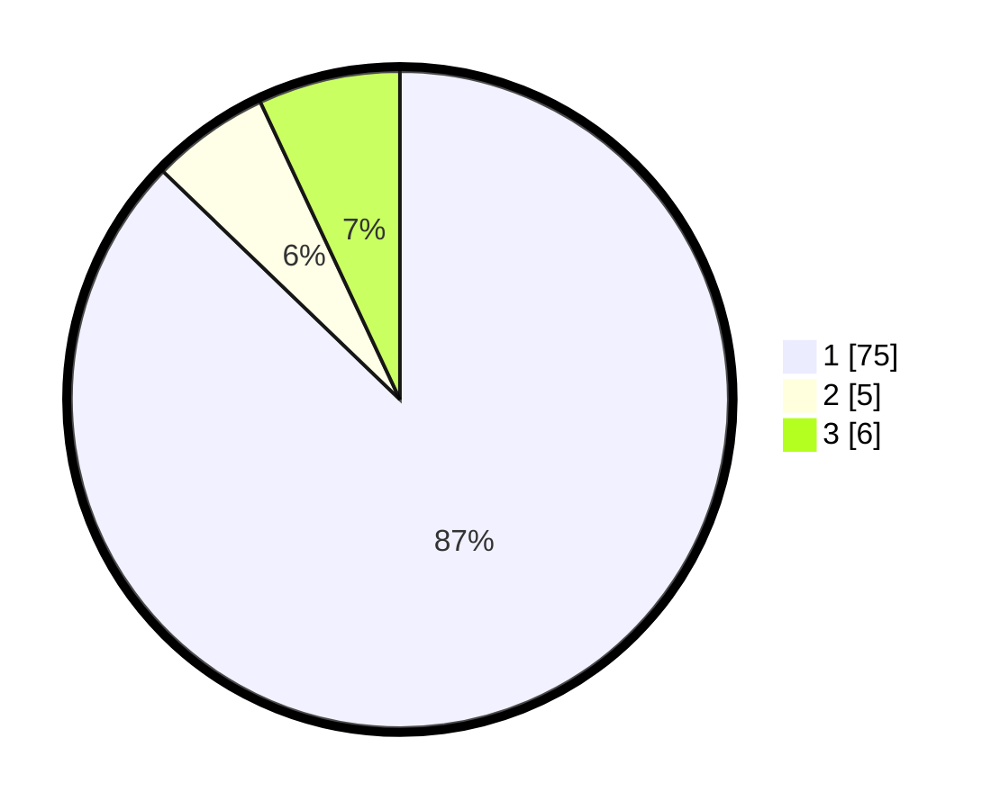

# Hasil

## Grafik

## Tabel

| No. | Nama Paslon    | Suara | Suara (raw) | Persentase |
|:--- |:-------------- | -----:| -----------:| ----------:|
| 1   | ANIES MUHAIMIN | 75    | [75][p-1]   | 87,21      |
| 2   | PRABOWO GIBRAN | 5     | [5][p-2]    | 5,81       |
| 3   | GANJAR MAHFUD  | 6     | [6][p-3]    | 6,98       |

[p-1]: https://github.com/gigit-pemilu/pemilu-2024/blob/main/pilpres/hitung-suara/sub/13-sumatera-barat/sub/05-padang-pariaman/sub/08-sungai-limau/sub/2003-guguak-kuranji-hilir/sub/008-tps/sub/paslon-1.txt
[p-2]: https://github.com/gigit-pemilu/pemilu-2024/blob/main/pilpres/hitung-suara/sub/13-sumatera-barat/sub/05-padang-pariaman/sub/08-sungai-limau/sub/2003-guguak-kuranji-hilir/sub/008-tps/sub/paslon-2.txt
[p-3]: https://github.com/gigit-pemilu/pemilu-2024/blob/main/pilpres/hitung-suara/sub/13-sumatera-barat/sub/05-padang-pariaman/sub/08-sungai-limau/sub/2003-guguak-kuranji-hilir/sub/008-tps/sub/paslon-3.txt

## Foto C Plano

https://sirekap-obj-formc.kpu.go.id/2211/pemilu/ppwp/13/05/08/20/03/1305082003008-20240224-001102--ae5521d2-0b6b-4fa4-94c3-b6be314aaa94.jpg

https://sirekap-obj-formc.kpu.go.id/2211/pemilu/ppwp/13/05/08/20/03/1305082003008-20240224-001222--eaf231b5-aa5e-4796-ac9d-e69484541aba.jpg

https://sirekap-obj-formc.kpu.go.id/2211/pemilu/ppwp/13/05/08/20/03/1305082003008-20240224-001258--17ab1350-1360-4395-9d18-7418a228c0c0.jpg

## Metadata

| Key        | Value               |
| ---------- | ------------------- |
| Time Stamp | 2024-02-24 22:31:28 |

## DATA PEMILIH TETAP

Jumlah pemilih dalam DPT: **0**.
 * L: **0**.
 * P: **0**.

## DATA PENGGUNA HAK PILIH

Jumlah pengguna hak pilih dalam DPT: **0**.
 * L: **0**.
 * P: **0**.

Jumlah pengguna hak pilih dalam DPTb: **555**.
 * L: **337**.
 * P: **555**.

Jumlah pengguna hak pilih dalam DPK: **78**.
 * L: **0**.
 * P: **1**.

Jumlah pengguna hak pilih: **714**.
 * L: **706**.
 * P: **407**.

## JUMLAH SUARA SAH DAN TIDAK SAH

JUMLAH SELURUH SUARA SAH: **7**.

JUMLAH SUARA TIDAK SAH: **241**.

JUMLAH SELURUH SUARA SAH DAN SUARA TIDAK SAH: **2**.

