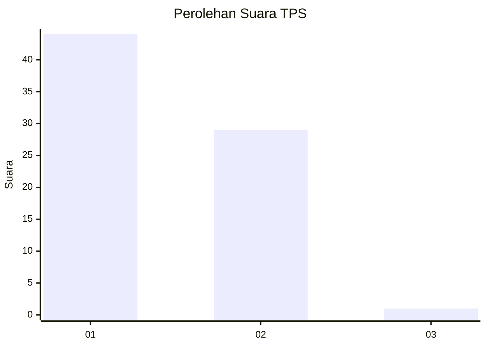
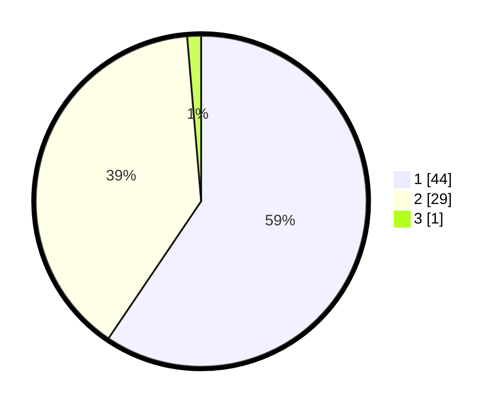

# Hasil

## Grafik

## Tabel

| No. | Nama Paslon    | Suara | Suara (raw) | Persentase |
|:--- |:-------------- | -----:| -----------:| ----------:|
| 1   | ANIES MUHAIMIN | 44    | [44][p-1]   | 59,46      |
| 2   | PRABOWO GIBRAN | 29    | [29][p-2]   | 39,19      |
| 3   | GANJAR MAHFUD  | 1     | [1][p-3]    | 1,35       |

[p-1]: https://github.com/gigit-pemilu/pemilu-2024-13-sumatera-barat/blob/main/pilpres/hitung-suara/sub/13-sumatera-barat/sub/05-padang-pariaman/sub/08-sungai-limau/sub/2004-koto-tinggi-kuranji-hilir/sub/007-tps/sub/paslon-1.txt
[p-2]: https://github.com/gigit-pemilu/pemilu-2024-13-sumatera-barat/blob/main/pilpres/hitung-suara/sub/13-sumatera-barat/sub/05-padang-pariaman/sub/08-sungai-limau/sub/2004-koto-tinggi-kuranji-hilir/sub/007-tps/sub/paslon-2.txt
[p-3]: https://github.com/gigit-pemilu/pemilu-2024-13-sumatera-barat/blob/main/pilpres/hitung-suara/sub/13-sumatera-barat/sub/05-padang-pariaman/sub/08-sungai-limau/sub/2004-koto-tinggi-kuranji-hilir/sub/007-tps/sub/paslon-3.txt

## Foto C Plano

https://sirekap-obj-formc.kpu.go.id/933d/pemilu/ppwp/13/05/08/20/04/1305082004007-20240223-182952--6edd548b-9766-4a45-b718-426c13cf338f.jpg

https://sirekap-obj-formc.kpu.go.id/933d/pemilu/ppwp/13/05/08/20/04/1305082004007-20240223-183023--2482fa83-ac53-4f57-b593-063b73832483.jpg

https://sirekap-obj-formc.kpu.go.id/933d/pemilu/ppwp/13/05/08/20/04/1305082004007-20240223-183106--256e8ba4-a645-4bd5-bcef-a7f00e61df0f.jpg

## Metadata

| Key        | Value               |
| ---------- | ------------------- |
| Time Stamp | 2024-02-24 22:31:28 |

## DATA PEMILIH TETAP

Jumlah pemilih dalam DPT: **190**.
 * L: **104**.
 * P: **86**.

## DATA PENGGUNA HAK PILIH

Jumlah pengguna hak pilih dalam DPT: **105**.
 * L: **49**.
 * P: **856**.

Jumlah pengguna hak pilih dalam DPTb: **877**.
 * L: **887**.
 * P: **887**.

Jumlah pengguna hak pilih dalam DPK: **86**.
 * L: **883**.
 * P: **803**.

Jumlah pengguna hak pilih: **114**.
 * L: **54**.
 * P: **63**.

## JUMLAH SUARA SAH DAN TIDAK SAH

JUMLAH SELURUH SUARA SAH: **114**.

JUMLAH SUARA TIDAK SAH: **3**.

JUMLAH SELURUH SUARA SAH DAN SUARA TIDAK SAH: **117**.

