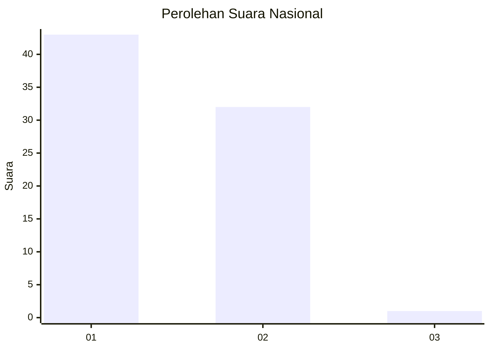
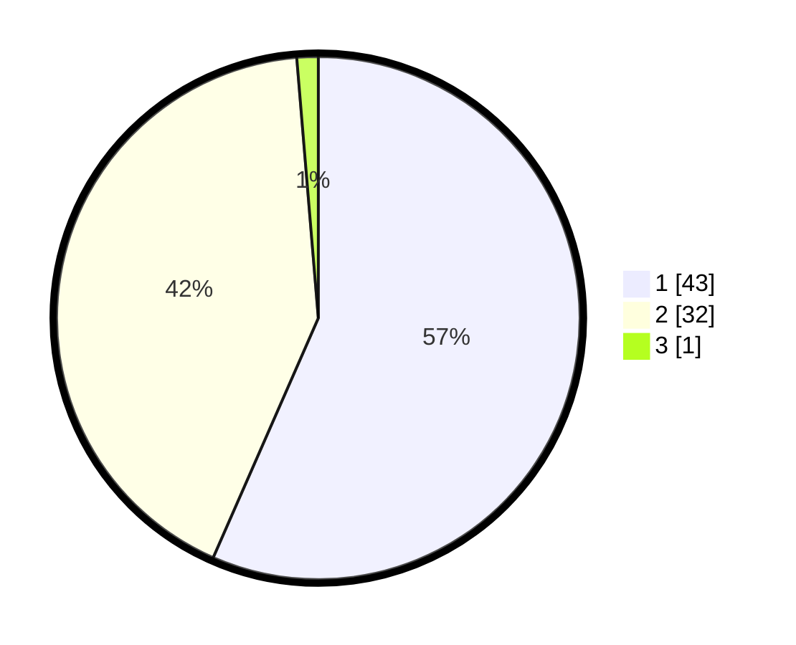

# Hasil

## Grafik

## Tabel

| No. | Nama Paslon    | Suara | Suara (raw) | Persentase |
|:--- |:-------------- | -----:| -----------:| ----------:|
| 1   | ANIES MUHAIMIN | 43    | [43][p-1]   | 56,58      |
| 2   | PRABOWO GIBRAN | 32    | [32][p-2]   | 42,11      |
| 3   | GANJAR MAHFUD  | 1     | [1][p-3]    | 1,32       |

[p-1]: https://github.com/gigit-pemilu/pemilu-2024/blob/main/pilpres/hitung-suara/sub/13-sumatera-barat/sub/05-padang-pariaman/sub/09-iv-koto-aur-malintang/sub/2002-iii-koto-aur-malintang-utara/sub/009-tps/sub/paslon-1.txt
[p-2]: https://github.com/gigit-pemilu/pemilu-2024/blob/main/pilpres/hitung-suara/sub/13-sumatera-barat/sub/05-padang-pariaman/sub/09-iv-koto-aur-malintang/sub/2002-iii-koto-aur-malintang-utara/sub/009-tps/sub/paslon-2.txt
[p-3]: https://github.com/gigit-pemilu/pemilu-2024/blob/main/pilpres/hitung-suara/sub/13-sumatera-barat/sub/05-padang-pariaman/sub/09-iv-koto-aur-malintang/sub/2002-iii-koto-aur-malintang-utara/sub/009-tps/sub/paslon-3.txt

## Foto C Plano

https://sirekap-obj-formc.kpu.go.id/11d2/pemilu/ppwp/13/05/09/20/02/1305092002009-20240215-002711--a3fcb644-9d1a-4304-9c8b-4015ab37f3ab.jpg

https://sirekap-obj-formc.kpu.go.id/11d2/pemilu/ppwp/13/05/09/20/02/1305092002009-20240214-222320--07df143f-88c1-431a-ab1b-07b7a9bda560.jpg

https://sirekap-obj-formc.kpu.go.id/11d2/pemilu/ppwp/13/05/09/20/02/1305092002009-20240214-222422--f7e0b887-5a2e-403f-9e53-258a5665653c.jpg

## Metadata

| Key        | Value               |
| ---------- | ------------------- |
| Time Stamp | 2024-02-15 20:30:46 |

