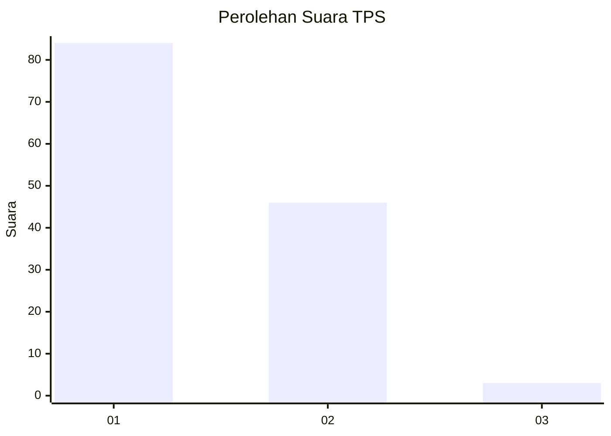
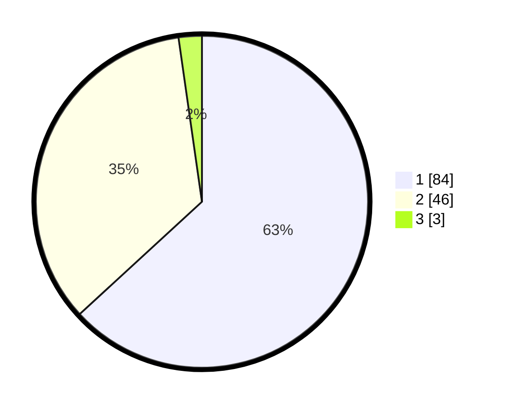

# Hasil

## Grafik

## Tabel

| No. | Nama Paslon    | Suara | Suara (raw) | Persentase |
|:--- |:-------------- | -----:| -----------:| ----------:|
| 1   | ANIES MUHAIMIN | 84    | [84][p-1]   | 63,16      |
| 2   | PRABOWO GIBRAN | 46    | [46][p-2]   | 34,59      |
| 3   | GANJAR MAHFUD  | 3     | [3][p-3]    | 2,26       |

[p-1]: https://github.com/gigit-pemilu/pemilu-2024-13-sumatera-barat/blob/main/pilpres/hitung-suara/sub/13-sumatera-barat/sub/05-padang-pariaman/sub/11-sintuak-toboh-gadang/sub/2001-sintuak/sub/003-tps/sub/paslon-1.txt
[p-2]: https://github.com/gigit-pemilu/pemilu-2024-13-sumatera-barat/blob/main/pilpres/hitung-suara/sub/13-sumatera-barat/sub/05-padang-pariaman/sub/11-sintuak-toboh-gadang/sub/2001-sintuak/sub/003-tps/sub/paslon-2.txt
[p-3]: https://github.com/gigit-pemilu/pemilu-2024-13-sumatera-barat/blob/main/pilpres/hitung-suara/sub/13-sumatera-barat/sub/05-padang-pariaman/sub/11-sintuak-toboh-gadang/sub/2001-sintuak/sub/003-tps/sub/paslon-3.txt

## Foto C Plano

https://sirekap-obj-formc.kpu.go.id/5ba3/pemilu/ppwp/13/05/11/20/01/1305112001003-20240215-040815--17f89e15-50be-4e75-8912-22a395c1ead8.jpg

https://sirekap-obj-formc.kpu.go.id/5ba3/pemilu/ppwp/13/05/11/20/01/1305112001003-20240215-041523--98ec0df9-3e1e-41f4-a567-039dc9cd05e8.jpg

https://sirekap-obj-formc.kpu.go.id/5ba3/pemilu/ppwp/13/05/11/20/01/1305112001003-20240215-042243--ea423ebc-da36-4568-83b0-8686a1b5b0a5.jpg

## Metadata

| Key        | Value               |
| ---------- | ------------------- |
| Time Stamp | 2024-02-15 19:00:26 |

