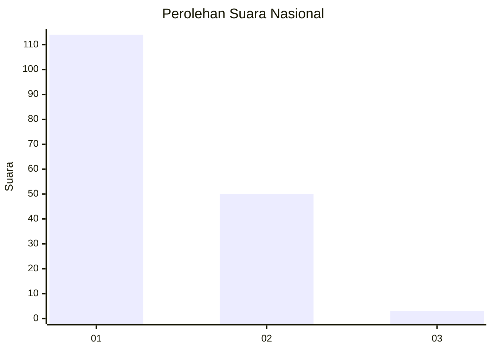
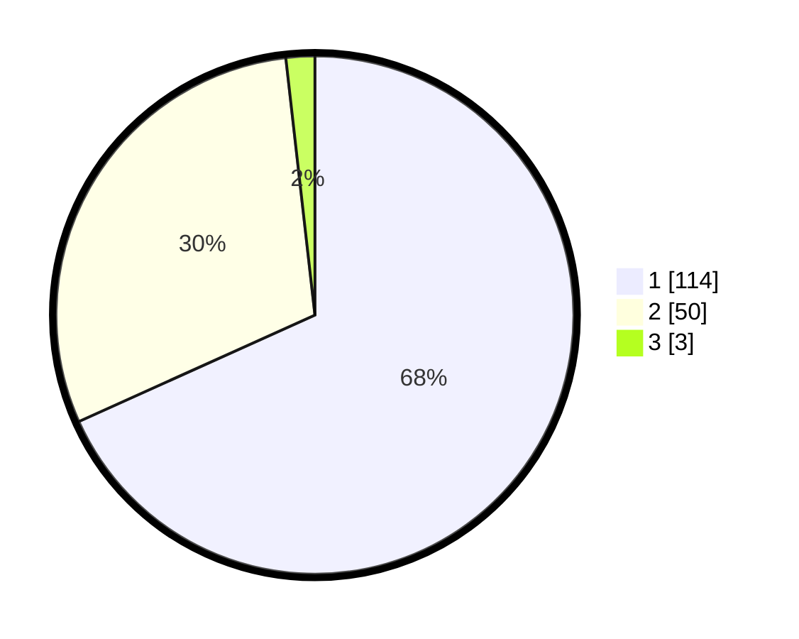

# Hasil

## Grafik

## Tabel

| No. | Nama Paslon    | Suara | Suara (raw) | Persentase |
|:--- |:-------------- | -----:| -----------:| ----------:|
| 1   | ANIES MUHAIMIN | 114   | [114][p-1]  | 68,26      |
| 2   | PRABOWO GIBRAN | 50    | [50][p-2]   | 29,94      |
| 3   | GANJAR MAHFUD  | 3     | [3][p-3]    | 1,80       |

[p-1]: https://github.com/gigit-pemilu/pemilu-2024/blob/main/pilpres/hitung-suara/sub/13-sumatera-barat/sub/05-padang-pariaman/sub/11-sintuak-toboh-gadang/sub/2001-sintuak/sub/007-tps/sub/paslon-1.txt
[p-2]: https://github.com/gigit-pemilu/pemilu-2024/blob/main/pilpres/hitung-suara/sub/13-sumatera-barat/sub/05-padang-pariaman/sub/11-sintuak-toboh-gadang/sub/2001-sintuak/sub/007-tps/sub/paslon-2.txt
[p-3]: https://github.com/gigit-pemilu/pemilu-2024/blob/main/pilpres/hitung-suara/sub/13-sumatera-barat/sub/05-padang-pariaman/sub/11-sintuak-toboh-gadang/sub/2001-sintuak/sub/007-tps/sub/paslon-3.txt

## Foto C Plano

https://sirekap-obj-formc.kpu.go.id/05a5/pemilu/ppwp/13/05/11/20/01/1305112001007-20240214-160055--5e87fcca-7925-423f-8bf9-3519080f9f52.jpg

https://sirekap-obj-formc.kpu.go.id/05a5/pemilu/ppwp/13/05/11/20/01/1305112001007-20240214-155310--6f95a192-afe8-41f8-9d8c-f0b45fd01a30.jpg

https://sirekap-obj-formc.kpu.go.id/05a5/pemilu/ppwp/13/05/11/20/01/1305112001007-20240214-155622--b3f108fc-b955-44bf-8dd3-922dd85bacb8.jpg

## Metadata

| Key        | Value               |
| ---------- | ------------------- |
| Time Stamp | 2024-02-15 20:00:44 |

