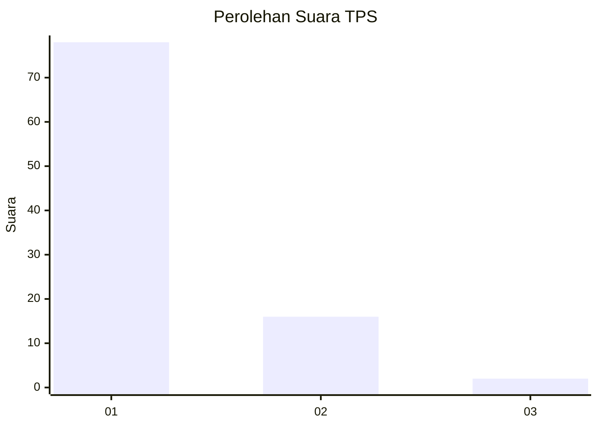
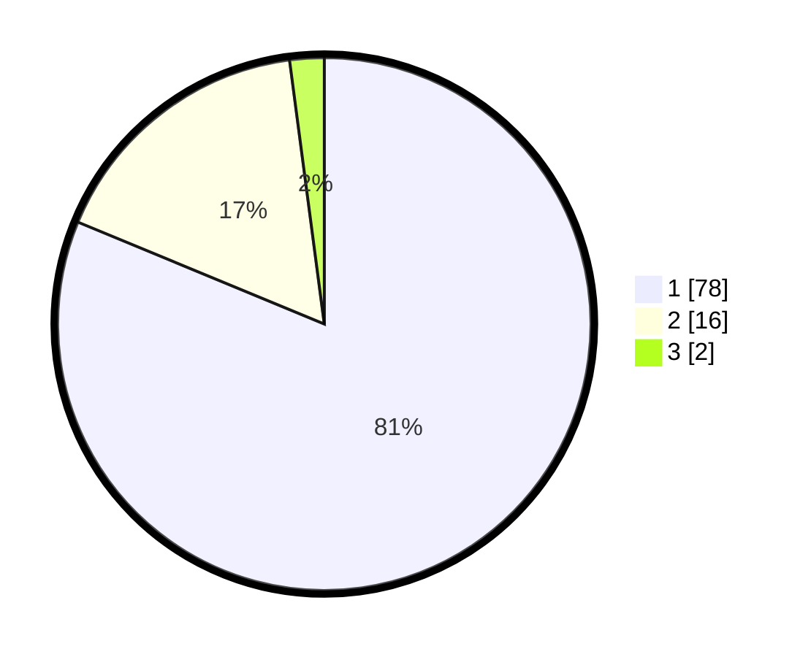

# Hasil

## Grafik

## Tabel

| No. | Nama Paslon    | Suara | Suara (raw) | Persentase |
|:--- |:-------------- | -----:| -----------:| ----------:|
| 1   | ANIES MUHAIMIN | 78    | [78][p-1]   | 81,25      |
| 2   | PRABOWO GIBRAN | 16    | [16][p-2]   | 16,67      |
| 3   | GANJAR MAHFUD  | 2     | [2][p-3]    | 2,08       |

[p-1]: https://github.com/gigit-pemilu/pemilu-2024-13-sumatera-barat/blob/main/pilpres/hitung-suara/sub/13-sumatera-barat/sub/05-padang-pariaman/sub/11-sintuak-toboh-gadang/sub/2004-toboh-gadang-barat/sub/002-tps/sub/paslon-1.txt
[p-2]: https://github.com/gigit-pemilu/pemilu-2024-13-sumatera-barat/blob/main/pilpres/hitung-suara/sub/13-sumatera-barat/sub/05-padang-pariaman/sub/11-sintuak-toboh-gadang/sub/2004-toboh-gadang-barat/sub/002-tps/sub/paslon-2.txt
[p-3]: https://github.com/gigit-pemilu/pemilu-2024-13-sumatera-barat/blob/main/pilpres/hitung-suara/sub/13-sumatera-barat/sub/05-padang-pariaman/sub/11-sintuak-toboh-gadang/sub/2004-toboh-gadang-barat/sub/002-tps/sub/paslon-3.txt

## Foto C Plano

https://sirekap-obj-formc.kpu.go.id/f191/pemilu/ppwp/13/05/11/20/04/1305112004002-20240214-232711--18353650-b0f5-46f3-9311-a70e98fb9880.jpg

https://sirekap-obj-formc.kpu.go.id/f191/pemilu/ppwp/13/05/11/20/04/1305112004002-20240214-233153--2e21ebf2-d333-4f17-a528-6124ab78efe7.jpg

https://sirekap-obj-formc.kpu.go.id/f191/pemilu/ppwp/13/05/11/20/04/1305112004002-20240215-005038--5dd0cb34-a9c0-4b9a-b041-45f8f7fc759a.jpg

## Metadata

| Key        | Value               |
| ---------- | ------------------- |
| Time Stamp | 2024-02-15 20:30:46 |

