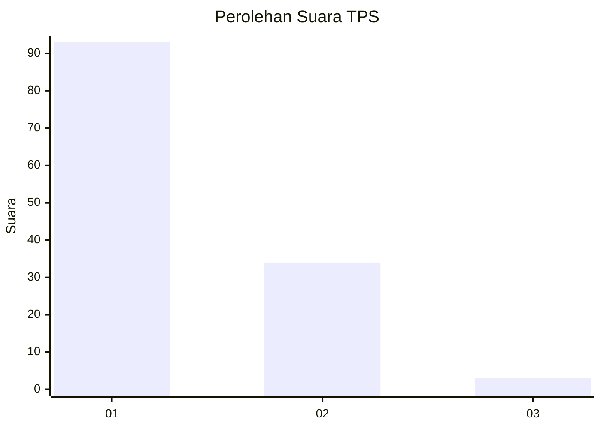
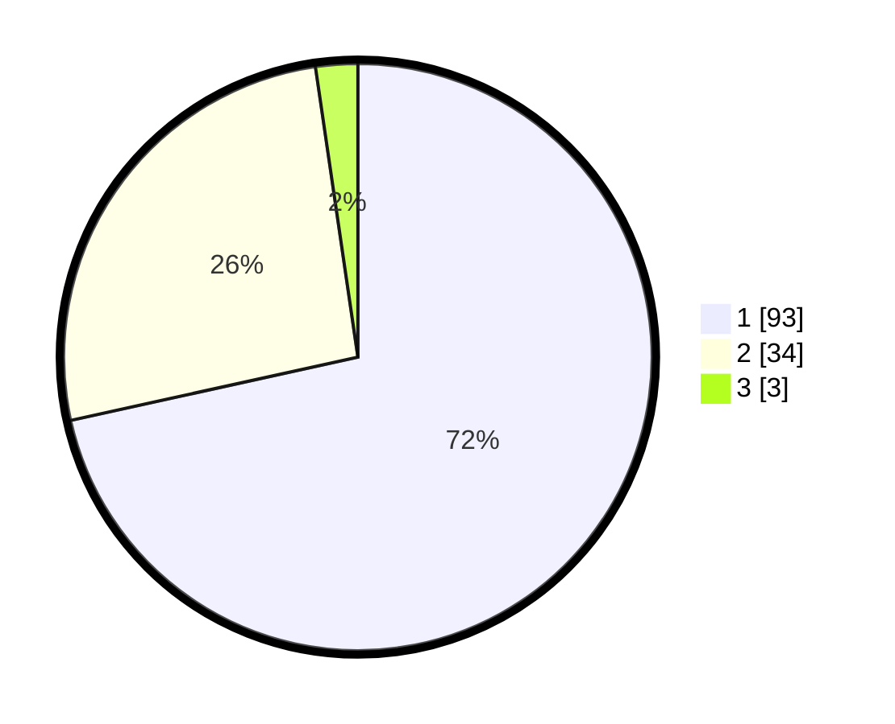

# Hasil

## Grafik

## Tabel

| No. | Nama Paslon    | Suara | Suara (raw) | Persentase |
|:--- |:-------------- | -----:| -----------:| ----------:|
| 1   | ANIES MUHAIMIN | 93    | [93][p-1]   | 71,54      |
| 2   | PRABOWO GIBRAN | 34    | [34][p-2]   | 26,15      |
| 3   | GANJAR MAHFUD  | 3     | [3][p-3]    | 2,31       |

[p-1]: https://github.com/gigit-pemilu/pemilu-2024-13-sumatera-barat/blob/main/pilpres/hitung-suara/sub/13-sumatera-barat/sub/05-padang-pariaman/sub/11-sintuak-toboh-gadang/sub/2004-toboh-gadang-barat/sub/004-tps/sub/paslon-1.txt
[p-2]: https://github.com/gigit-pemilu/pemilu-2024-13-sumatera-barat/blob/main/pilpres/hitung-suara/sub/13-sumatera-barat/sub/05-padang-pariaman/sub/11-sintuak-toboh-gadang/sub/2004-toboh-gadang-barat/sub/004-tps/sub/paslon-2.txt
[p-3]: https://github.com/gigit-pemilu/pemilu-2024-13-sumatera-barat/blob/main/pilpres/hitung-suara/sub/13-sumatera-barat/sub/05-padang-pariaman/sub/11-sintuak-toboh-gadang/sub/2004-toboh-gadang-barat/sub/004-tps/sub/paslon-3.txt

## Foto C Plano

https://sirekap-obj-formc.kpu.go.id/6902/pemilu/ppwp/13/05/11/20/04/1305112004004-20240214-224719--b684bb9f-0a00-44a5-90f1-b90a31095bd2.jpg

https://sirekap-obj-formc.kpu.go.id/6902/pemilu/ppwp/13/05/11/20/04/1305112004004-20240214-225205--cb43c3bd-791a-4987-b441-126e38aa9c77.jpg

https://sirekap-obj-formc.kpu.go.id/6902/pemilu/ppwp/13/05/11/20/04/1305112004004-20240214-225616--4fcbe474-cc5b-4aa5-b709-94a385b9d634.jpg

## Metadata

| Key        | Value               |
| ---------- | ------------------- |
| Time Stamp | 2024-02-15 20:30:46 |

