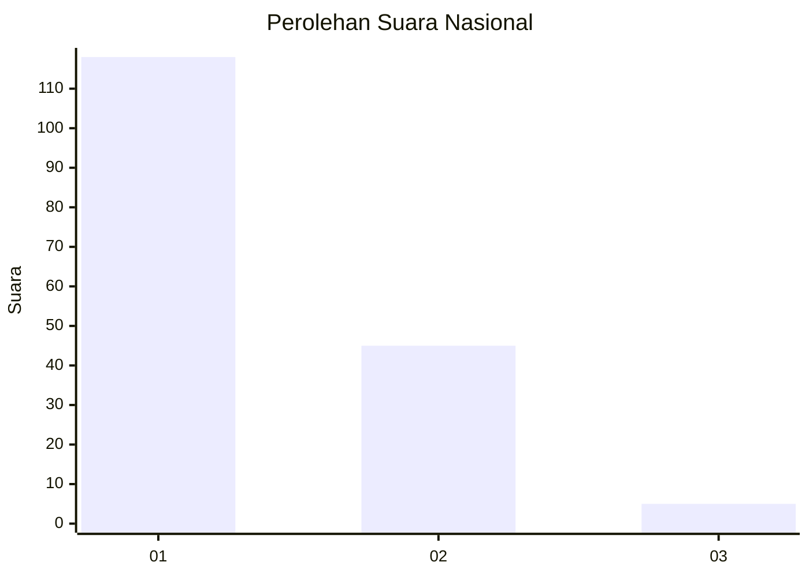
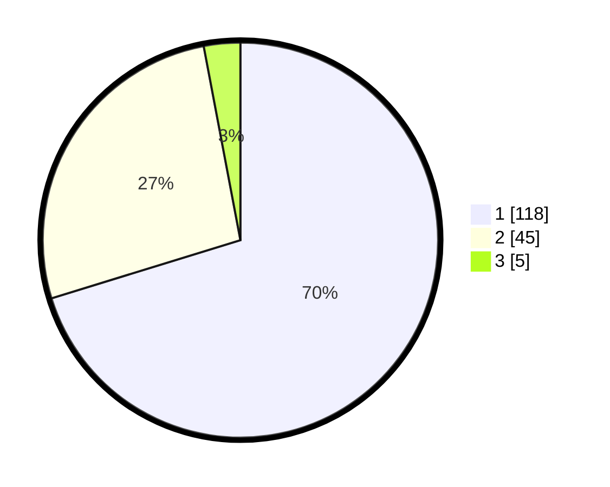

# Hasil

## Grafik

## Tabel

| No. | Nama Paslon    | Suara | Suara (raw) | Persentase |
|:--- |:-------------- | -----:| -----------:| ----------:|
| 1   | ANIES MUHAIMIN | 118   | [118][p-1]  | 70,24      |
| 2   | PRABOWO GIBRAN | 45    | [45][p-2]   | 26,79      |
| 3   | GANJAR MAHFUD  | 5     | [5][p-3]    | 2,98       |

[p-1]: https://github.com/gigit-pemilu/pemilu-2024/blob/main/pilpres/hitung-suara/sub/13-sumatera-barat/sub/05-padang-pariaman/sub/13-batang-gasan/sub/2003-malai-v-suku-timur/sub/001-tps/sub/paslon-1.txt
[p-2]: https://github.com/gigit-pemilu/pemilu-2024/blob/main/pilpres/hitung-suara/sub/13-sumatera-barat/sub/05-padang-pariaman/sub/13-batang-gasan/sub/2003-malai-v-suku-timur/sub/001-tps/sub/paslon-2.txt
[p-3]: https://github.com/gigit-pemilu/pemilu-2024/blob/main/pilpres/hitung-suara/sub/13-sumatera-barat/sub/05-padang-pariaman/sub/13-batang-gasan/sub/2003-malai-v-suku-timur/sub/001-tps/sub/paslon-3.txt

## Foto C Plano

https://sirekap-obj-formc.kpu.go.id/7451/pemilu/ppwp/13/05/13/20/03/1305132003001-20240222-165138--da90e704-ab77-45ed-9056-7a9bdf46b844.jpg

https://sirekap-obj-formc.kpu.go.id/7451/pemilu/ppwp/13/05/13/20/03/1305132003001-20240222-165201--6f634e9e-0266-4d36-b1da-33530410b729.jpg

https://sirekap-obj-formc.kpu.go.id/7451/pemilu/ppwp/13/05/13/20/03/1305132003001-20240222-165219--3e3c32fa-77b3-4eed-ad9f-5a65e67da3f1.jpg

## Metadata

| Key        | Value               |
| ---------- | ------------------- |
| Time Stamp | 2024-02-22 17:00:00 |

## DATA PEMILIH TETAP

Jumlah pemilih dalam DPT: **281**.
 * L: **133**.
 * P: **140**.

## DATA PENGGUNA HAK PILIH

Jumlah pengguna hak pilih dalam DPT: **172**.
 * L: **873**.
 * P: **599**.

Jumlah pengguna hak pilih dalam DPTb: **288**.
 * L: **888**.
 * P: **888**.

Jumlah pengguna hak pilih dalam DPK: **281**.
 * L: **801**.
 * P: **8**.

Jumlah pengguna hak pilih: **173**.
 * L: **874**.
 * P: **899**.

## JUMLAH SUARA SAH DAN TIDAK SAH

JUMLAH SELURUH SUARA SAH: **166**.

JUMLAH SUARA TIDAK SAH: **885**.

JUMLAH SELURUH SUARA SAH DAN SUARA TIDAK SAH: **173**.

