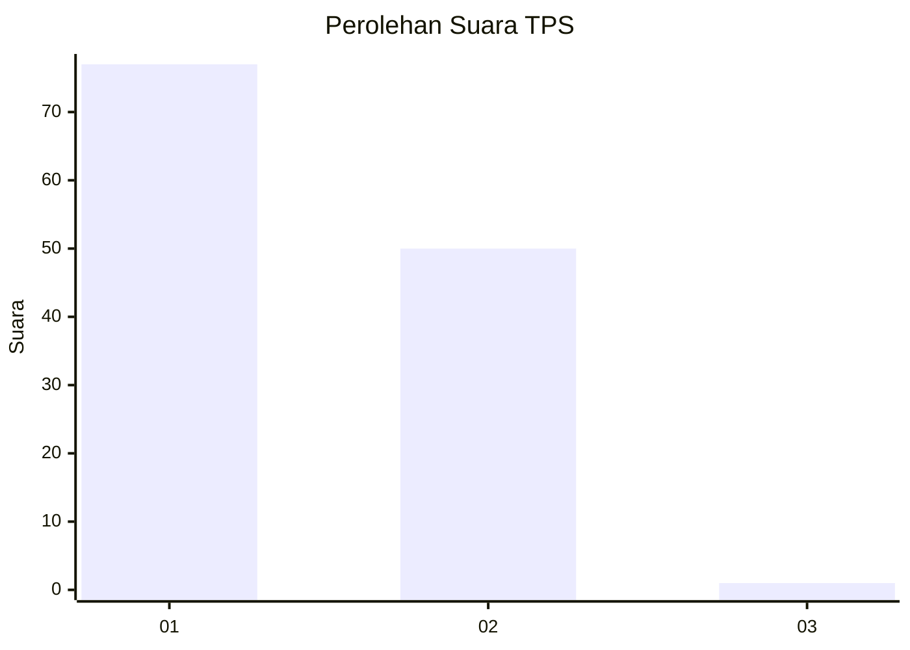
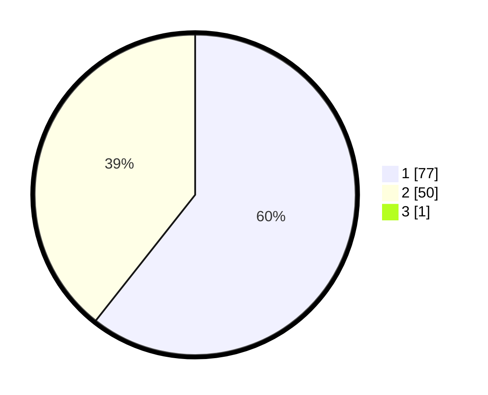

# Hasil

## Grafik

## Tabel

| No. | Nama Paslon    | Suara | Suara (raw) | Persentase |
|:--- |:-------------- | -----:| -----------:| ----------:|
| 1   | ANIES MUHAIMIN | 77    | [77][p-1]   | 60,16      |
| 2   | PRABOWO GIBRAN | 50    | [50][p-2]   | 39,06      |
| 3   | GANJAR MAHFUD  | 1     | [1][p-3]    | 0,78       |

[p-1]: https://github.com/gigit-pemilu/pemilu-2024-13-sumatera-barat/blob/main/pilpres/hitung-suara/sub/13-sumatera-barat/sub/05-padang-pariaman/sub/14-v-koto-timur/sub/2001-kudu-gantiang/sub/003-tps/sub/paslon-1.txt
[p-2]: https://github.com/gigit-pemilu/pemilu-2024-13-sumatera-barat/blob/main/pilpres/hitung-suara/sub/13-sumatera-barat/sub/05-padang-pariaman/sub/14-v-koto-timur/sub/2001-kudu-gantiang/sub/003-tps/sub/paslon-2.txt
[p-3]: https://github.com/gigit-pemilu/pemilu-2024-13-sumatera-barat/blob/main/pilpres/hitung-suara/sub/13-sumatera-barat/sub/05-padang-pariaman/sub/14-v-koto-timur/sub/2001-kudu-gantiang/sub/003-tps/sub/paslon-3.txt

## Foto C Plano

https://sirekap-obj-formc.kpu.go.id/a0b2/pemilu/ppwp/13/05/14/20/01/1305142001003-20240222-004238--a35d3fb7-210a-4c02-b3b2-7a037ec7f3ac.jpg

https://sirekap-obj-formc.kpu.go.id/a0b2/pemilu/ppwp/13/05/14/20/01/1305142001003-20240222-004339--6e434122-f381-49fc-952a-ae59fed58a71.jpg

https://sirekap-obj-formc.kpu.go.id/a0b2/pemilu/ppwp/13/05/14/20/01/1305142001003-20240222-004502--94e8b0d5-f1fb-4641-b541-6c280588aaf5.jpg

## Metadata

| Key        | Value               |
| ---------- | ------------------- |
| Time Stamp | 2024-02-25 11:00:00 |

