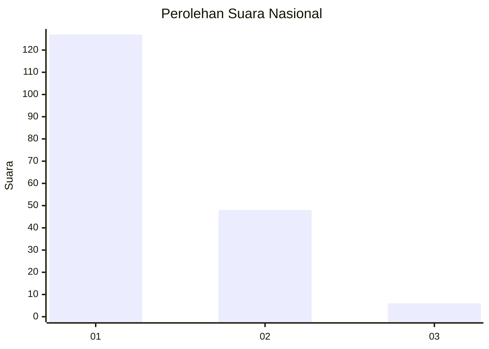
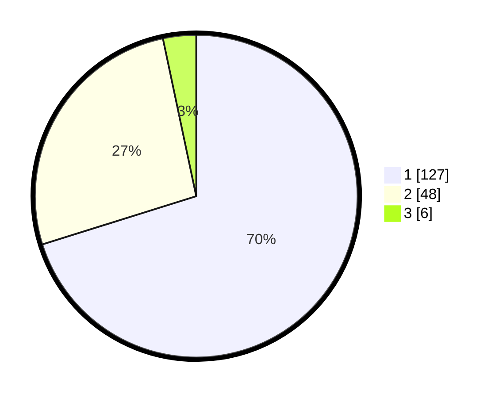

# Hasil

## Grafik

## Tabel

| No. | Nama Paslon    | Suara | Suara (raw) | Persentase |
|:--- |:-------------- | -----:| -----------:| ----------:|
| 1   | ANIES MUHAIMIN | 127   | [127][p-1]  | 70,17      |
| 2   | PRABOWO GIBRAN | 48    | [48][p-2]   | 26,52      |
| 3   | GANJAR MAHFUD  | 6     | [6][p-3]    | 3,31       |

[p-1]: https://github.com/gigit-pemilu/pemilu-2024/blob/main/pilpres/hitung-suara/sub/13-sumatera-barat/sub/05-padang-pariaman/sub/14-v-koto-timur/sub/2001-kudu-gantiang/sub/004-tps/sub/paslon-1.txt
[p-2]: https://github.com/gigit-pemilu/pemilu-2024/blob/main/pilpres/hitung-suara/sub/13-sumatera-barat/sub/05-padang-pariaman/sub/14-v-koto-timur/sub/2001-kudu-gantiang/sub/004-tps/sub/paslon-2.txt
[p-3]: https://github.com/gigit-pemilu/pemilu-2024/blob/main/pilpres/hitung-suara/sub/13-sumatera-barat/sub/05-padang-pariaman/sub/14-v-koto-timur/sub/2001-kudu-gantiang/sub/004-tps/sub/paslon-3.txt

## Foto C Plano

https://sirekap-obj-formc.kpu.go.id/70b9/pemilu/ppwp/13/05/14/20/01/1305142001004-20240221-230942--081d687d-71fd-4bce-802d-73477ed8f959.jpg

https://sirekap-obj-formc.kpu.go.id/70b9/pemilu/ppwp/13/05/14/20/01/1305142001004-20240221-231012--f9c7d01e-e3f2-48c0-b77f-ec57ce1a7840.jpg

https://sirekap-obj-formc.kpu.go.id/70b9/pemilu/ppwp/13/05/14/20/01/1305142001004-20240221-231125--d81d24da-62b8-41f0-9719-b15e29683982.jpg

## Metadata

| Key        | Value               |
| ---------- | ------------------- |
| Time Stamp | 2024-02-24 22:31:28 |

