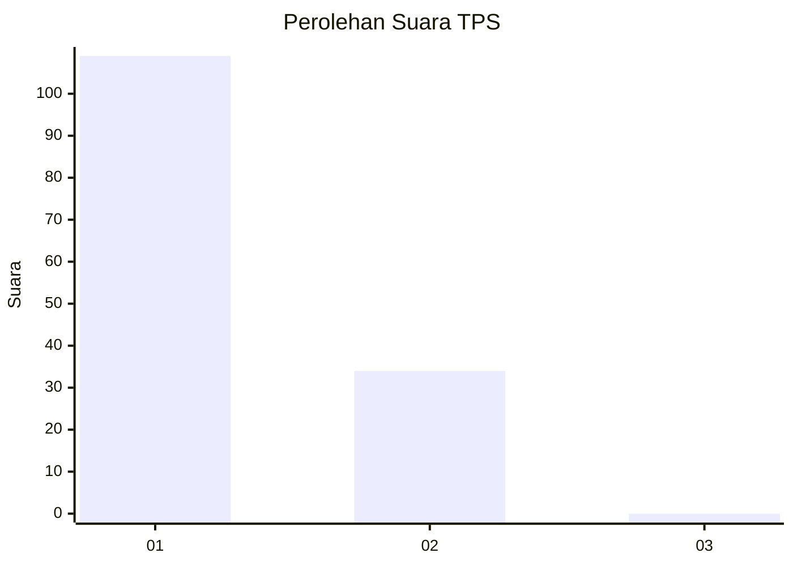
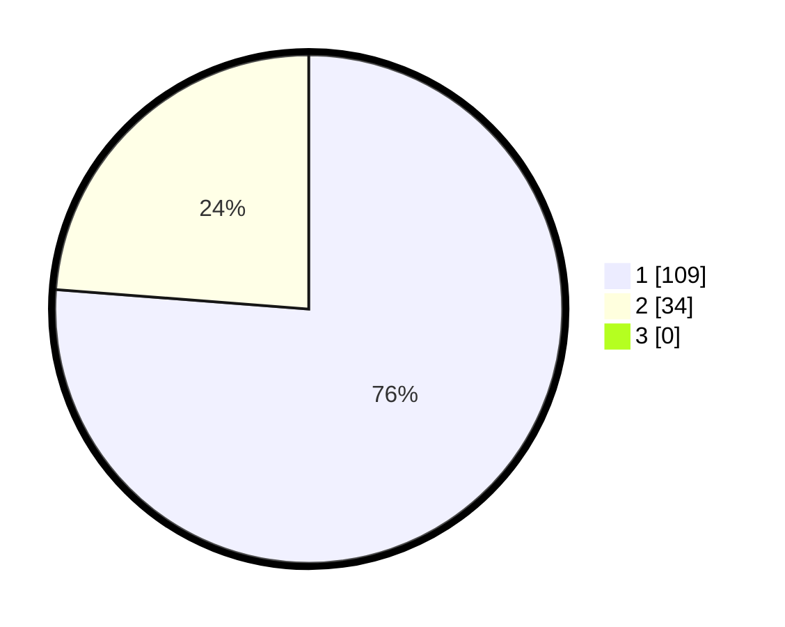

# Hasil

## Grafik

## Tabel

| No. | Nama Paslon    | Suara | Suara (raw) | Persentase |
|:--- |:-------------- | -----:| -----------:| ----------:|
| 1   | ANIES MUHAIMIN | 109   | [109][p-1]  | 76,22      |
| 2   | PRABOWO GIBRAN | 34    | [34][p-2]   | 23,78      |
| 3   | GANJAR MAHFUD  | 0     | [0][p-3]    | 0,00       |

[p-1]: https://github.com/gigit-pemilu/pemilu-2024-13-sumatera-barat/blob/main/pilpres/hitung-suara/sub/13-sumatera-barat/sub/05-padang-pariaman/sub/14-v-koto-timur/sub/2001-kudu-gantiang/sub/005-tps/sub/paslon-1.txt
[p-2]: https://github.com/gigit-pemilu/pemilu-2024-13-sumatera-barat/blob/main/pilpres/hitung-suara/sub/13-sumatera-barat/sub/05-padang-pariaman/sub/14-v-koto-timur/sub/2001-kudu-gantiang/sub/005-tps/sub/paslon-2.txt
[p-3]: https://github.com/gigit-pemilu/pemilu-2024-13-sumatera-barat/blob/main/pilpres/hitung-suara/sub/13-sumatera-barat/sub/05-padang-pariaman/sub/14-v-koto-timur/sub/2001-kudu-gantiang/sub/005-tps/sub/paslon-3.txt

## Foto C Plano

https://sirekap-obj-formc.kpu.go.id/bdc2/pemilu/ppwp/13/05/14/20/01/1305142001005-20240214-214223--ba17692d-4cfb-4d03-b866-354b1019cab2.jpg

https://sirekap-obj-formc.kpu.go.id/bdc2/pemilu/ppwp/13/05/14/20/01/1305142001005-20240221-194114--e5a1aece-5434-49b9-a38b-6587bef81736.jpg

https://sirekap-obj-formc.kpu.go.id/bdc2/pemilu/ppwp/13/05/14/20/01/1305142001005-20240221-194156--e5feccc3-1459-4524-b9dc-a840bb4ef8d1.jpg

## Metadata

| Key        | Value               |
| ---------- | ------------------- |
| Time Stamp | 2024-02-21 20:00:00 |

