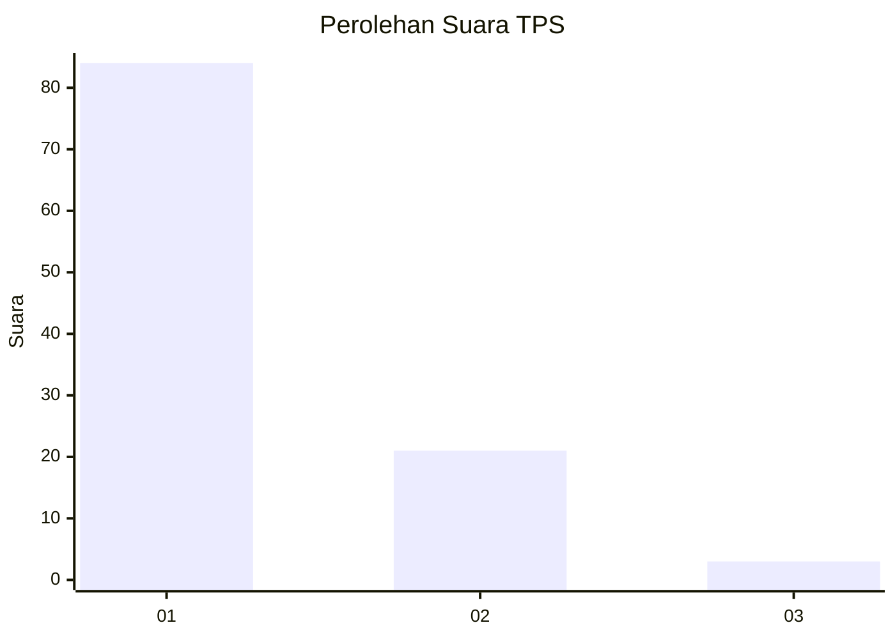
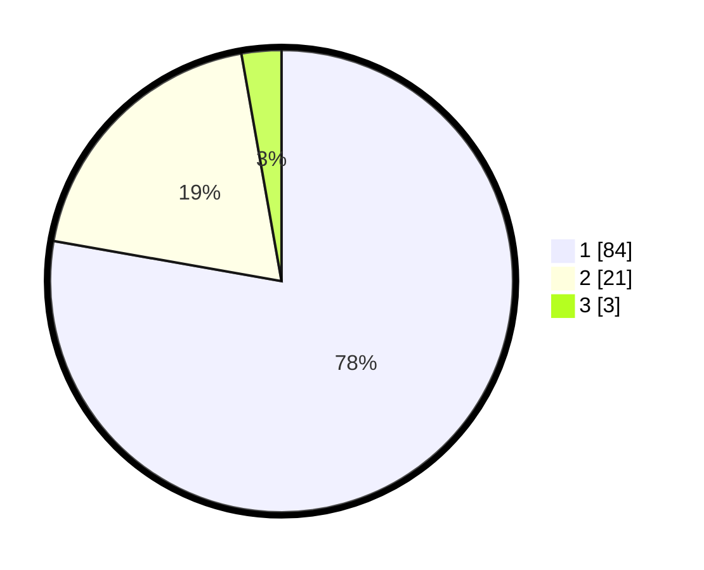

# Hasil

## Grafik

## Tabel

| No. | Nama Paslon    | Suara | Suara (raw) | Persentase |
|:--- |:-------------- | -----:| -----------:| ----------:|
| 1   | ANIES MUHAIMIN | 84    | [84][p-1]   | 77,78      |
| 2   | PRABOWO GIBRAN | 21    | [21][p-2]   | 19,44      |
| 3   | GANJAR MAHFUD  | 3     | [3][p-3]    | 2,78       |

[p-1]: https://github.com/gigit-pemilu/pemilu-2024-13-sumatera-barat/blob/main/pilpres/hitung-suara/sub/13-sumatera-barat/sub/05-padang-pariaman/sub/14-v-koto-timur/sub/2002-limau-puruik/sub/005-tps/sub/paslon-1.txt
[p-2]: https://github.com/gigit-pemilu/pemilu-2024-13-sumatera-barat/blob/main/pilpres/hitung-suara/sub/13-sumatera-barat/sub/05-padang-pariaman/sub/14-v-koto-timur/sub/2002-limau-puruik/sub/005-tps/sub/paslon-2.txt
[p-3]: https://github.com/gigit-pemilu/pemilu-2024-13-sumatera-barat/blob/main/pilpres/hitung-suara/sub/13-sumatera-barat/sub/05-padang-pariaman/sub/14-v-koto-timur/sub/2002-limau-puruik/sub/005-tps/sub/paslon-3.txt

## Foto C Plano

https://sirekap-obj-formc.kpu.go.id/377f/pemilu/ppwp/13/05/14/20/02/1305142002005-20240222-165912--d42ff93b-12cc-4144-ace8-3327c4d61fc1.jpg

https://sirekap-obj-formc.kpu.go.id/377f/pemilu/ppwp/13/05/14/20/02/1305142002005-20240222-170000--2a06f75f-2ea7-4cc0-8cb4-6ef4a4fb985b.jpg

https://sirekap-obj-formc.kpu.go.id/377f/pemilu/ppwp/13/05/14/20/02/1305142002005-20240222-170052--0964db9b-31da-4747-a399-1fa94712657c.jpg

## Metadata

| Key        | Value               |
| ---------- | ------------------- |
| Time Stamp | 2024-02-24 22:31:28 |

