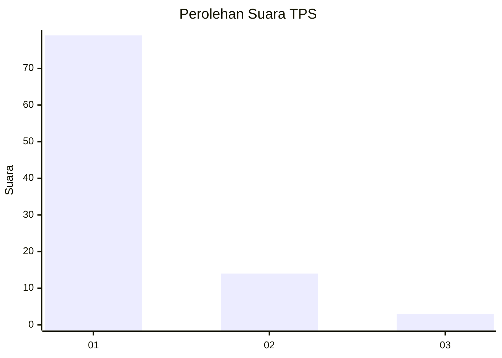
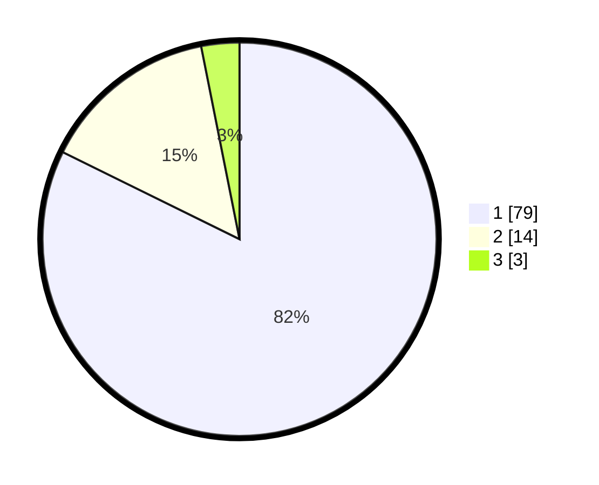

# Hasil

## Grafik

## Tabel

| No. | Nama Paslon    | Suara | Suara (raw) | Persentase |
|:--- |:-------------- | -----:| -----------:| ----------:|
| 1   | ANIES MUHAIMIN | 79    | [79][p-1]   | 82,29      |
| 2   | PRABOWO GIBRAN | 14    | [14][p-2]   | 14,58      |
| 3   | GANJAR MAHFUD  | 3     | [3][p-3]    | 3,13       |

[p-1]: https://github.com/gigit-pemilu/pemilu-2024-13-sumatera-barat/blob/main/pilpres/hitung-suara/sub/13-sumatera-barat/sub/05-padang-pariaman/sub/14-v-koto-timur/sub/2002-limau-puruik/sub/009-tps/sub/paslon-1.txt
[p-2]: https://github.com/gigit-pemilu/pemilu-2024-13-sumatera-barat/blob/main/pilpres/hitung-suara/sub/13-sumatera-barat/sub/05-padang-pariaman/sub/14-v-koto-timur/sub/2002-limau-puruik/sub/009-tps/sub/paslon-2.txt
[p-3]: https://github.com/gigit-pemilu/pemilu-2024-13-sumatera-barat/blob/main/pilpres/hitung-suara/sub/13-sumatera-barat/sub/05-padang-pariaman/sub/14-v-koto-timur/sub/2002-limau-puruik/sub/009-tps/sub/paslon-3.txt

## Foto C Plano

https://sirekap-obj-formc.kpu.go.id/6f8f/pemilu/ppwp/13/05/14/20/02/1305142002009-20240221-203638--c84c399e-0281-4777-bf2c-944abd7a3efe.jpg

https://sirekap-obj-formc.kpu.go.id/6f8f/pemilu/ppwp/13/05/14/20/02/1305142002009-20240221-203701--2cacf0e6-4056-4075-8225-0945e56bcbc1.jpg

https://sirekap-obj-formc.kpu.go.id/6f8f/pemilu/ppwp/13/05/14/20/02/1305142002009-20240221-203715--3109af70-e751-4993-8759-30e40b7b5f36.jpg

## Metadata

| Key        | Value               |
| ---------- | ------------------- |
| Time Stamp | 2024-02-25 16:00:00 |

