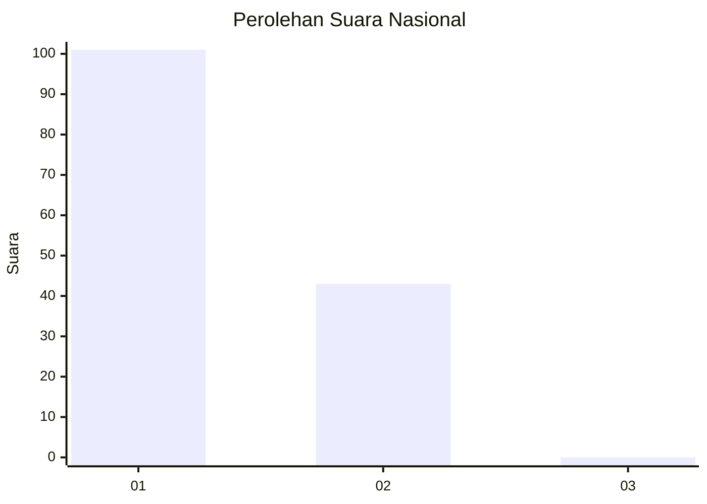
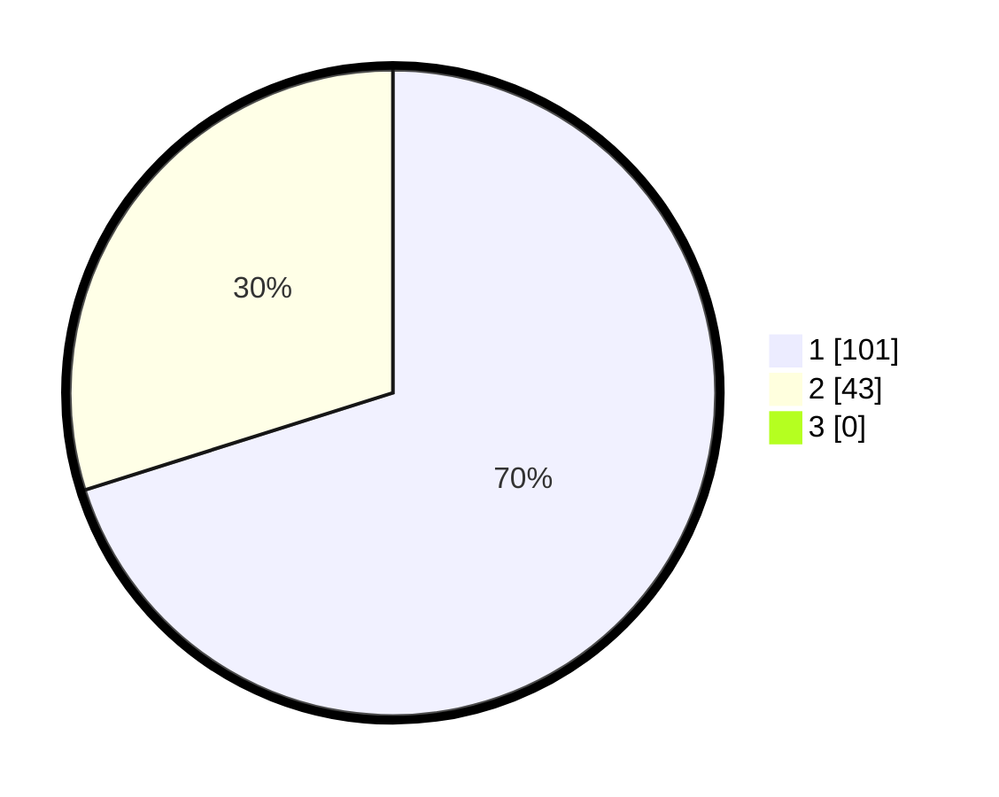

# Hasil

## Grafik

## Tabel

| No. | Nama Paslon    | Suara | Suara (raw) | Persentase |
|:--- |:-------------- | -----:| -----------:| ----------:|
| 1   | ANIES MUHAIMIN | 101   | [101][p-1]  | 70,14      |
| 2   | PRABOWO GIBRAN | 43    | [43][p-2]   | 29,86      |
| 3   | GANJAR MAHFUD  | 0     | [0][p-3]    | 0,00       |

[p-1]: https://github.com/gigit-pemilu/pemilu-2024/blob/main/pilpres/hitung-suara/sub/13-sumatera-barat/sub/05-padang-pariaman/sub/14-v-koto-timur/sub/2002-limau-puruik/sub/010-tps/sub/paslon-1.txt
[p-2]: https://github.com/gigit-pemilu/pemilu-2024/blob/main/pilpres/hitung-suara/sub/13-sumatera-barat/sub/05-padang-pariaman/sub/14-v-koto-timur/sub/2002-limau-puruik/sub/010-tps/sub/paslon-2.txt
[p-3]: https://github.com/gigit-pemilu/pemilu-2024/blob/main/pilpres/hitung-suara/sub/13-sumatera-barat/sub/05-padang-pariaman/sub/14-v-koto-timur/sub/2002-limau-puruik/sub/010-tps/sub/paslon-3.txt

## Foto C Plano

https://sirekap-obj-formc.kpu.go.id/e60d/pemilu/ppwp/13/05/14/20/02/1305142002010-20240227-195203--853be89f-b792-449c-a2df-33b24b35f3e6.jpg

https://sirekap-obj-formc.kpu.go.id/e60d/pemilu/ppwp/13/05/14/20/02/1305142002010-20240221-180819--ba69a079-62c8-4cfe-a462-be6ba958808b.jpg

https://sirekap-obj-formc.kpu.go.id/e60d/pemilu/ppwp/13/05/14/20/02/1305142002010-20240221-181001--957a8e54-b9ce-4c23-8ed1-617128eac977.jpg

## Metadata

| Key        | Value               |
| ---------- | ------------------- |
| Time Stamp | 2024-02-27 20:00:00 |

