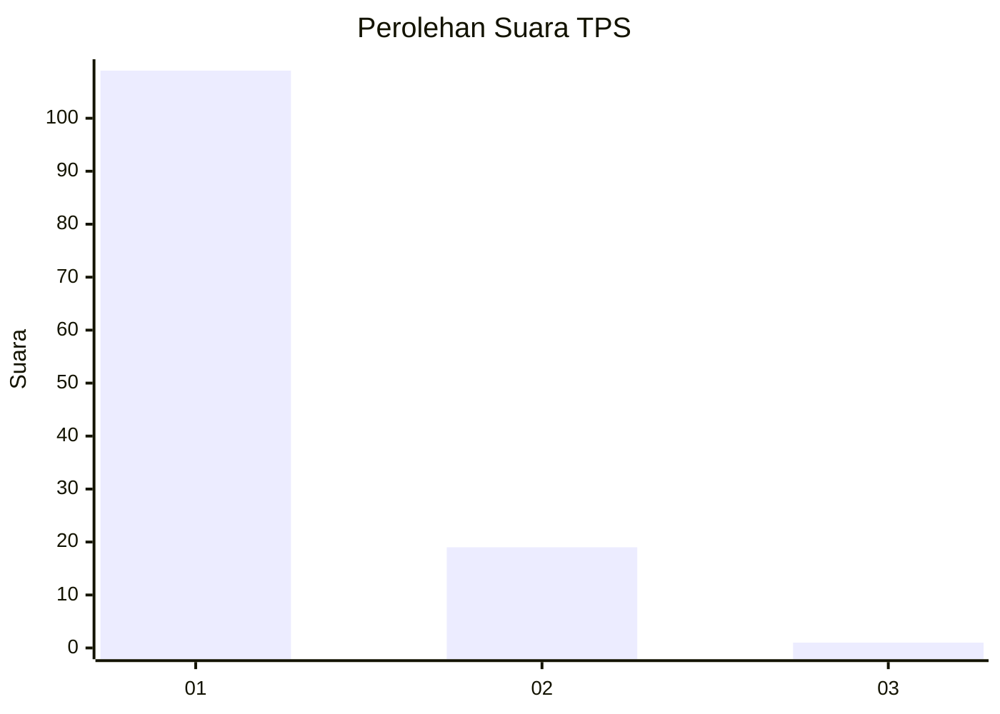
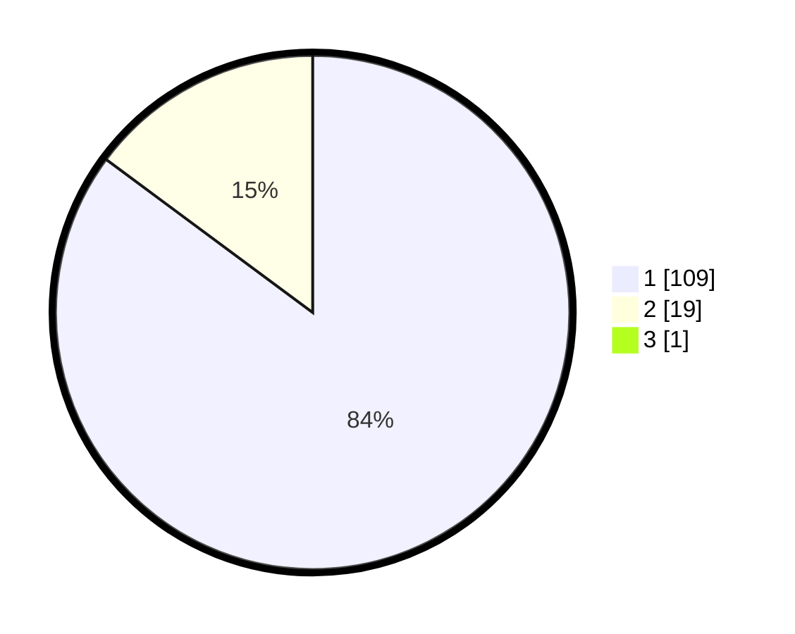

# Hasil

## Grafik

## Tabel

| No. | Nama Paslon    | Suara | Suara (raw) | Persentase |
|:--- |:-------------- | -----:| -----------:| ----------:|
| 1   | ANIES MUHAIMIN | 109   | [109][p-1]  | 84,50      |
| 2   | PRABOWO GIBRAN | 19    | [19][p-2]   | 14,73      |
| 3   | GANJAR MAHFUD  | 1     | [1][p-3]    | 0,78       |

[p-1]: https://github.com/gigit-pemilu/pemilu-2024-13-sumatera-barat/blob/main/pilpres/hitung-suara/sub/13-sumatera-barat/sub/05-padang-pariaman/sub/14-v-koto-timur/sub/2003-gunung-padang-alai/sub/003-tps/sub/paslon-1.txt
[p-2]: https://github.com/gigit-pemilu/pemilu-2024-13-sumatera-barat/blob/main/pilpres/hitung-suara/sub/13-sumatera-barat/sub/05-padang-pariaman/sub/14-v-koto-timur/sub/2003-gunung-padang-alai/sub/003-tps/sub/paslon-2.txt
[p-3]: https://github.com/gigit-pemilu/pemilu-2024-13-sumatera-barat/blob/main/pilpres/hitung-suara/sub/13-sumatera-barat/sub/05-padang-pariaman/sub/14-v-koto-timur/sub/2003-gunung-padang-alai/sub/003-tps/sub/paslon-3.txt

## Foto C Plano

https://sirekap-obj-formc.kpu.go.id/3d62/pemilu/ppwp/13/05/14/20/03/1305142003003-20240218-165300--418a73db-1e42-485e-af8e-23fd2e17a731.jpg

https://sirekap-obj-formc.kpu.go.id/3d62/pemilu/ppwp/13/05/14/20/03/1305142003003-20240218-165343--29e446dd-fb0a-44f9-a5ee-cc8ffaa2ea4f.jpg

https://sirekap-obj-formc.kpu.go.id/3d62/pemilu/ppwp/13/05/14/20/03/1305142003003-20240218-165424--22ef35af-3cc5-49f2-96ea-7536b7447afe.jpg

## Metadata

| Key        | Value               |
| ---------- | ------------------- |
| Time Stamp | 2024-02-25 22:00:00 |

