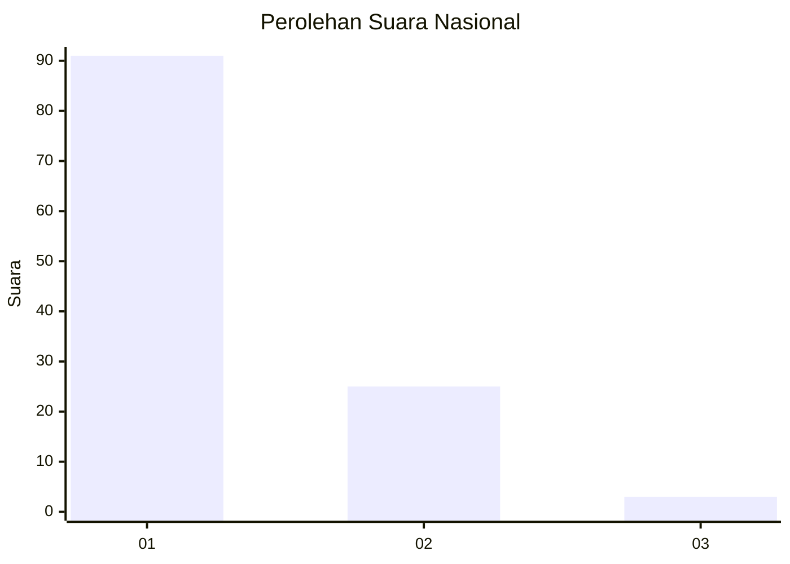
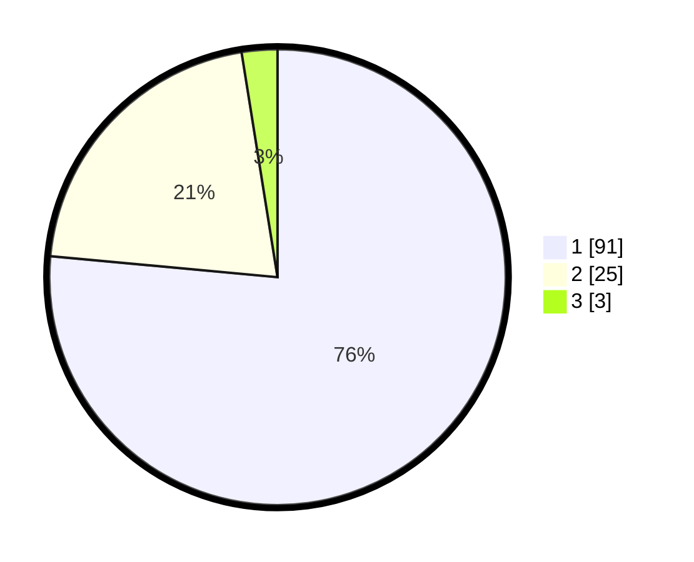

# Hasil

## Grafik

## Tabel

| No. | Nama Paslon    | Suara | Suara (raw) | Persentase |
|:--- |:-------------- | -----:| -----------:| ----------:|
| 1   | ANIES MUHAIMIN | 91    | [91][p-1]   | 76,47      |
| 2   | PRABOWO GIBRAN | 25    | [25][p-2]   | 21,01      |
| 3   | GANJAR MAHFUD  | 3     | [3][p-3]    | 2,52       |

[p-1]: https://github.com/gigit-pemilu/pemilu-2024/blob/main/pilpres/hitung-suara/sub/13-sumatera-barat/sub/05-padang-pariaman/sub/14-v-koto-timur/sub/2003-gunung-padang-alai/sub/015-tps/sub/paslon-1.txt
[p-2]: https://github.com/gigit-pemilu/pemilu-2024/blob/main/pilpres/hitung-suara/sub/13-sumatera-barat/sub/05-padang-pariaman/sub/14-v-koto-timur/sub/2003-gunung-padang-alai/sub/015-tps/sub/paslon-2.txt
[p-3]: https://github.com/gigit-pemilu/pemilu-2024/blob/main/pilpres/hitung-suara/sub/13-sumatera-barat/sub/05-padang-pariaman/sub/14-v-koto-timur/sub/2003-gunung-padang-alai/sub/015-tps/sub/paslon-3.txt

## Foto C Plano

https://sirekap-obj-formc.kpu.go.id/ea7f/pemilu/ppwp/13/05/14/20/03/1305142003015-20240222-160550--739bb315-b5b0-4146-9d90-2cc979dff1dc.jpg

https://sirekap-obj-formc.kpu.go.id/ea7f/pemilu/ppwp/13/05/14/20/03/1305142003015-20240222-160610--732bf4c5-f2d4-4385-9856-91c8621f9475.jpg

https://sirekap-obj-formc.kpu.go.id/ea7f/pemilu/ppwp/13/05/14/20/03/1305142003015-20240222-160637--2166347a-804b-4286-a295-013cecec35e8.jpg

## Metadata

| Key        | Value               |
| ---------- | ------------------- |
| Time Stamp | 2024-02-25 15:00:00 |

