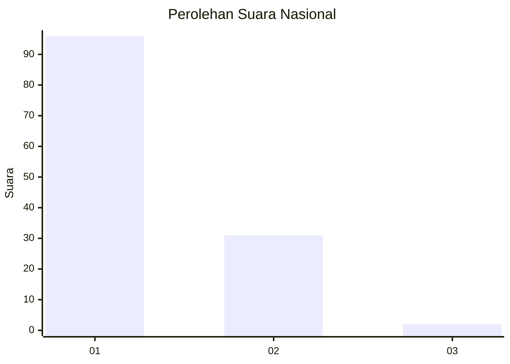
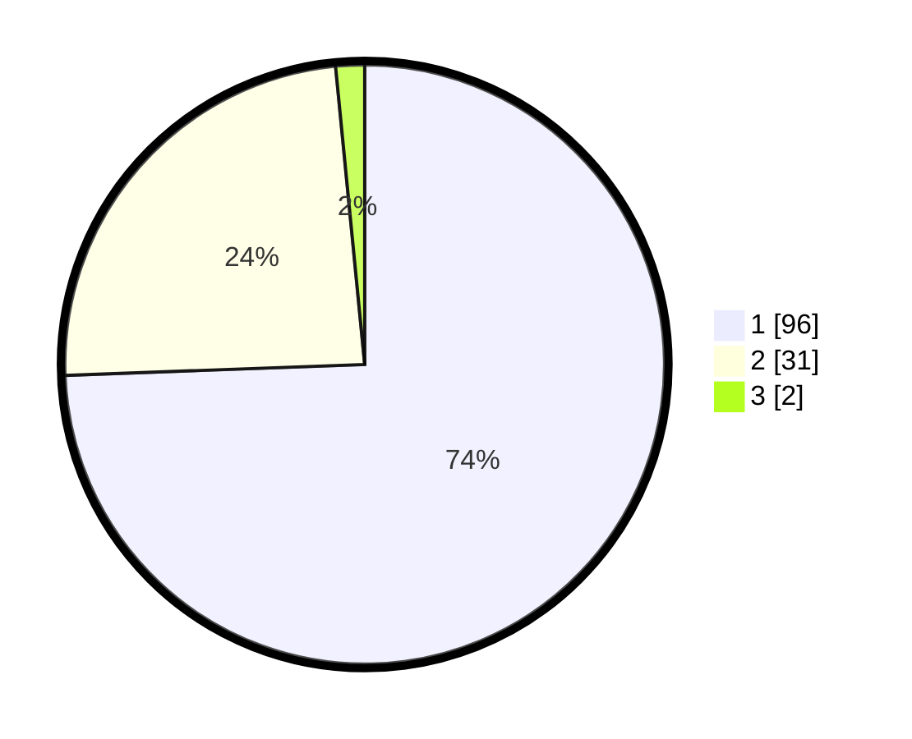

# Hasil

## Grafik

## Tabel

| No. | Nama Paslon    | Suara | Suara (raw) | Persentase |
|:--- |:-------------- | -----:| -----------:| ----------:|
| 1   | ANIES MUHAIMIN | 96    | [96][p-1]   | 74,42      |
| 2   | PRABOWO GIBRAN | 31    | [31][p-2]   | 24,03      |
| 3   | GANJAR MAHFUD  | 2     | [2][p-3]    | 1,55       |

[p-1]: https://github.com/gigit-pemilu/pemilu-2024/blob/main/pilpres/hitung-suara/sub/13-sumatera-barat/sub/05-padang-pariaman/sub/14-v-koto-timur/sub/2003-gunung-padang-alai/sub/016-tps/sub/paslon-1.txt
[p-2]: https://github.com/gigit-pemilu/pemilu-2024/blob/main/pilpres/hitung-suara/sub/13-sumatera-barat/sub/05-padang-pariaman/sub/14-v-koto-timur/sub/2003-gunung-padang-alai/sub/016-tps/sub/paslon-2.txt
[p-3]: https://github.com/gigit-pemilu/pemilu-2024/blob/main/pilpres/hitung-suara/sub/13-sumatera-barat/sub/05-padang-pariaman/sub/14-v-koto-timur/sub/2003-gunung-padang-alai/sub/016-tps/sub/paslon-3.txt

## Foto C Plano

https://sirekap-obj-formc.kpu.go.id/4a2e/pemilu/ppwp/13/05/14/20/03/1305142003016-20240215-030248--a80970d2-4a29-4a23-b7bc-a49e21e93f70.jpg

https://sirekap-obj-formc.kpu.go.id/4a2e/pemilu/ppwp/13/05/14/20/03/1305142003016-20240222-150836--de60d9f6-d45c-4cf6-b245-d4c2bed5f5ac.jpg

https://sirekap-obj-formc.kpu.go.id/4a2e/pemilu/ppwp/13/05/14/20/03/1305142003016-20240222-150855--5c4a8eed-833f-41b2-a995-8e5cc2303263.jpg

## Metadata

| Key        | Value               |
| ---------- | ------------------- |
| Time Stamp | 2024-02-25 16:00:00 |

