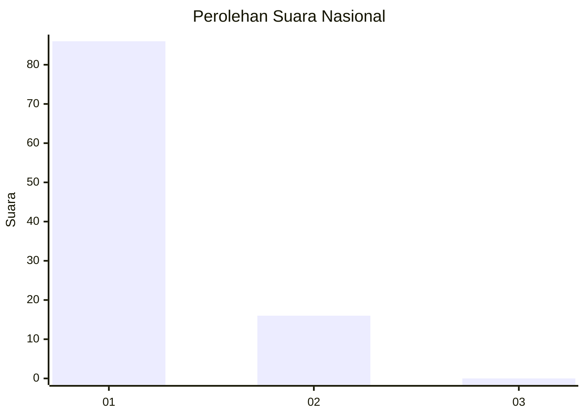
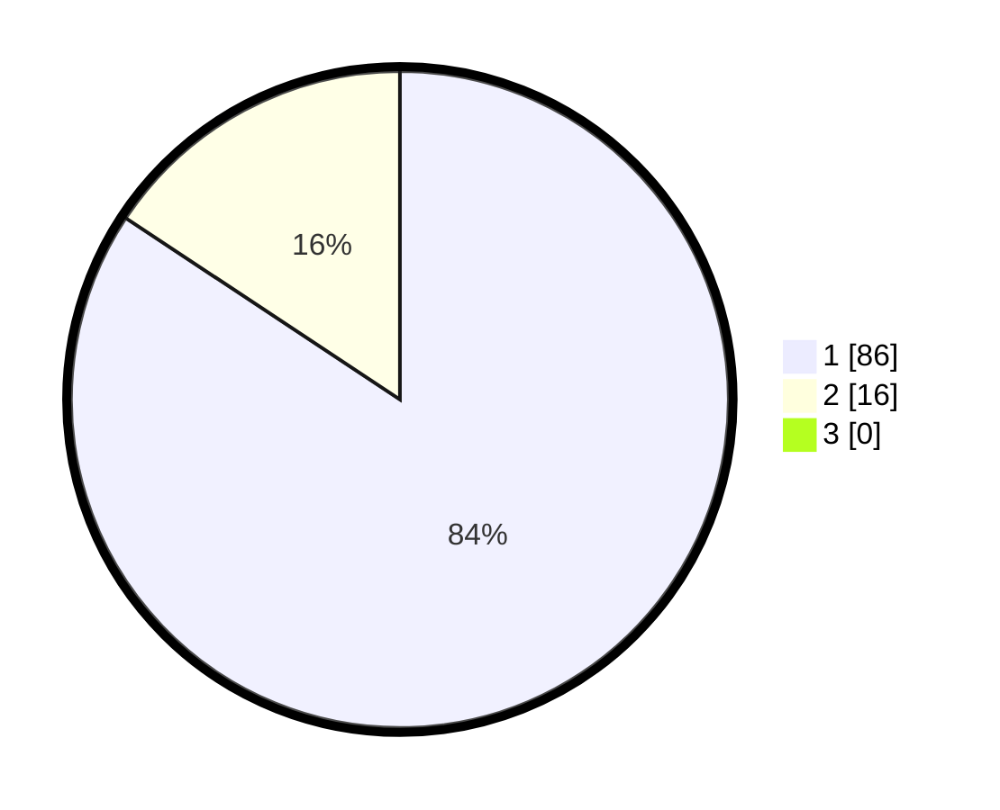

# Hasil

## Grafik

## Tabel

| No. | Nama Paslon    | Suara | Suara (raw) | Persentase |
|:--- |:-------------- | -----:| -----------:| ----------:|
| 1   | ANIES MUHAIMIN | 86    | [86][p-1]   | 84,31      |
| 2   | PRABOWO GIBRAN | 16    | [16][p-2]   | 15,69      |
| 3   | GANJAR MAHFUD  | 0     | [0][p-3]    | 0,00       |

[p-1]: https://github.com/gigit-pemilu/pemilu-2024/blob/main/pilpres/hitung-suara/sub/13-sumatera-barat/sub/05-padang-pariaman/sub/14-v-koto-timur/sub/2003-gunung-padang-alai/sub/017-tps/sub/paslon-1.txt
[p-2]: https://github.com/gigit-pemilu/pemilu-2024/blob/main/pilpres/hitung-suara/sub/13-sumatera-barat/sub/05-padang-pariaman/sub/14-v-koto-timur/sub/2003-gunung-padang-alai/sub/017-tps/sub/paslon-2.txt
[p-3]: https://github.com/gigit-pemilu/pemilu-2024/blob/main/pilpres/hitung-suara/sub/13-sumatera-barat/sub/05-padang-pariaman/sub/14-v-koto-timur/sub/2003-gunung-padang-alai/sub/017-tps/sub/paslon-3.txt

## Foto C Plano

https://sirekap-obj-formc.kpu.go.id/300a/pemilu/ppwp/13/05/14/20/03/1305142003017-20240222-190552--6f5146c6-6ca6-4cc6-b764-dd9f445b760d.jpg

https://sirekap-obj-formc.kpu.go.id/300a/pemilu/ppwp/13/05/14/20/03/1305142003017-20240222-190611--e1890738-9179-4f8a-b3b3-5ccf1edf49f7.jpg

https://sirekap-obj-formc.kpu.go.id/300a/pemilu/ppwp/13/05/14/20/03/1305142003017-20240222-190628--a626b1bf-0197-4a88-8ace-d9b9393b2b64.jpg

## Metadata

| Key        | Value               |
| ---------- | ------------------- |
| Time Stamp | 2024-02-24 22:31:28 |

