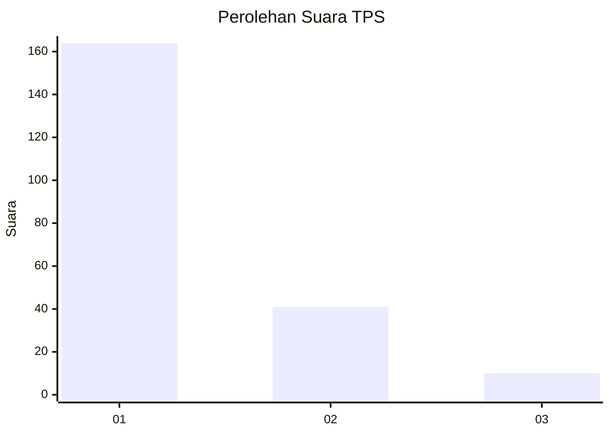
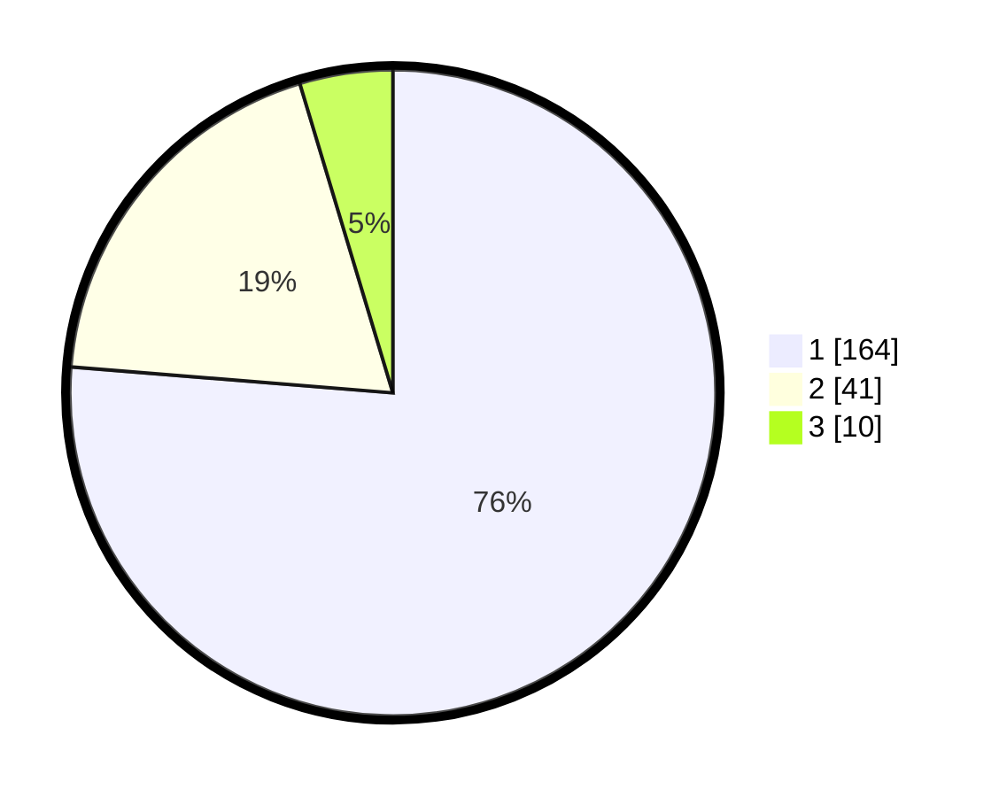

# Hasil

## Grafik

## Tabel

| No. | Nama Paslon    | Suara | Suara (raw) | Persentase |
|:--- |:-------------- | -----:| -----------:| ----------:|
| 1   | ANIES MUHAIMIN | 164   | [164][p-1]  | 76,28      |
| 2   | PRABOWO GIBRAN | 41    | [41][p-2]   | 19,07      |
| 3   | GANJAR MAHFUD  | 10    | [10][p-3]   | 4,65       |

[p-1]: https://github.com/gigit-pemilu/pemilu-2024-13-sumatera-barat/blob/main/pilpres/hitung-suara/sub/13-sumatera-barat/sub/05-padang-pariaman/sub/14-v-koto-timur/sub/2004-kudu-gantiang-barat/sub/001-tps/sub/paslon-1.txt
[p-2]: https://github.com/gigit-pemilu/pemilu-2024-13-sumatera-barat/blob/main/pilpres/hitung-suara/sub/13-sumatera-barat/sub/05-padang-pariaman/sub/14-v-koto-timur/sub/2004-kudu-gantiang-barat/sub/001-tps/sub/paslon-2.txt
[p-3]: https://github.com/gigit-pemilu/pemilu-2024-13-sumatera-barat/blob/main/pilpres/hitung-suara/sub/13-sumatera-barat/sub/05-padang-pariaman/sub/14-v-koto-timur/sub/2004-kudu-gantiang-barat/sub/001-tps/sub/paslon-3.txt

## Foto C Plano

https://sirekap-obj-formc.kpu.go.id/d0fd/pemilu/ppwp/13/05/14/20/04/1305142004001-20240219-221848--cb9d3426-3c7c-4a50-a1b9-0ea9aa97a750.jpg

https://sirekap-obj-formc.kpu.go.id/d0fd/pemilu/ppwp/13/05/14/20/04/1305142004001-20240214-222243--f68f6c7a-22e6-4be4-a054-64ceb3e59fd6.jpg

https://sirekap-obj-formc.kpu.go.id/d0fd/pemilu/ppwp/13/05/14/20/04/1305142004001-20240219-222009--2d1f23e4-0d87-49e2-981a-dcaf4661c98b.jpg

## Metadata

| Key        | Value               |
| ---------- | ------------------- |
| Time Stamp | 2024-02-19 23:00:00 |

