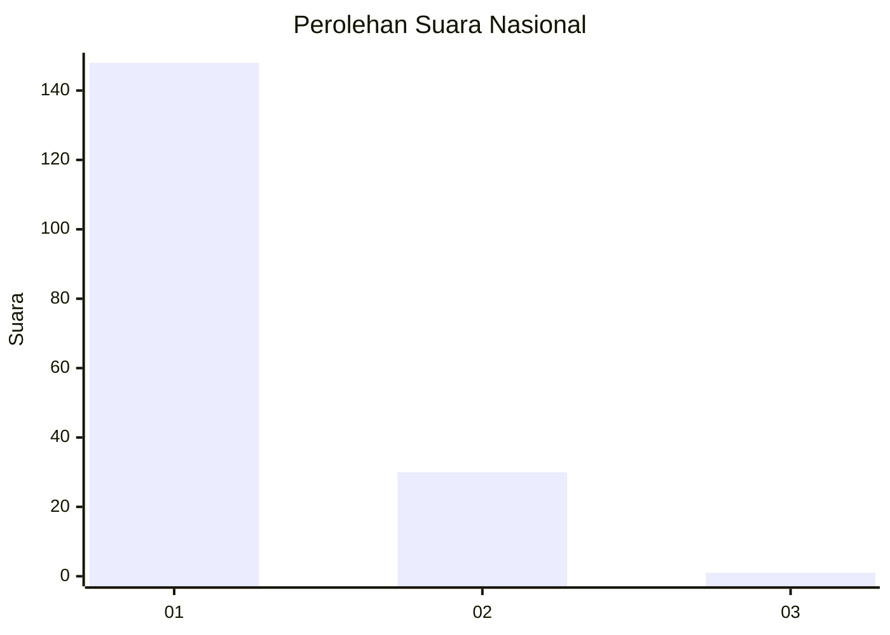
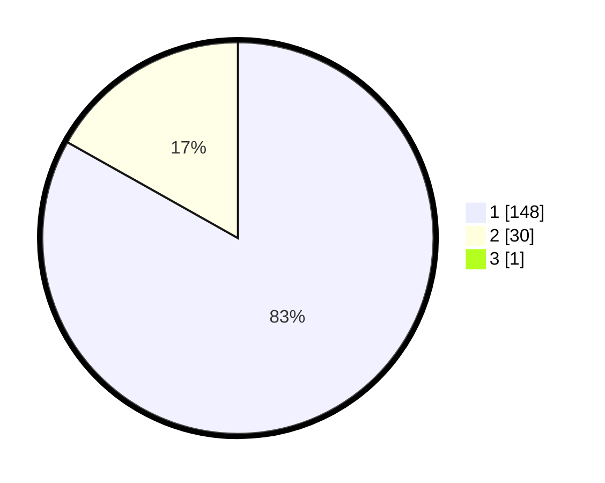

# Hasil

## Grafik

## Tabel

| No. | Nama Paslon    | Suara | Suara (raw) | Persentase |
|:--- |:-------------- | -----:| -----------:| ----------:|
| 1   | ANIES MUHAIMIN | 148   | [148][p-1]  | 82,68      |
| 2   | PRABOWO GIBRAN | 30    | [30][p-2]   | 16,76      |
| 3   | GANJAR MAHFUD  | 1     | [1][p-3]    | 0,56       |

[p-1]: https://github.com/gigit-pemilu/pemilu-2024/blob/main/pilpres/hitung-suara/sub/13-sumatera-barat/sub/05-padang-pariaman/sub/14-v-koto-timur/sub/2004-kudu-gantiang-barat/sub/003-tps/sub/paslon-1.txt
[p-2]: https://github.com/gigit-pemilu/pemilu-2024/blob/main/pilpres/hitung-suara/sub/13-sumatera-barat/sub/05-padang-pariaman/sub/14-v-koto-timur/sub/2004-kudu-gantiang-barat/sub/003-tps/sub/paslon-2.txt
[p-3]: https://github.com/gigit-pemilu/pemilu-2024/blob/main/pilpres/hitung-suara/sub/13-sumatera-barat/sub/05-padang-pariaman/sub/14-v-koto-timur/sub/2004-kudu-gantiang-barat/sub/003-tps/sub/paslon-3.txt

## Foto C Plano

https://sirekap-obj-formc.kpu.go.id/1200/pemilu/ppwp/13/05/14/20/04/1305142004003-20240219-183211--0701261b-13d3-4c1d-b63c-0bf5adcd18aa.jpg

https://sirekap-obj-formc.kpu.go.id/1200/pemilu/ppwp/13/05/14/20/04/1305142004003-20240219-183257--5550ede9-9683-4303-ae56-d2665bbb1c5a.jpg

https://sirekap-obj-formc.kpu.go.id/1200/pemilu/ppwp/13/05/14/20/04/1305142004003-20240219-183334--c8f8bf23-1fc0-4589-9c84-68fd63ef28cc.jpg

## Metadata

| Key        | Value               |
| ---------- | ------------------- |
| Time Stamp | 2024-02-25 12:00:00 |

