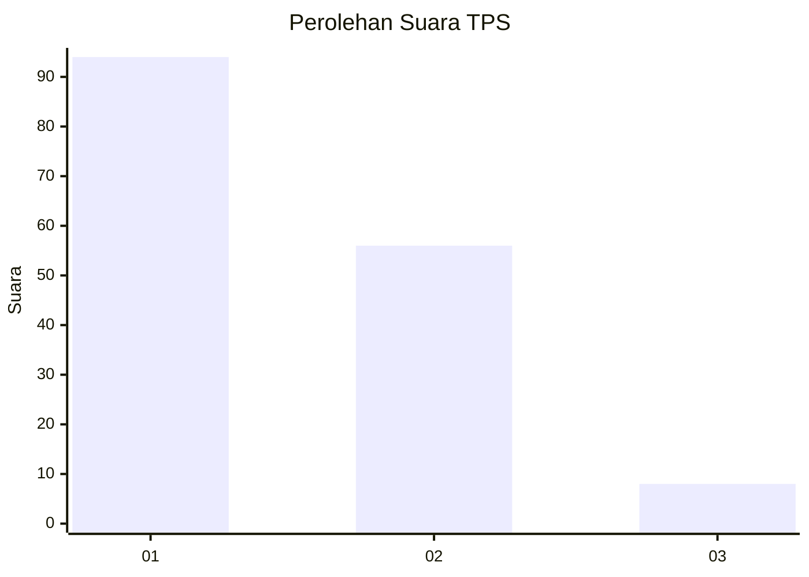
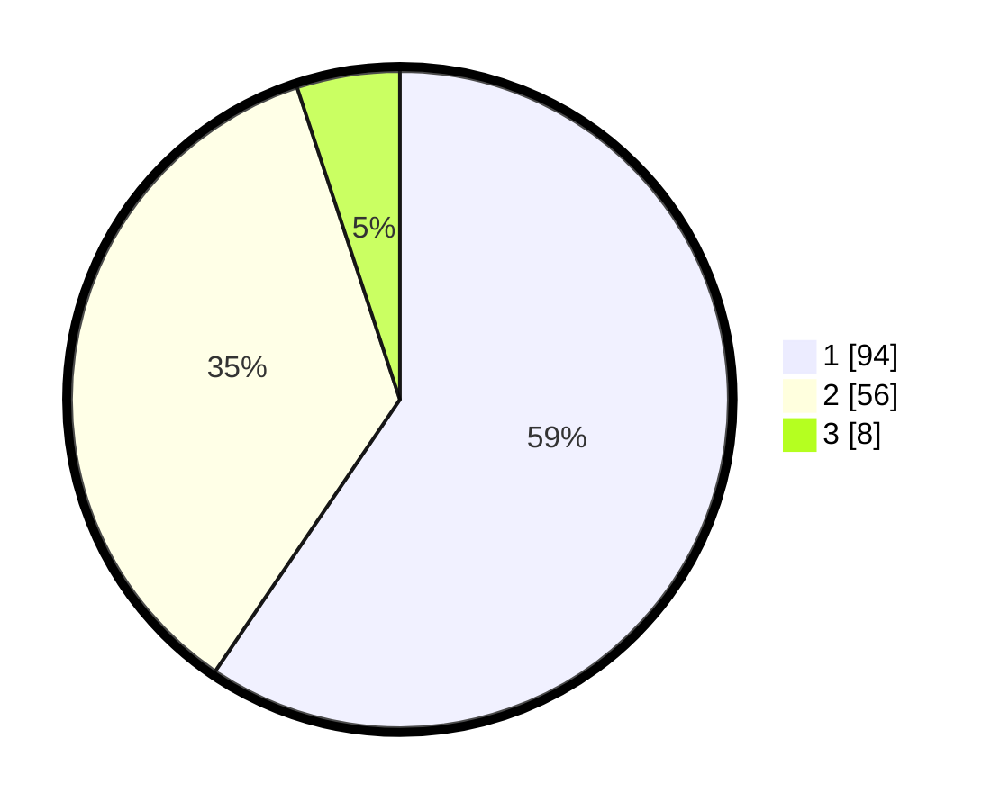

# Hasil

## Grafik

## Tabel

| No. | Nama Paslon    | Suara | Suara (raw) | Persentase |
|:--- |:-------------- | -----:| -----------:| ----------:|
| 1   | ANIES MUHAIMIN | 94    | [94][p-1]   | 59,49      |
| 2   | PRABOWO GIBRAN | 56    | [56][p-2]   | 35,44      |
| 3   | GANJAR MAHFUD  | 8     | [8][p-3]    | 5,06       |

[p-1]: https://github.com/gigit-pemilu/pemilu-2024-13-sumatera-barat/blob/main/pilpres/hitung-suara/sub/13-sumatera-barat/sub/05-padang-pariaman/sub/15-2-x-11-kayu-tanam/sub/2001-kayu-tanam/sub/006-tps/sub/paslon-1.txt
[p-2]: https://github.com/gigit-pemilu/pemilu-2024-13-sumatera-barat/blob/main/pilpres/hitung-suara/sub/13-sumatera-barat/sub/05-padang-pariaman/sub/15-2-x-11-kayu-tanam/sub/2001-kayu-tanam/sub/006-tps/sub/paslon-2.txt
[p-3]: https://github.com/gigit-pemilu/pemilu-2024-13-sumatera-barat/blob/main/pilpres/hitung-suara/sub/13-sumatera-barat/sub/05-padang-pariaman/sub/15-2-x-11-kayu-tanam/sub/2001-kayu-tanam/sub/006-tps/sub/paslon-3.txt

## Foto C Plano

https://sirekap-obj-formc.kpu.go.id/94ba/pemilu/ppwp/13/05/15/20/01/1305152001006-20240222-121028--237b4a87-22fe-4b7f-a7ab-214cac341775.jpg

https://sirekap-obj-formc.kpu.go.id/94ba/pemilu/ppwp/13/05/15/20/01/1305152001006-20240222-121117--cf2fdef9-fe77-4067-b803-e4d242786b0f.jpg

https://sirekap-obj-formc.kpu.go.id/94ba/pemilu/ppwp/13/05/15/20/01/1305152001006-20240222-121305--d1dee19e-f0fb-4b7a-ac9b-3d295f4f8427.jpg

## Metadata

| Key        | Value               |
| ---------- | ------------------- |
| Time Stamp | 2024-02-24 22:31:28 |

