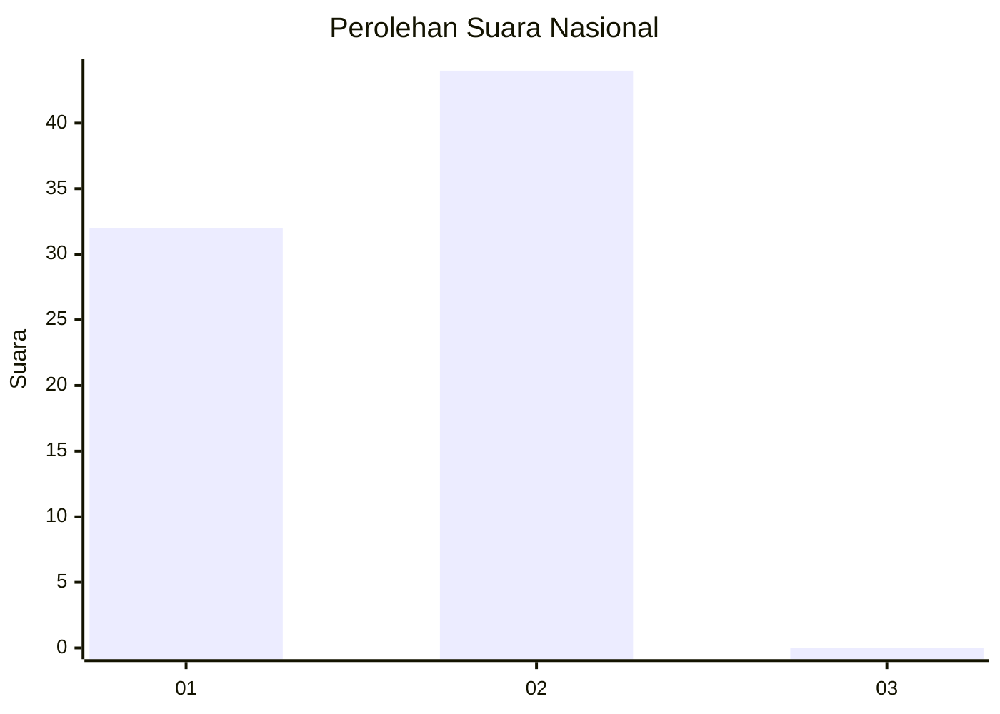
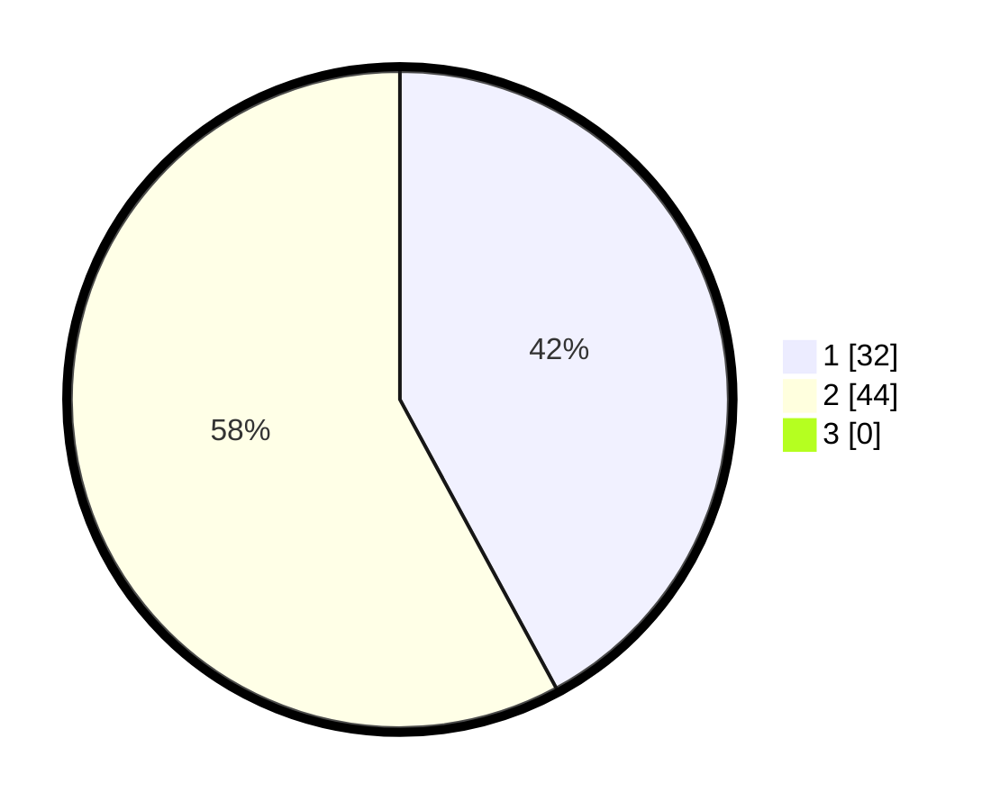

# Hasil

## Grafik

## Tabel

| No. | Nama Paslon    | Suara | Suara (raw) | Persentase |
|:--- |:-------------- | -----:| -----------:| ----------:|
| 1   | ANIES MUHAIMIN | 32    | [32][p-1]   | 42,11      |
| 2   | PRABOWO GIBRAN | 44    | [44][p-2]   | 57,89      |
| 3   | GANJAR MAHFUD  | 0     | [0][p-3]    | 0,00       |

[p-1]: https://github.com/gigit-pemilu/pemilu-2024/blob/main/pilpres/hitung-suara/sub/13-sumatera-barat/sub/06-agam/sub/01-tanjung-mutiara/sub/2001-tiku-selatan/sub/007-tps/sub/paslon-1.txt
[p-2]: https://github.com/gigit-pemilu/pemilu-2024/blob/main/pilpres/hitung-suara/sub/13-sumatera-barat/sub/06-agam/sub/01-tanjung-mutiara/sub/2001-tiku-selatan/sub/007-tps/sub/paslon-2.txt
[p-3]: https://github.com/gigit-pemilu/pemilu-2024/blob/main/pilpres/hitung-suara/sub/13-sumatera-barat/sub/06-agam/sub/01-tanjung-mutiara/sub/2001-tiku-selatan/sub/007-tps/sub/paslon-3.txt

## Foto C Plano

https://sirekap-obj-formc.kpu.go.id/fff6/pemilu/ppwp/13/06/01/20/01/1306012001007-20240215-093447--3d8f79fb-3dd1-412d-a2ec-84e237d22179.jpg

https://sirekap-obj-formc.kpu.go.id/fff6/pemilu/ppwp/13/06/01/20/01/1306012001007-20240215-093501--ff662bef-f30c-4c66-a7da-313fe82bf7aa.jpg

https://sirekap-obj-formc.kpu.go.id/fff6/pemilu/ppwp/13/06/01/20/01/1306012001007-20240215-093516--df0950e2-df1b-44db-970c-8720878bb08b.jpg

## Metadata

| Key        | Value               |
| ---------- | ------------------- |
| Time Stamp | 2024-02-25 12:00:00 |

