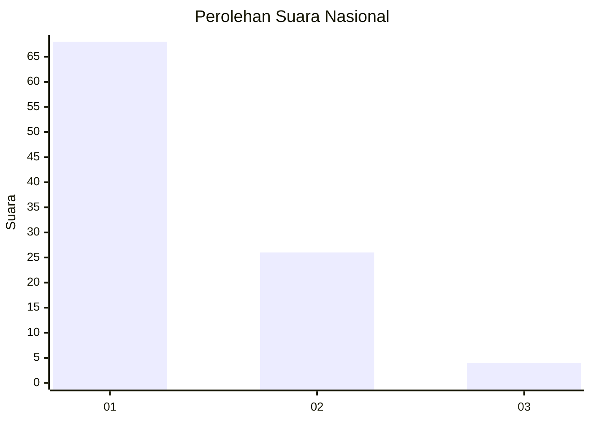
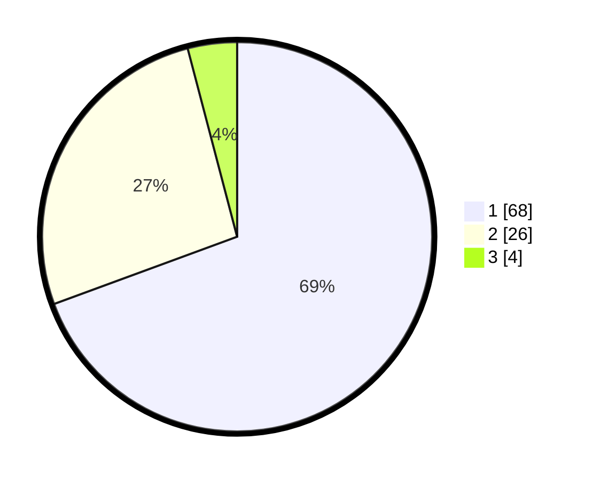

# Hasil

## Grafik

## Tabel

| No. | Nama Paslon    | Suara | Suara (raw) | Persentase |
|:--- |:-------------- | -----:| -----------:| ----------:|
| 1   | ANIES MUHAIMIN | 68    | [68][p-1]   | 69,39      |
| 2   | PRABOWO GIBRAN | 26    | [26][p-2]   | 26,53      |
| 3   | GANJAR MAHFUD  | 4     | [4][p-3]    | 4,08       |

[p-1]: https://github.com/gigit-pemilu/pemilu-2024/blob/main/pilpres/hitung-suara/sub/13-sumatera-barat/sub/06-agam/sub/01-tanjung-mutiara/sub/2001-tiku-selatan/sub/025-tps/sub/paslon-1.txt
[p-2]: https://github.com/gigit-pemilu/pemilu-2024/blob/main/pilpres/hitung-suara/sub/13-sumatera-barat/sub/06-agam/sub/01-tanjung-mutiara/sub/2001-tiku-selatan/sub/025-tps/sub/paslon-2.txt
[p-3]: https://github.com/gigit-pemilu/pemilu-2024/blob/main/pilpres/hitung-suara/sub/13-sumatera-barat/sub/06-agam/sub/01-tanjung-mutiara/sub/2001-tiku-selatan/sub/025-tps/sub/paslon-3.txt

## Foto C Plano

https://sirekap-obj-formc.kpu.go.id/fc57/pemilu/ppwp/13/06/01/20/01/1306012001025-20240215-020138--c6623812-a59b-471b-915e-5a3ba2404a59.jpg

https://sirekap-obj-formc.kpu.go.id/fc57/pemilu/ppwp/13/06/01/20/01/1306012001025-20240215-020157--4ad4c33a-551b-48c3-9b04-dee86209b718.jpg

https://sirekap-obj-formc.kpu.go.id/fc57/pemilu/ppwp/13/06/01/20/01/1306012001025-20240215-020203--a3954042-12a9-4128-be56-6043b8cf7cd9.jpg

## Metadata

| Key        | Value               |
| ---------- | ------------------- |
| Time Stamp | 2024-02-15 09:00:24 |

