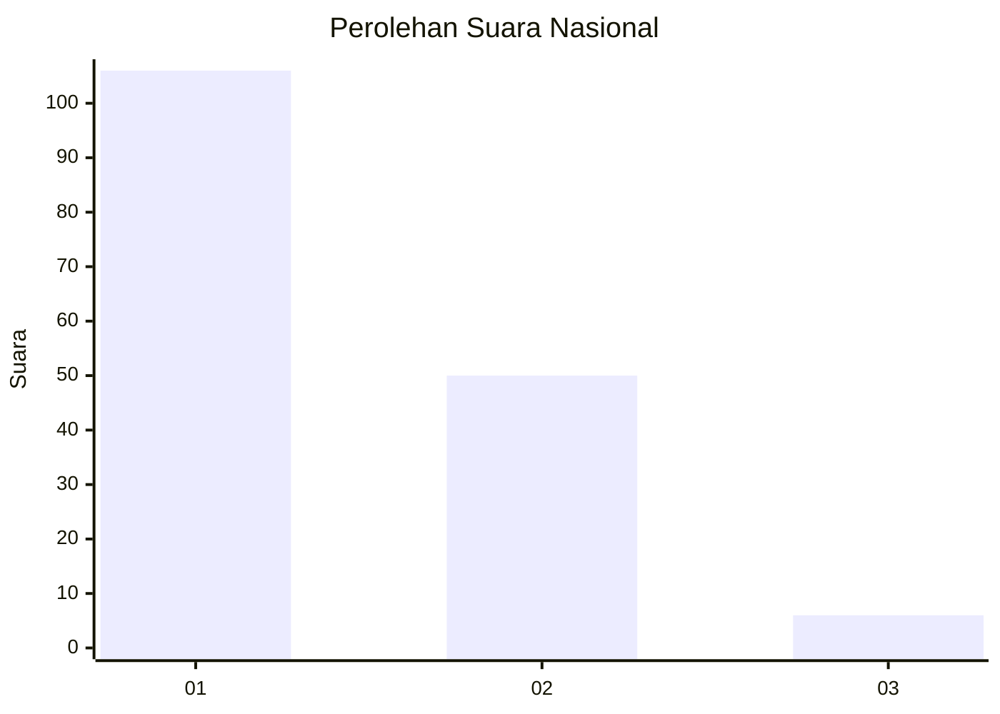
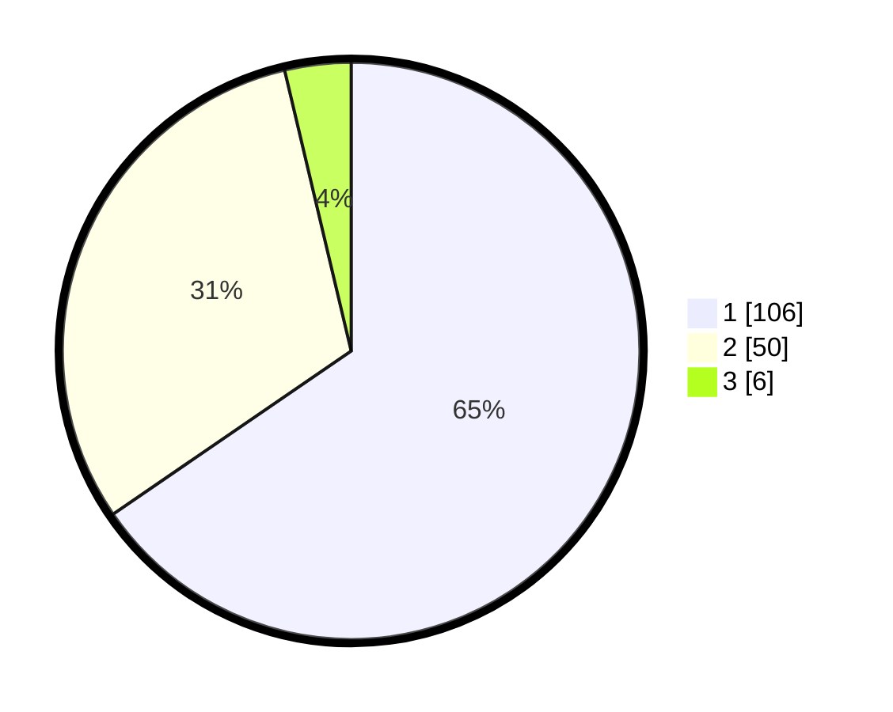

# Hasil

## Grafik

## Tabel

| No. | Nama Paslon    | Suara | Suara (raw) | Persentase |
|:--- |:-------------- | -----:| -----------:| ----------:|
| 1   | ANIES MUHAIMIN | 106   | [106][p-1]  | 65,43      |
| 2   | PRABOWO GIBRAN | 50    | [50][p-2]   | 30,86      |
| 3   | GANJAR MAHFUD  | 6     | [6][p-3]    | 3,70       |

[p-1]: https://github.com/gigit-pemilu/pemilu-2024/blob/main/pilpres/hitung-suara/sub/13-sumatera-barat/sub/06-agam/sub/01-tanjung-mutiara/sub/2001-tiku-selatan/sub/027-tps/sub/paslon-1.txt
[p-2]: https://github.com/gigit-pemilu/pemilu-2024/blob/main/pilpres/hitung-suara/sub/13-sumatera-barat/sub/06-agam/sub/01-tanjung-mutiara/sub/2001-tiku-selatan/sub/027-tps/sub/paslon-2.txt
[p-3]: https://github.com/gigit-pemilu/pemilu-2024/blob/main/pilpres/hitung-suara/sub/13-sumatera-barat/sub/06-agam/sub/01-tanjung-mutiara/sub/2001-tiku-selatan/sub/027-tps/sub/paslon-3.txt

## Foto C Plano

https://sirekap-obj-formc.kpu.go.id/e11a/pemilu/ppwp/13/06/01/20/01/1306012001027-20240214-211730--e5d6fb5f-9fad-4b6e-a380-6d881496cea9.jpg

https://sirekap-obj-formc.kpu.go.id/e11a/pemilu/ppwp/13/06/01/20/01/1306012001027-20240214-204539--64645717-b4bc-47ba-a290-861090e53fac.jpg

https://sirekap-obj-formc.kpu.go.id/e11a/pemilu/ppwp/13/06/01/20/01/1306012001027-20240214-204544--01e8a02e-a020-407f-a7f2-1921e94fd5fc.jpg

## Metadata

| Key        | Value               |
| ---------- | ------------------- |
| Time Stamp | 2024-02-17 19:00:04 |

## DATA PEMILIH TETAP

Jumlah pemilih dalam DPT: **255**.
 * L: **330**.
 * P: **835**.

## DATA PENGGUNA HAK PILIH

Jumlah pengguna hak pilih dalam DPT: **950**.
 * L: **70**.
 * P: **830**.

Jumlah pengguna hak pilih dalam DPTb: **770**.
 * L: **537**.
 * P: **777**.

Jumlah pengguna hak pilih dalam DPK: **80**.
 * L: **2**.
 * P: **0**.

Jumlah pengguna hak pilih: **253**.
 * L: **72**.
 * P: **74**.

## JUMLAH SUARA SAH DAN TIDAK SAH

JUMLAH SELURUH SUARA SAH: **162**.

JUMLAH SUARA TIDAK SAH: **1**.

JUMLAH SELURUH SUARA SAH DAN SUARA TIDAK SAH: **163**.

