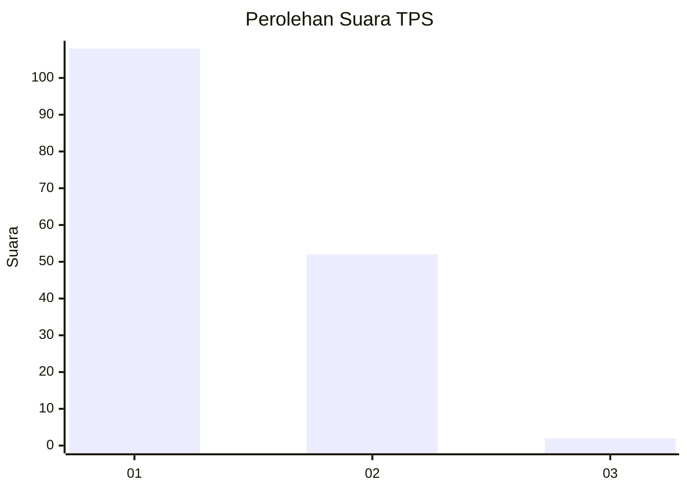
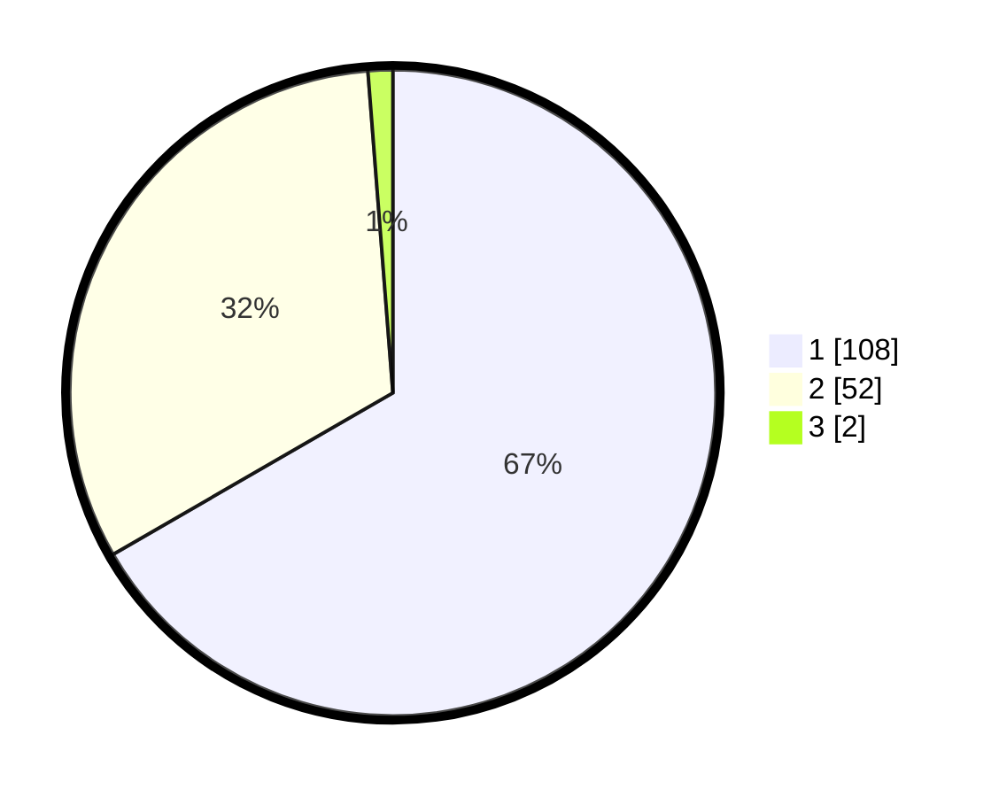

# Hasil

## Grafik

## Tabel

| No. | Nama Paslon    | Suara | Suara (raw) | Persentase |
|:--- |:-------------- | -----:| -----------:| ----------:|
| 1   | ANIES MUHAIMIN | 108   | [108][p-1]  | 66,67      |
| 2   | PRABOWO GIBRAN | 52    | [52][p-2]   | 32,10      |
| 3   | GANJAR MAHFUD  | 2     | [2][p-3]    | 1,23       |

[p-1]: https://github.com/gigit-pemilu/pemilu-2024-13-sumatera-barat/blob/main/pilpres/hitung-suara/sub/13-sumatera-barat/sub/06-agam/sub/02-lubuk-basung/sub/2001-lubuk-basung/sub/001-tps/sub/paslon-1.txt
[p-2]: https://github.com/gigit-pemilu/pemilu-2024-13-sumatera-barat/blob/main/pilpres/hitung-suara/sub/13-sumatera-barat/sub/06-agam/sub/02-lubuk-basung/sub/2001-lubuk-basung/sub/001-tps/sub/paslon-2.txt
[p-3]: https://github.com/gigit-pemilu/pemilu-2024-13-sumatera-barat/blob/main/pilpres/hitung-suara/sub/13-sumatera-barat/sub/06-agam/sub/02-lubuk-basung/sub/2001-lubuk-basung/sub/001-tps/sub/paslon-3.txt

## Foto C Plano

https://sirekap-obj-formc.kpu.go.id/c1fb/pemilu/ppwp/13/06/02/20/01/1306022001001-20240215-051824--4e873699-5c8e-4b98-b9d2-b31f50c41e01.jpg

https://sirekap-obj-formc.kpu.go.id/c1fb/pemilu/ppwp/13/06/02/20/01/1306022001001-20240215-052112--5d45b8be-af9d-4b17-8702-bbecdc83c6b5.jpg

https://sirekap-obj-formc.kpu.go.id/c1fb/pemilu/ppwp/13/06/02/20/01/1306022001001-20240215-052245--551bd62d-a595-4a96-94ab-03fc90549f23.jpg

## Metadata

| Key        | Value               |
| ---------- | ------------------- |
| Time Stamp | 2024-02-25 17:00:00 |

