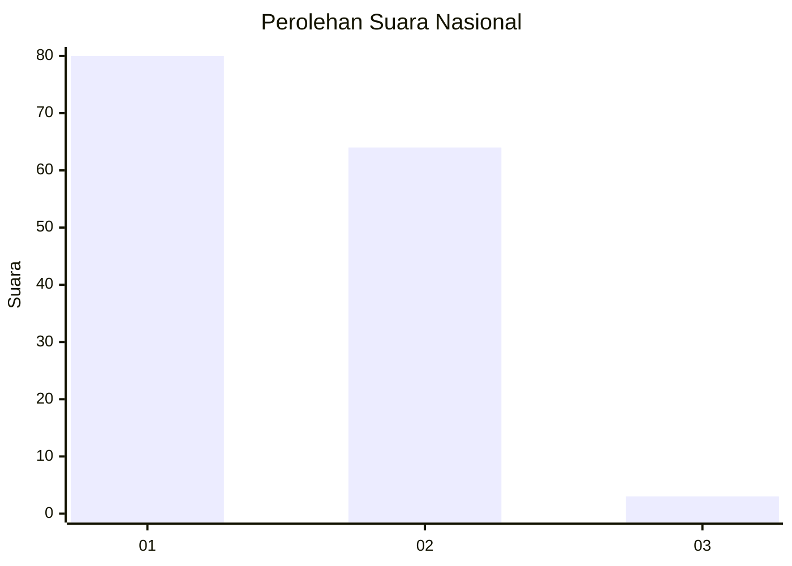
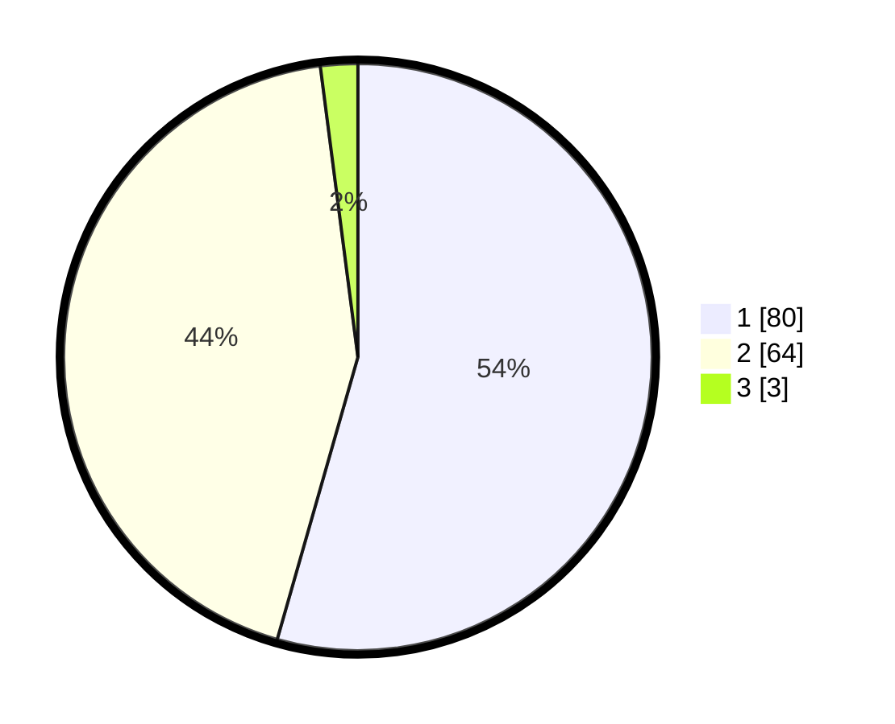

# Hasil

## Grafik

## Tabel

| No. | Nama Paslon    | Suara | Suara (raw) | Persentase |
|:--- |:-------------- | -----:| -----------:| ----------:|
| 1   | ANIES MUHAIMIN | 80    | [80][p-1]   | 54,42      |
| 2   | PRABOWO GIBRAN | 64    | [64][p-2]   | 43,54      |
| 3   | GANJAR MAHFUD  | 3     | [3][p-3]    | 2,04       |

[p-1]: https://github.com/gigit-pemilu/pemilu-2024/blob/main/pilpres/hitung-suara/sub/13-sumatera-barat/sub/06-agam/sub/02-lubuk-basung/sub/2001-lubuk-basung/sub/002-tps/sub/paslon-1.txt
[p-2]: https://github.com/gigit-pemilu/pemilu-2024/blob/main/pilpres/hitung-suara/sub/13-sumatera-barat/sub/06-agam/sub/02-lubuk-basung/sub/2001-lubuk-basung/sub/002-tps/sub/paslon-2.txt
[p-3]: https://github.com/gigit-pemilu/pemilu-2024/blob/main/pilpres/hitung-suara/sub/13-sumatera-barat/sub/06-agam/sub/02-lubuk-basung/sub/2001-lubuk-basung/sub/002-tps/sub/paslon-3.txt

## Foto C Plano

https://sirekap-obj-formc.kpu.go.id/e47b/pemilu/ppwp/13/06/02/20/01/1306022001002-20240215-023123--c2628310-5850-4a68-9faa-93b36a3d27f4.jpg

https://sirekap-obj-formc.kpu.go.id/e47b/pemilu/ppwp/13/06/02/20/01/1306022001002-20240215-023205--d3b2389b-de3b-4162-b307-f9ef898b85f4.jpg

https://sirekap-obj-formc.kpu.go.id/e47b/pemilu/ppwp/13/06/02/20/01/1306022001002-20240215-023318--a825d031-48bb-4a75-8784-1314939096f6.jpg

## Metadata

| Key        | Value               |
| ---------- | ------------------- |
| Time Stamp | 2024-02-25 15:00:00 |

