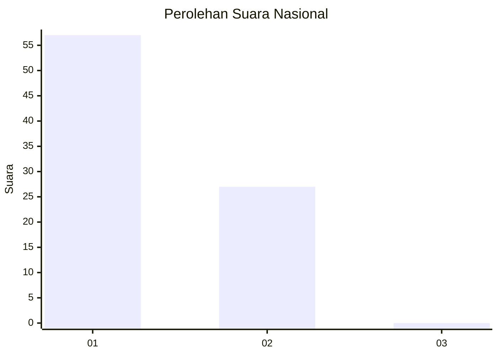
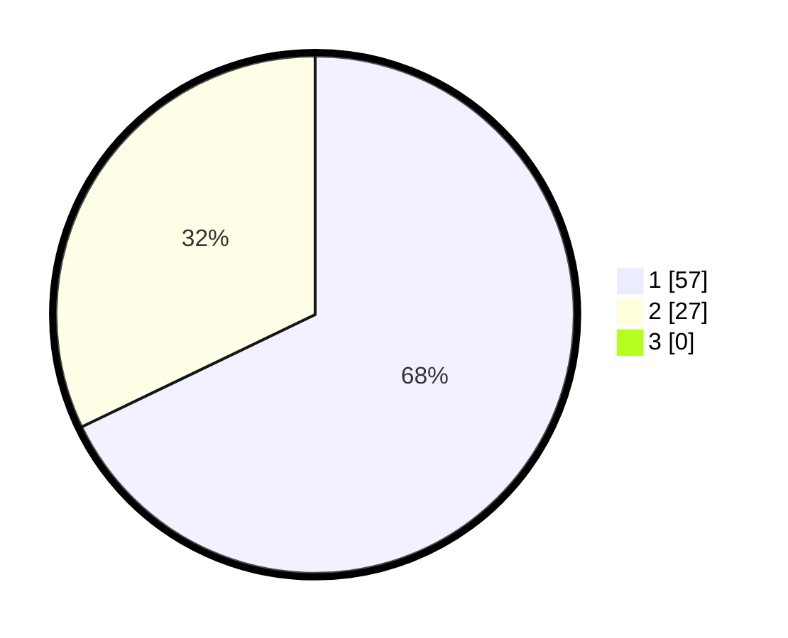

# Hasil

## Grafik

## Tabel

| No. | Nama Paslon    | Suara | Suara (raw) | Persentase |
|:--- |:-------------- | -----:| -----------:| ----------:|
| 1   | ANIES MUHAIMIN | 57    | [57][p-1]   | 67,86      |
| 2   | PRABOWO GIBRAN | 27    | [27][p-2]   | 32,14      |
| 3   | GANJAR MAHFUD  | 0     | [0][p-3]    | 0,00       |

[p-1]: https://github.com/gigit-pemilu/pemilu-2024/blob/main/pilpres/hitung-suara/sub/13-sumatera-barat/sub/06-agam/sub/02-lubuk-basung/sub/2001-lubuk-basung/sub/003-tps/sub/paslon-1.txt
[p-2]: https://github.com/gigit-pemilu/pemilu-2024/blob/main/pilpres/hitung-suara/sub/13-sumatera-barat/sub/06-agam/sub/02-lubuk-basung/sub/2001-lubuk-basung/sub/003-tps/sub/paslon-2.txt
[p-3]: https://github.com/gigit-pemilu/pemilu-2024/blob/main/pilpres/hitung-suara/sub/13-sumatera-barat/sub/06-agam/sub/02-lubuk-basung/sub/2001-lubuk-basung/sub/003-tps/sub/paslon-3.txt

## Foto C Plano

https://sirekap-obj-formc.kpu.go.id/48ad/pemilu/ppwp/13/06/02/20/01/1306022001003-20240215-015751--201e54b3-e77d-42c6-b6c4-92c3e631ccf3.jpg

https://sirekap-obj-formc.kpu.go.id/48ad/pemilu/ppwp/13/06/02/20/01/1306022001003-20240215-022443--14930a4e-519b-4f55-925d-81e7793ca61c.jpg

https://sirekap-obj-formc.kpu.go.id/48ad/pemilu/ppwp/13/06/02/20/01/1306022001003-20240215-020014--b0365271-24c5-4d41-ac74-8d84ff159b8c.jpg

## Metadata

| Key        | Value               |
| ---------- | ------------------- |
| Time Stamp | 2024-02-17 19:30:00 |

