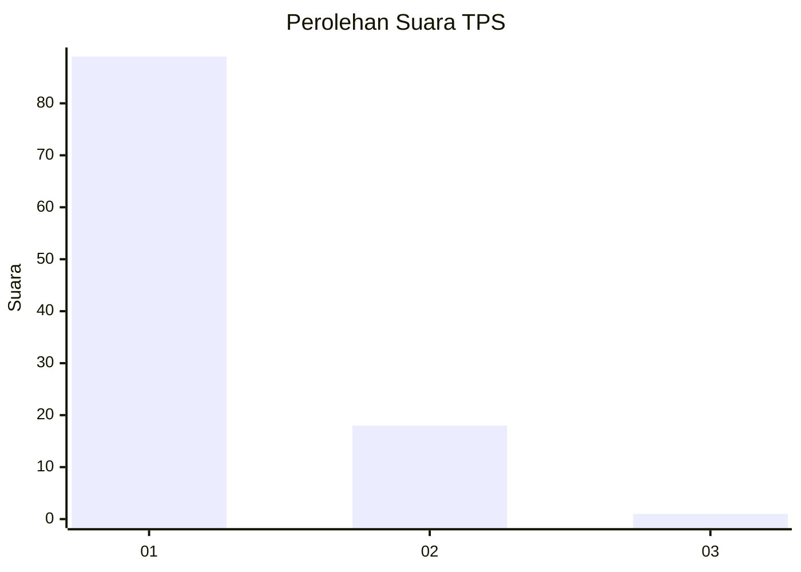
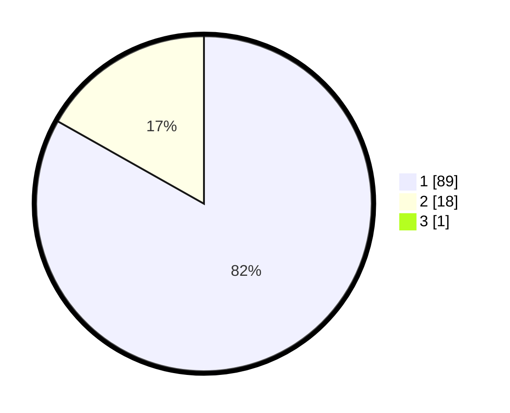

# Hasil

## Grafik

## Tabel

| No. | Nama Paslon    | Suara | Suara (raw) | Persentase |
|:--- |:-------------- | -----:| -----------:| ----------:|
| 1   | ANIES MUHAIMIN | 89    | [89][p-1]   | 82,41      |
| 2   | PRABOWO GIBRAN | 18    | [18][p-2]   | 16,67      |
| 3   | GANJAR MAHFUD  | 1     | [1][p-3]    | 0,93       |

[p-1]: https://github.com/gigit-pemilu/pemilu-2024-13-sumatera-barat/blob/main/pilpres/hitung-suara/sub/13-sumatera-barat/sub/06-agam/sub/02-lubuk-basung/sub/2001-lubuk-basung/sub/004-tps/sub/paslon-1.txt
[p-2]: https://github.com/gigit-pemilu/pemilu-2024-13-sumatera-barat/blob/main/pilpres/hitung-suara/sub/13-sumatera-barat/sub/06-agam/sub/02-lubuk-basung/sub/2001-lubuk-basung/sub/004-tps/sub/paslon-2.txt
[p-3]: https://github.com/gigit-pemilu/pemilu-2024-13-sumatera-barat/blob/main/pilpres/hitung-suara/sub/13-sumatera-barat/sub/06-agam/sub/02-lubuk-basung/sub/2001-lubuk-basung/sub/004-tps/sub/paslon-3.txt

## Foto C Plano

https://sirekap-obj-formc.kpu.go.id/c2da/pemilu/ppwp/13/06/02/20/01/1306022001004-20240215-012632--baa01f72-39fb-448a-b1d4-5505cb724c45.jpg

https://sirekap-obj-formc.kpu.go.id/c2da/pemilu/ppwp/13/06/02/20/01/1306022001004-20240215-012733--3f013099-118c-4b0c-8956-3c839d9050bf.jpg

https://sirekap-obj-formc.kpu.go.id/c2da/pemilu/ppwp/13/06/02/20/01/1306022001004-20240215-012830--b5c7a10f-253c-499b-972d-87083c0577f8.jpg

## Metadata

| Key        | Value               |
| ---------- | ------------------- |
| Time Stamp | 2024-02-24 22:31:28 |

