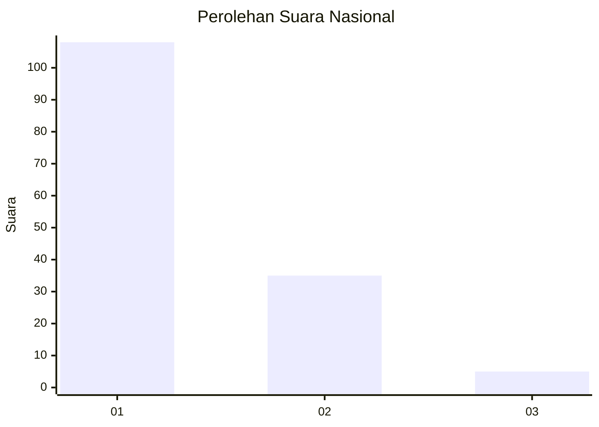
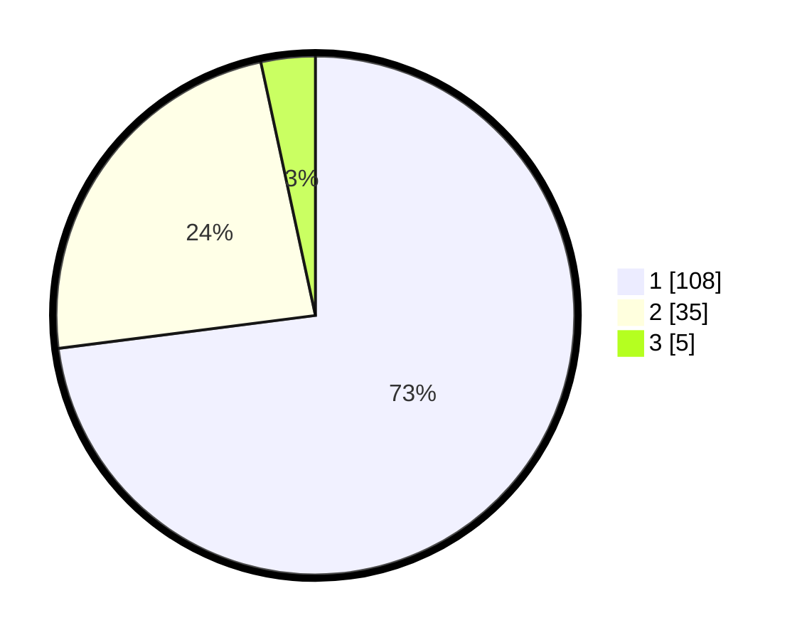

# Hasil

## Grafik

## Tabel

| No. | Nama Paslon    | Suara | Suara (raw) | Persentase |
|:--- |:-------------- | -----:| -----------:| ----------:|
| 1   | ANIES MUHAIMIN | 108   | [108][p-1]  | 72,97      |
| 2   | PRABOWO GIBRAN | 35    | [35][p-2]   | 23,65      |
| 3   | GANJAR MAHFUD  | 5     | [5][p-3]    | 3,38       |

[p-1]: https://github.com/gigit-pemilu/pemilu-2024/blob/main/pilpres/hitung-suara/sub/13-sumatera-barat/sub/06-agam/sub/02-lubuk-basung/sub/2001-lubuk-basung/sub/009-tps/sub/paslon-1.txt
[p-2]: https://github.com/gigit-pemilu/pemilu-2024/blob/main/pilpres/hitung-suara/sub/13-sumatera-barat/sub/06-agam/sub/02-lubuk-basung/sub/2001-lubuk-basung/sub/009-tps/sub/paslon-2.txt
[p-3]: https://github.com/gigit-pemilu/pemilu-2024/blob/main/pilpres/hitung-suara/sub/13-sumatera-barat/sub/06-agam/sub/02-lubuk-basung/sub/2001-lubuk-basung/sub/009-tps/sub/paslon-3.txt

## Foto C Plano

https://sirekap-obj-formc.kpu.go.id/5b30/pemilu/ppwp/13/06/02/20/01/1306022001009-20240215-040842--bb6927fd-dc66-44ff-9144-280cdc653fff.jpg

https://sirekap-obj-formc.kpu.go.id/5b30/pemilu/ppwp/13/06/02/20/01/1306022001009-20240214-211402--52683934-f8be-49b0-b8de-8c42d8a9b87d.jpg

https://sirekap-obj-formc.kpu.go.id/5b30/pemilu/ppwp/13/06/02/20/01/1306022001009-20240214-211535--6c1f8f0e-1013-4422-9141-537e5c0ceedf.jpg

## Metadata

| Key        | Value               |
| ---------- | ------------------- |
| Time Stamp | 2024-02-17 19:30:00 |

