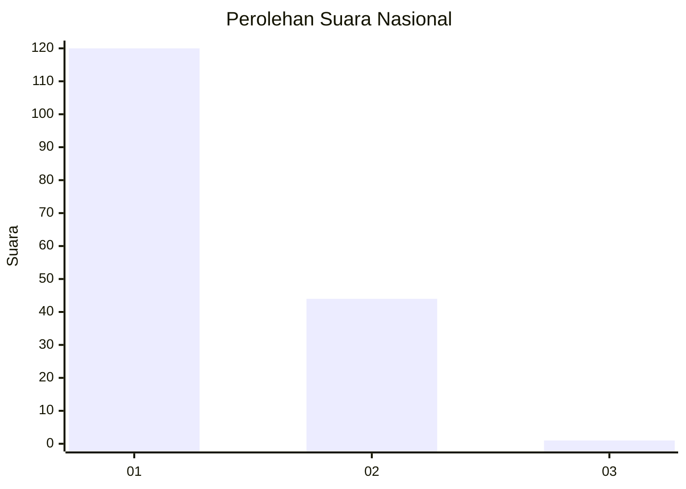
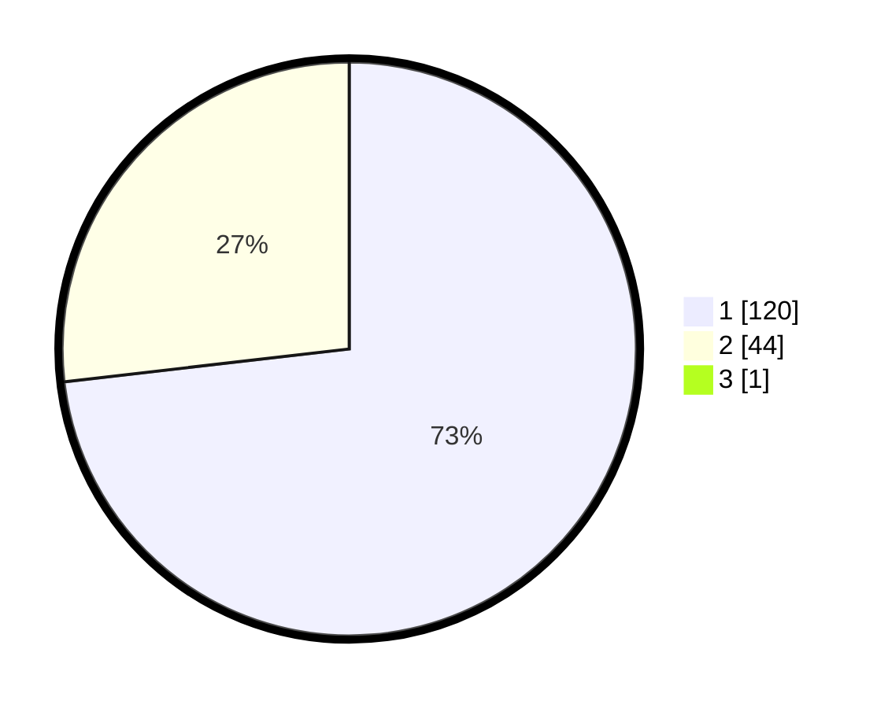

# Hasil

## Grafik

## Tabel

| No. | Nama Paslon    | Suara | Suara (raw) | Persentase |
|:--- |:-------------- | -----:| -----------:| ----------:|
| 1   | ANIES MUHAIMIN | 120   | [120][p-1]  | 72,73      |
| 2   | PRABOWO GIBRAN | 44    | [44][p-2]   | 26,67      |
| 3   | GANJAR MAHFUD  | 1     | [1][p-3]    | 0,61       |

[p-1]: https://github.com/gigit-pemilu/pemilu-2024/blob/main/pilpres/hitung-suara/sub/13-sumatera-barat/sub/06-agam/sub/02-lubuk-basung/sub/2001-lubuk-basung/sub/011-tps/sub/paslon-1.txt
[p-2]: https://github.com/gigit-pemilu/pemilu-2024/blob/main/pilpres/hitung-suara/sub/13-sumatera-barat/sub/06-agam/sub/02-lubuk-basung/sub/2001-lubuk-basung/sub/011-tps/sub/paslon-2.txt
[p-3]: https://github.com/gigit-pemilu/pemilu-2024/blob/main/pilpres/hitung-suara/sub/13-sumatera-barat/sub/06-agam/sub/02-lubuk-basung/sub/2001-lubuk-basung/sub/011-tps/sub/paslon-3.txt

## Foto C Plano

https://sirekap-obj-formc.kpu.go.id/f21e/pemilu/ppwp/13/06/02/20/01/1306022001011-20240215-003316--63a397a0-9656-4614-88fa-f40b51a6f962.jpg

https://sirekap-obj-formc.kpu.go.id/f21e/pemilu/ppwp/13/06/02/20/01/1306022001011-20240215-003459--fe63fbe8-2e29-467c-888f-6cab49d7a06b.jpg

https://sirekap-obj-formc.kpu.go.id/f21e/pemilu/ppwp/13/06/02/20/01/1306022001011-20240215-003635--fb9f02bf-9c73-4d6e-b8ac-067aa4d45265.jpg

## Metadata

| Key        | Value               |
| ---------- | ------------------- |
| Time Stamp | 2024-02-25 13:00:00 |

