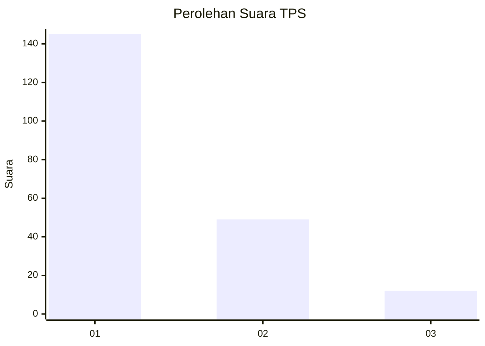
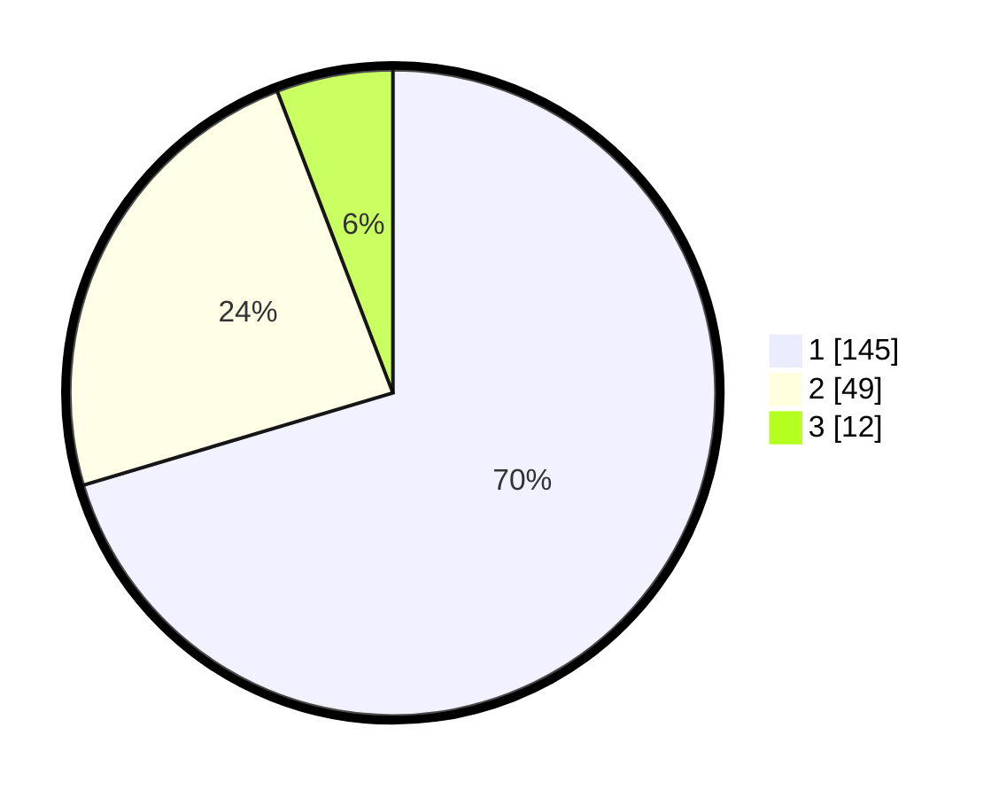

# Hasil

## Grafik

## Tabel

| No. | Nama Paslon    | Suara | Suara (raw) | Persentase |
|:--- |:-------------- | -----:| -----------:| ----------:|
| 1   | ANIES MUHAIMIN | 145   | [145][p-1]  | 70,39      |
| 2   | PRABOWO GIBRAN | 49    | [49][p-2]   | 23,79      |
| 3   | GANJAR MAHFUD  | 12    | [12][p-3]   | 5,83       |

[p-1]: https://github.com/gigit-pemilu/pemilu-2024-13-sumatera-barat/blob/main/pilpres/hitung-suara/sub/13-sumatera-barat/sub/06-agam/sub/02-lubuk-basung/sub/2001-lubuk-basung/sub/074-tps/sub/paslon-1.txt
[p-2]: https://github.com/gigit-pemilu/pemilu-2024-13-sumatera-barat/blob/main/pilpres/hitung-suara/sub/13-sumatera-barat/sub/06-agam/sub/02-lubuk-basung/sub/2001-lubuk-basung/sub/074-tps/sub/paslon-2.txt
[p-3]: https://github.com/gigit-pemilu/pemilu-2024-13-sumatera-barat/blob/main/pilpres/hitung-suara/sub/13-sumatera-barat/sub/06-agam/sub/02-lubuk-basung/sub/2001-lubuk-basung/sub/074-tps/sub/paslon-3.txt

## Foto C Plano

https://sirekap-obj-formc.kpu.go.id/c883/pemilu/ppwp/13/06/02/20/01/1306022001074-20240215-061850--75ce5203-5562-4813-b489-4136643b1858.jpg

https://sirekap-obj-formc.kpu.go.id/c883/pemilu/ppwp/13/06/02/20/01/1306022001074-20240215-062127--562ce749-bd5c-401e-953f-76456f69d7c5.jpg

https://sirekap-obj-formc.kpu.go.id/c883/pemilu/ppwp/13/06/02/20/01/1306022001074-20240215-062314--d935dec6-95ce-4fdd-a108-31f15d89cc05.jpg

## Metadata

| Key        | Value               |
| ---------- | ------------------- |
| Time Stamp | 2024-02-25 12:00:00 |

