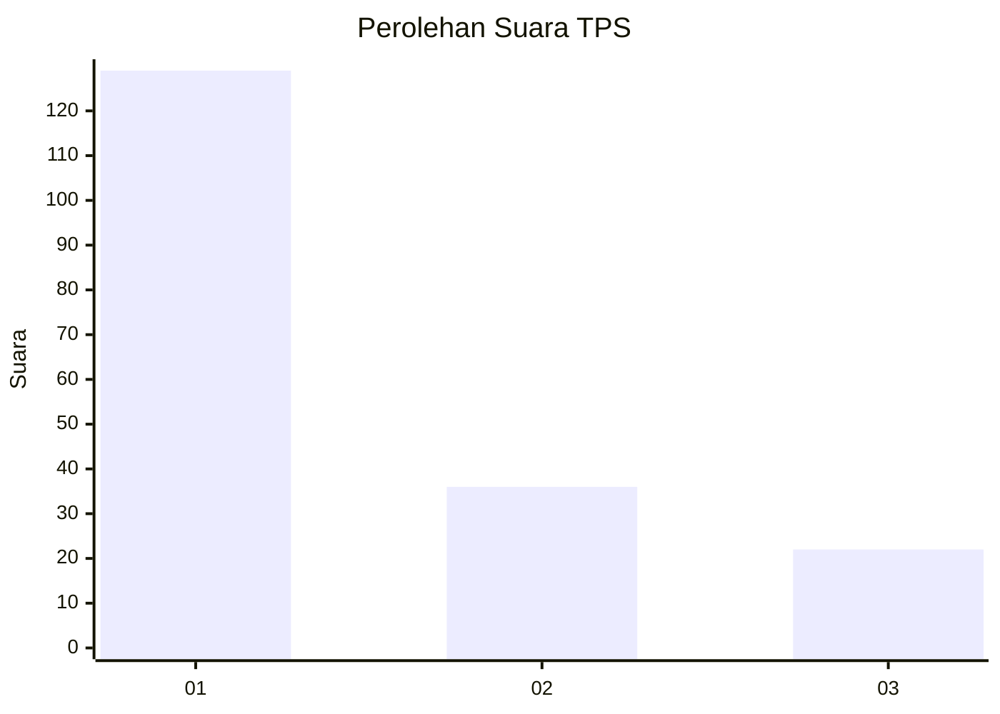
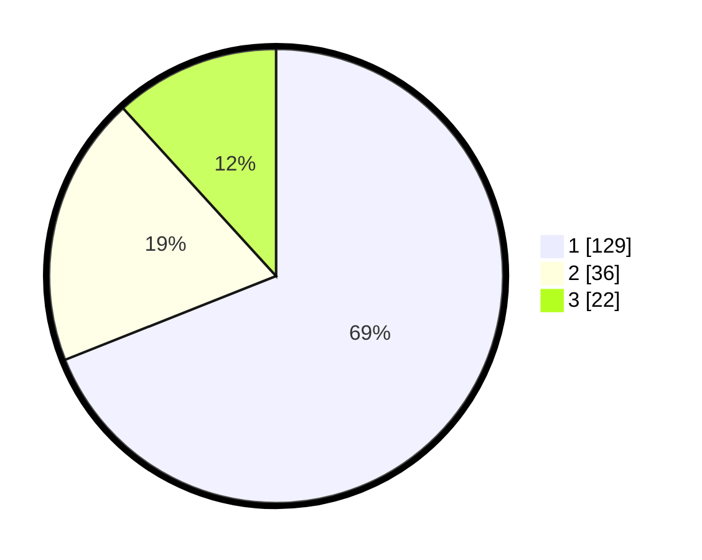

# Hasil

## Grafik

## Tabel

| No. | Nama Paslon    | Suara | Suara (raw) | Persentase |
|:--- |:-------------- | -----:| -----------:| ----------:|
| 1   | ANIES MUHAIMIN | 129   | [129][p-1]  | 68,98      |
| 2   | PRABOWO GIBRAN | 36    | [36][p-2]   | 19,25      |
| 3   | GANJAR MAHFUD  | 22    | [22][p-3]   | 11,76      |

[p-1]: https://github.com/gigit-pemilu/pemilu-2024-13-sumatera-barat/blob/main/pilpres/hitung-suara/sub/13-sumatera-barat/sub/06-agam/sub/02-lubuk-basung/sub/2001-lubuk-basung/sub/092-tps/sub/paslon-1.txt
[p-2]: https://github.com/gigit-pemilu/pemilu-2024-13-sumatera-barat/blob/main/pilpres/hitung-suara/sub/13-sumatera-barat/sub/06-agam/sub/02-lubuk-basung/sub/2001-lubuk-basung/sub/092-tps/sub/paslon-2.txt
[p-3]: https://github.com/gigit-pemilu/pemilu-2024-13-sumatera-barat/blob/main/pilpres/hitung-suara/sub/13-sumatera-barat/sub/06-agam/sub/02-lubuk-basung/sub/2001-lubuk-basung/sub/092-tps/sub/paslon-3.txt

## Foto C Plano

https://sirekap-obj-formc.kpu.go.id/2d47/pemilu/ppwp/13/06/02/20/01/1306022001092-20240215-035158--0b853ed8-939b-4939-8678-fb0c4d5cfade.jpg

https://sirekap-obj-formc.kpu.go.id/2d47/pemilu/ppwp/13/06/02/20/01/1306022001092-20240215-031020--e5294938-e308-4107-ba98-524c72566ac7.jpg

https://sirekap-obj-formc.kpu.go.id/2d47/pemilu/ppwp/13/06/02/20/01/1306022001092-20240215-031130--5484f2eb-d246-46d1-b068-92ce3c62af59.jpg

## Metadata

| Key        | Value               |
| ---------- | ------------------- |
| Time Stamp | 2024-02-25 12:00:00 |

