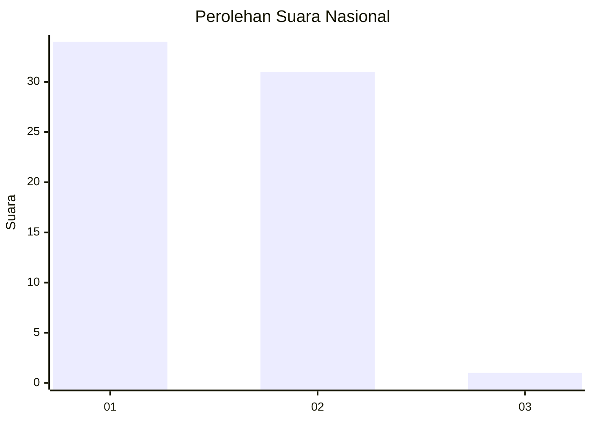
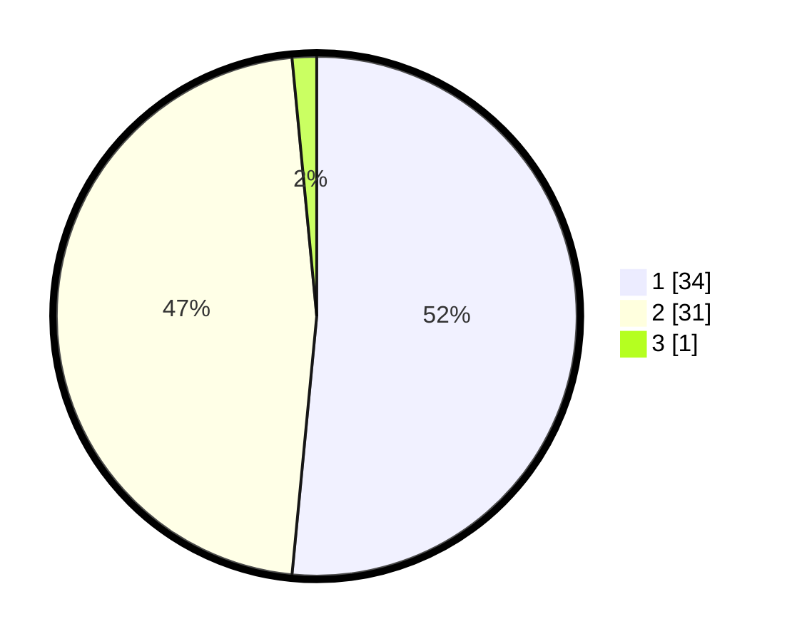

# Hasil

## Grafik

## Tabel

| No. | Nama Paslon    | Suara | Suara (raw) | Persentase |
|:--- |:-------------- | -----:| -----------:| ----------:|
| 1   | ANIES MUHAIMIN | 34    | [34][p-1]   | 51,52      |
| 2   | PRABOWO GIBRAN | 31    | [31][p-2]   | 46,97      |
| 3   | GANJAR MAHFUD  | 1     | [1][p-3]    | 1,52       |

[p-1]: https://github.com/gigit-pemilu/pemilu-2024/blob/main/pilpres/hitung-suara/sub/13-sumatera-barat/sub/06-agam/sub/02-lubuk-basung/sub/2001-lubuk-basung/sub/100-tps/sub/paslon-1.txt
[p-2]: https://github.com/gigit-pemilu/pemilu-2024/blob/main/pilpres/hitung-suara/sub/13-sumatera-barat/sub/06-agam/sub/02-lubuk-basung/sub/2001-lubuk-basung/sub/100-tps/sub/paslon-2.txt
[p-3]: https://github.com/gigit-pemilu/pemilu-2024/blob/main/pilpres/hitung-suara/sub/13-sumatera-barat/sub/06-agam/sub/02-lubuk-basung/sub/2001-lubuk-basung/sub/100-tps/sub/paslon-3.txt

## Foto C Plano

https://sirekap-obj-formc.kpu.go.id/8249/pemilu/ppwp/13/06/02/20/01/1306022001100-20240214-214207--8f3f9ce5-6a3d-4f01-84ae-54afebc37721.jpg

https://sirekap-obj-formc.kpu.go.id/8249/pemilu/ppwp/13/06/02/20/01/1306022001100-20240214-204515--ba0d3fce-ef74-4903-a97c-6c43ec2cbadf.jpg

https://sirekap-obj-formc.kpu.go.id/8249/pemilu/ppwp/13/06/02/20/01/1306022001100-20240214-204529--0f41a75a-2e2b-49c6-862d-53bf8497c1f8.jpg

## Metadata

| Key        | Value               |
| ---------- | ------------------- |
| Time Stamp | 2024-02-15 00:41:44 |

