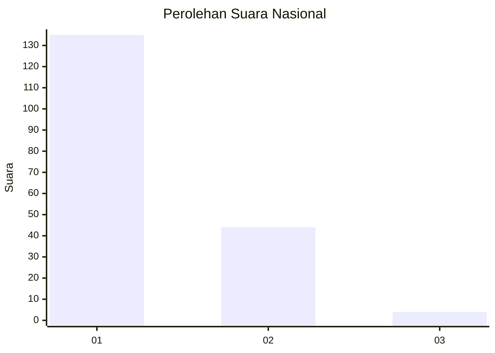
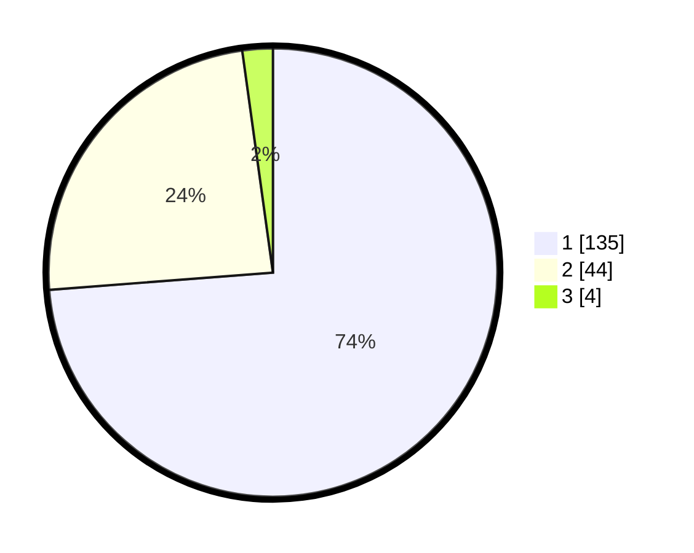

# Hasil

## Grafik

## Tabel

| No. | Nama Paslon    | Suara | Suara (raw) | Persentase |
|:--- |:-------------- | -----:| -----------:| ----------:|
| 1   | ANIES MUHAIMIN | 135   | [135][p-1]  | 73,77      |
| 2   | PRABOWO GIBRAN | 44    | [44][p-2]   | 24,04      |
| 3   | GANJAR MAHFUD  | 4     | [4][p-3]    | 2,19       |

[p-1]: https://github.com/gigit-pemilu/pemilu-2024/blob/main/pilpres/hitung-suara/sub/13-sumatera-barat/sub/06-agam/sub/02-lubuk-basung/sub/2002-garagahan/sub/007-tps/sub/paslon-1.txt
[p-2]: https://github.com/gigit-pemilu/pemilu-2024/blob/main/pilpres/hitung-suara/sub/13-sumatera-barat/sub/06-agam/sub/02-lubuk-basung/sub/2002-garagahan/sub/007-tps/sub/paslon-2.txt
[p-3]: https://github.com/gigit-pemilu/pemilu-2024/blob/main/pilpres/hitung-suara/sub/13-sumatera-barat/sub/06-agam/sub/02-lubuk-basung/sub/2002-garagahan/sub/007-tps/sub/paslon-3.txt

## Foto C Plano

https://sirekap-obj-formc.kpu.go.id/a77f/pemilu/ppwp/13/06/02/20/02/1306022002007-20240214-233627--798ae817-6493-42a6-af94-188df9c6a68b.jpg

https://sirekap-obj-formc.kpu.go.id/a77f/pemilu/ppwp/13/06/02/20/02/1306022002007-20240215-000942--3a468baf-2589-4fa6-b8b3-2f507f05bf7b.jpg

https://sirekap-obj-formc.kpu.go.id/a77f/pemilu/ppwp/13/06/02/20/02/1306022002007-20240214-212021--bc0dce10-fb46-4324-ad7f-5634a31a66bd.jpg

## Metadata

| Key        | Value               |
| ---------- | ------------------- |
| Time Stamp | 2024-02-15 15:00:29 |

