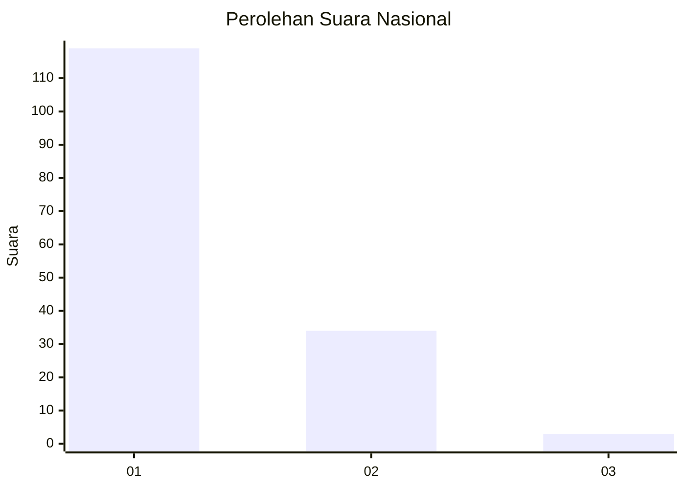
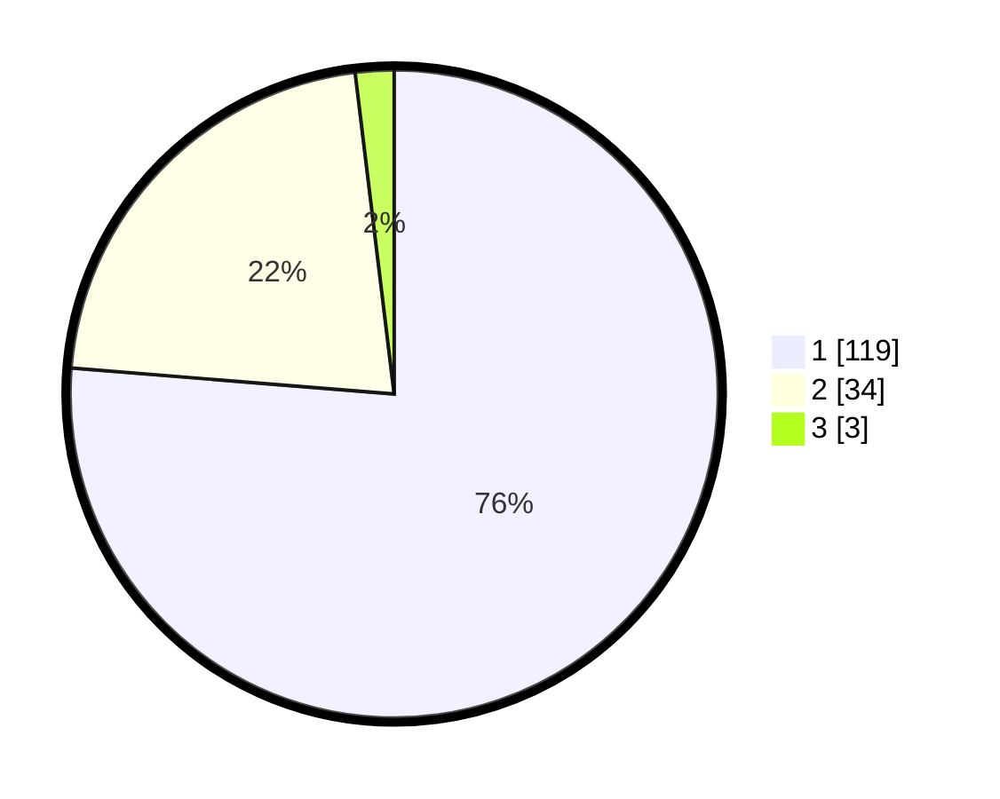

# Hasil

## Grafik

## Tabel

| No. | Nama Paslon    | Suara | Suara (raw) | Persentase |
|:--- |:-------------- | -----:| -----------:| ----------:|
| 1   | ANIES MUHAIMIN | 119   | [119][p-1]  | 76,28      |
| 2   | PRABOWO GIBRAN | 34    | [34][p-2]   | 21,79      |
| 3   | GANJAR MAHFUD  | 3     | [3][p-3]    | 1,92       |

[p-1]: https://github.com/gigit-pemilu/pemilu-2024/blob/main/pilpres/hitung-suara/sub/13-sumatera-barat/sub/06-agam/sub/02-lubuk-basung/sub/2003-kampung-pinang/sub/002-tps/sub/paslon-1.txt
[p-2]: https://github.com/gigit-pemilu/pemilu-2024/blob/main/pilpres/hitung-suara/sub/13-sumatera-barat/sub/06-agam/sub/02-lubuk-basung/sub/2003-kampung-pinang/sub/002-tps/sub/paslon-2.txt
[p-3]: https://github.com/gigit-pemilu/pemilu-2024/blob/main/pilpres/hitung-suara/sub/13-sumatera-barat/sub/06-agam/sub/02-lubuk-basung/sub/2003-kampung-pinang/sub/002-tps/sub/paslon-3.txt

## Foto C Plano

https://sirekap-obj-formc.kpu.go.id/99b1/pemilu/ppwp/13/06/02/20/03/1306022003002-20240215-030301--d7eb5b0f-01b0-4a0c-b488-eb578fabb01d.jpg

https://sirekap-obj-formc.kpu.go.id/99b1/pemilu/ppwp/13/06/02/20/03/1306022003002-20240215-030430--dfce54c8-e1ab-4f81-84f2-7ef789c59b79.jpg

https://sirekap-obj-formc.kpu.go.id/99b1/pemilu/ppwp/13/06/02/20/03/1306022003002-20240215-063850--9ed6aef8-e8e5-4df6-8b1b-77762d1ff569.jpg

## Metadata

| Key        | Value               |
| ---------- | ------------------- |
| Time Stamp | 2024-02-24 22:31:28 |

