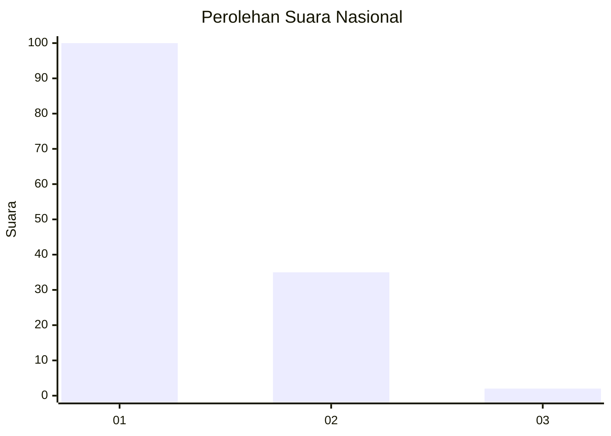
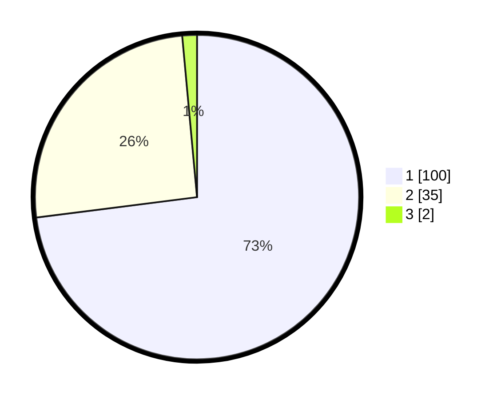

# Hasil

## Grafik

## Tabel

| No. | Nama Paslon    | Suara | Suara (raw) | Persentase |
|:--- |:-------------- | -----:| -----------:| ----------:|
| 1   | ANIES MUHAIMIN | 100   | [100][p-1]  | 72,99      |
| 2   | PRABOWO GIBRAN | 35    | [35][p-2]   | 25,55      |
| 3   | GANJAR MAHFUD  | 2     | [2][p-3]    | 1,46       |

[p-1]: https://github.com/gigit-pemilu/pemilu-2024/blob/main/pilpres/hitung-suara/sub/13-sumatera-barat/sub/06-agam/sub/02-lubuk-basung/sub/2004-kampung-tangah/sub/005-tps/sub/paslon-1.txt
[p-2]: https://github.com/gigit-pemilu/pemilu-2024/blob/main/pilpres/hitung-suara/sub/13-sumatera-barat/sub/06-agam/sub/02-lubuk-basung/sub/2004-kampung-tangah/sub/005-tps/sub/paslon-2.txt
[p-3]: https://github.com/gigit-pemilu/pemilu-2024/blob/main/pilpres/hitung-suara/sub/13-sumatera-barat/sub/06-agam/sub/02-lubuk-basung/sub/2004-kampung-tangah/sub/005-tps/sub/paslon-3.txt

## Foto C Plano

https://sirekap-obj-formc.kpu.go.id/3da9/pemilu/ppwp/13/06/02/20/04/1306022004005-20240218-102240--1c7805a6-a320-484b-9334-0744daaa04de.jpg

https://sirekap-obj-formc.kpu.go.id/3da9/pemilu/ppwp/13/06/02/20/04/1306022004005-20240218-102345--68766547-80ef-435e-9c7d-9e62f452221d.jpg

https://sirekap-obj-formc.kpu.go.id/3da9/pemilu/ppwp/13/06/02/20/04/1306022004005-20240218-102446--2702c335-86f9-49a4-93ee-384dab3aaaac.jpg

## Metadata

| Key        | Value               |
| ---------- | ------------------- |
| Time Stamp | 2024-02-25 16:00:00 |

