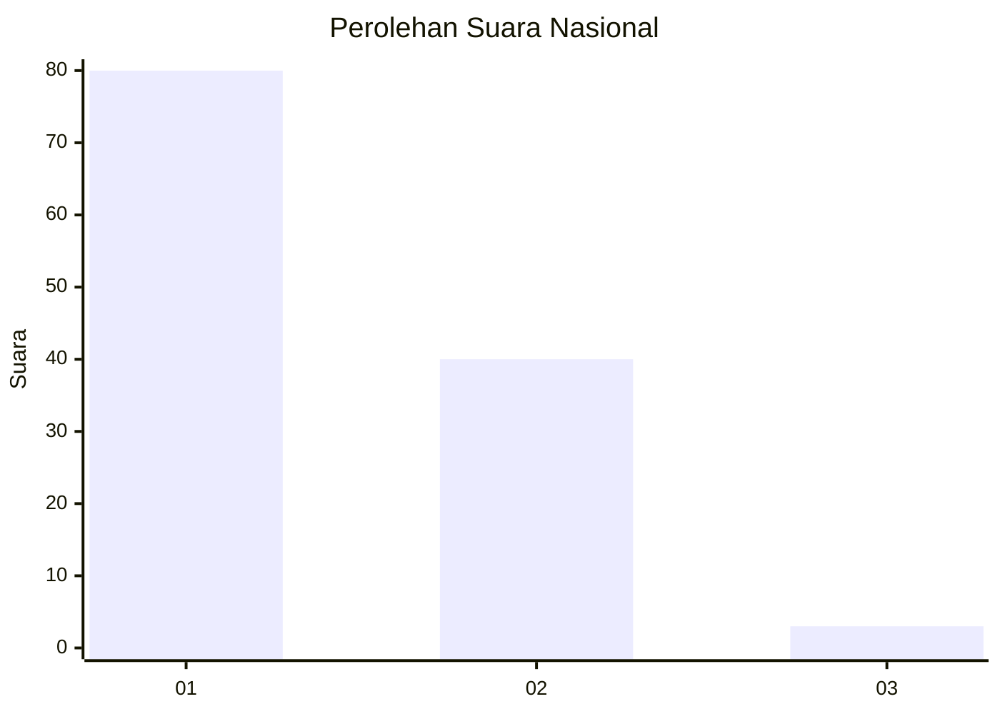
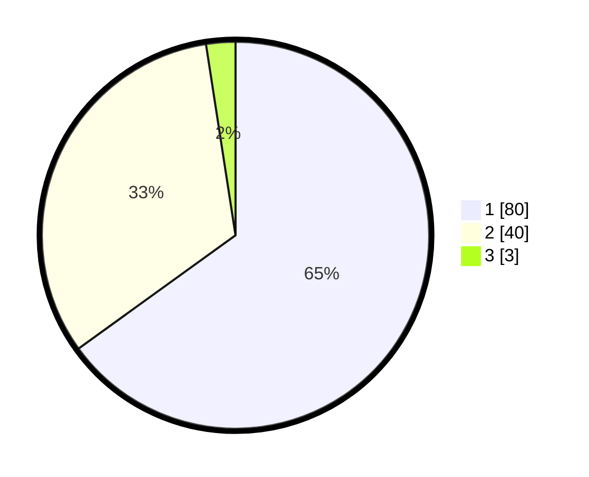

# Hasil

## Grafik

## Tabel

| No. | Nama Paslon    | Suara | Suara (raw) | Persentase |
|:--- |:-------------- | -----:| -----------:| ----------:|
| 1   | ANIES MUHAIMIN | 80    | [80][p-1]   | 65,04      |
| 2   | PRABOWO GIBRAN | 40    | [40][p-2]   | 32,52      |
| 3   | GANJAR MAHFUD  | 3     | [3][p-3]    | 2,44       |

[p-1]: https://github.com/gigit-pemilu/pemilu-2024/blob/main/pilpres/hitung-suara/sub/13-sumatera-barat/sub/06-agam/sub/02-lubuk-basung/sub/2004-kampung-tangah/sub/009-tps/sub/paslon-1.txt
[p-2]: https://github.com/gigit-pemilu/pemilu-2024/blob/main/pilpres/hitung-suara/sub/13-sumatera-barat/sub/06-agam/sub/02-lubuk-basung/sub/2004-kampung-tangah/sub/009-tps/sub/paslon-2.txt
[p-3]: https://github.com/gigit-pemilu/pemilu-2024/blob/main/pilpres/hitung-suara/sub/13-sumatera-barat/sub/06-agam/sub/02-lubuk-basung/sub/2004-kampung-tangah/sub/009-tps/sub/paslon-3.txt

## Foto C Plano

https://sirekap-obj-formc.kpu.go.id/13cd/pemilu/ppwp/13/06/02/20/04/1306022004009-20240215-013019--b9379a86-d079-40e0-9f7d-cc24adfe155b.jpg

https://sirekap-obj-formc.kpu.go.id/13cd/pemilu/ppwp/13/06/02/20/04/1306022004009-20240215-012455--59de9fdd-6332-4382-a8b4-0ac16ae93a77.jpg

https://sirekap-obj-formc.kpu.go.id/13cd/pemilu/ppwp/13/06/02/20/04/1306022004009-20240215-012849--1bc78ab0-e2c5-4b88-97bf-ac4bb5bfc9a9.jpg

## Metadata

| Key        | Value               |
| ---------- | ------------------- |
| Time Stamp | 2024-02-19 06:16:00 |

