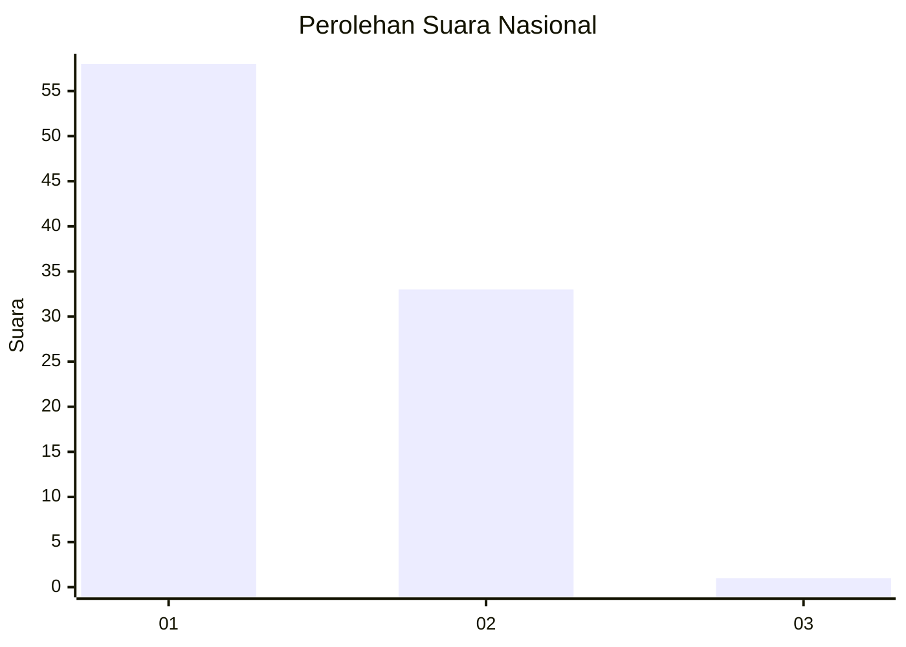
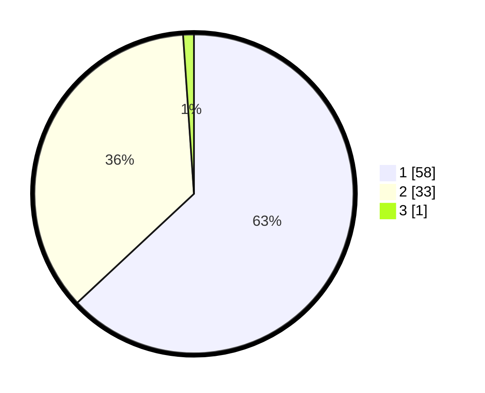

# Hasil

## Grafik

## Tabel

| No. | Nama Paslon    | Suara | Suara (raw) | Persentase |
|:--- |:-------------- | -----:| -----------:| ----------:|
| 1   | ANIES MUHAIMIN | 58    | [58][p-1]   | 63,04      |
| 2   | PRABOWO GIBRAN | 33    | [33][p-2]   | 35,87      |
| 3   | GANJAR MAHFUD  | 1     | [1][p-3]    | 1,09       |

[p-1]: https://github.com/gigit-pemilu/pemilu-2024/blob/main/pilpres/hitung-suara/sub/13-sumatera-barat/sub/06-agam/sub/02-lubuk-basung/sub/2004-kampung-tangah/sub/012-tps/sub/paslon-1.txt
[p-2]: https://github.com/gigit-pemilu/pemilu-2024/blob/main/pilpres/hitung-suara/sub/13-sumatera-barat/sub/06-agam/sub/02-lubuk-basung/sub/2004-kampung-tangah/sub/012-tps/sub/paslon-2.txt
[p-3]: https://github.com/gigit-pemilu/pemilu-2024/blob/main/pilpres/hitung-suara/sub/13-sumatera-barat/sub/06-agam/sub/02-lubuk-basung/sub/2004-kampung-tangah/sub/012-tps/sub/paslon-3.txt

## Foto C Plano

https://sirekap-obj-formc.kpu.go.id/2f86/pemilu/ppwp/13/06/02/20/04/1306022004012-20240215-005127--976af5ab-d54d-4051-aa62-1da36ededbe9.jpg

https://sirekap-obj-formc.kpu.go.id/2f86/pemilu/ppwp/13/06/02/20/04/1306022004012-20240215-012850--6069b077-1e65-474a-980d-353ab02765fd.jpg

https://sirekap-obj-formc.kpu.go.id/2f86/pemilu/ppwp/13/06/02/20/04/1306022004012-20240215-004307--150a116a-f6af-4945-939c-655bfed1e9fd.jpg

## Metadata

| Key        | Value               |
| ---------- | ------------------- |
| Time Stamp | 2024-02-24 22:31:28 |

