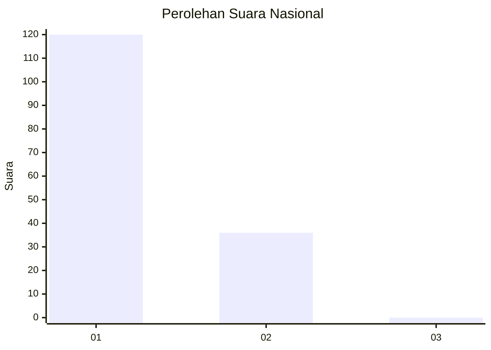
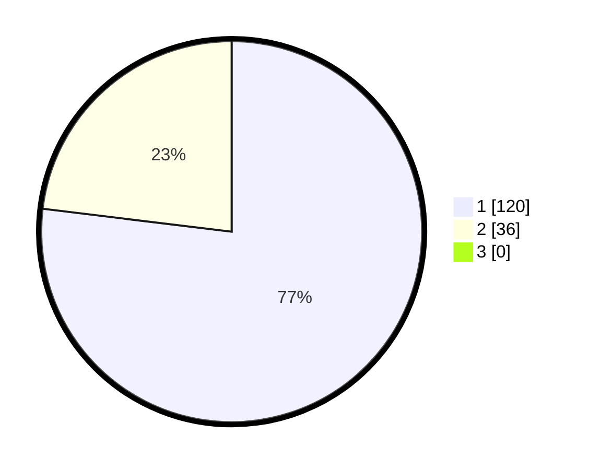

# Hasil

## Grafik

## Tabel

| No. | Nama Paslon    | Suara | Suara (raw) | Persentase |
|:--- |:-------------- | -----:| -----------:| ----------:|
| 1   | ANIES MUHAIMIN | 120   | [120][p-1]  | 76,92      |
| 2   | PRABOWO GIBRAN | 36    | [36][p-2]   | 23,08      |
| 3   | GANJAR MAHFUD  | 0     | [0][p-3]    | 0,00       |

[p-1]: https://github.com/gigit-pemilu/pemilu-2024/blob/main/pilpres/hitung-suara/sub/13-sumatera-barat/sub/06-agam/sub/02-lubuk-basung/sub/2004-kampung-tangah/sub/018-tps/sub/paslon-1.txt
[p-2]: https://github.com/gigit-pemilu/pemilu-2024/blob/main/pilpres/hitung-suara/sub/13-sumatera-barat/sub/06-agam/sub/02-lubuk-basung/sub/2004-kampung-tangah/sub/018-tps/sub/paslon-2.txt
[p-3]: https://github.com/gigit-pemilu/pemilu-2024/blob/main/pilpres/hitung-suara/sub/13-sumatera-barat/sub/06-agam/sub/02-lubuk-basung/sub/2004-kampung-tangah/sub/018-tps/sub/paslon-3.txt

## Foto C Plano

https://sirekap-obj-formc.kpu.go.id/584c/pemilu/ppwp/13/06/02/20/04/1306022004018-20240214-212155--5eef5b0b-94bf-4cdf-aba6-cf98567b45d3.jpg

https://sirekap-obj-formc.kpu.go.id/584c/pemilu/ppwp/13/06/02/20/04/1306022004018-20240214-212546--84c755c1-acac-4c4f-a876-66b4ecef7675.jpg

https://sirekap-obj-formc.kpu.go.id/584c/pemilu/ppwp/13/06/02/20/04/1306022004018-20240214-213919--a884f8a5-bfb7-4c8e-90de-ef7db8a1f25a.jpg

## Metadata

| Key        | Value               |
| ---------- | ------------------- |
| Time Stamp | 2024-02-15 09:00:24 |

