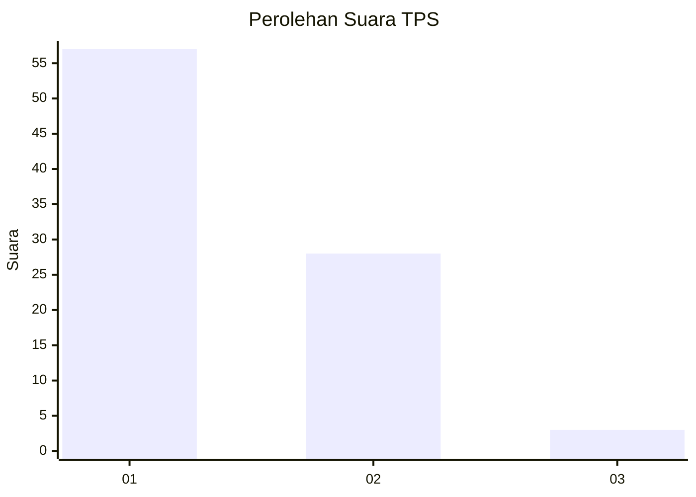
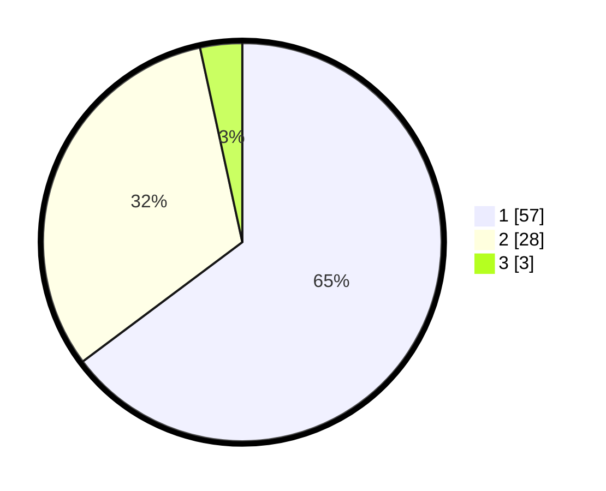

# Hasil

## Grafik

## Tabel

| No. | Nama Paslon    | Suara | Suara (raw) | Persentase |
|:--- |:-------------- | -----:| -----------:| ----------:|
| 1   | ANIES MUHAIMIN | 57    | [57][p-1]   | 64,77      |
| 2   | PRABOWO GIBRAN | 28    | [28][p-2]   | 31,82      |
| 3   | GANJAR MAHFUD  | 3     | [3][p-3]    | 3,41       |

[p-1]: https://github.com/gigit-pemilu/pemilu-2024-13-sumatera-barat/blob/main/pilpres/hitung-suara/sub/13-sumatera-barat/sub/06-agam/sub/02-lubuk-basung/sub/2005-manggopoh/sub/011-tps/sub/paslon-1.txt
[p-2]: https://github.com/gigit-pemilu/pemilu-2024-13-sumatera-barat/blob/main/pilpres/hitung-suara/sub/13-sumatera-barat/sub/06-agam/sub/02-lubuk-basung/sub/2005-manggopoh/sub/011-tps/sub/paslon-2.txt
[p-3]: https://github.com/gigit-pemilu/pemilu-2024-13-sumatera-barat/blob/main/pilpres/hitung-suara/sub/13-sumatera-barat/sub/06-agam/sub/02-lubuk-basung/sub/2005-manggopoh/sub/011-tps/sub/paslon-3.txt

## Foto C Plano

https://sirekap-obj-formc.kpu.go.id/ddae/pemilu/ppwp/13/06/02/20/05/1306022005011-20240214-215324--7ab33b44-684c-4d56-bcae-bc1f77bb219b.jpg

https://sirekap-obj-formc.kpu.go.id/ddae/pemilu/ppwp/13/06/02/20/05/1306022005011-20240214-200011--e2370e1e-f704-45c3-bdc0-26058a14af2f.jpg

https://sirekap-obj-formc.kpu.go.id/ddae/pemilu/ppwp/13/06/02/20/05/1306022005011-20240214-215551--eb096ca9-b354-4c78-aa31-76b236e1bc7a.jpg

## Metadata

| Key        | Value               |
| ---------- | ------------------- |
| Time Stamp | 2024-02-21 22:00:00 |

