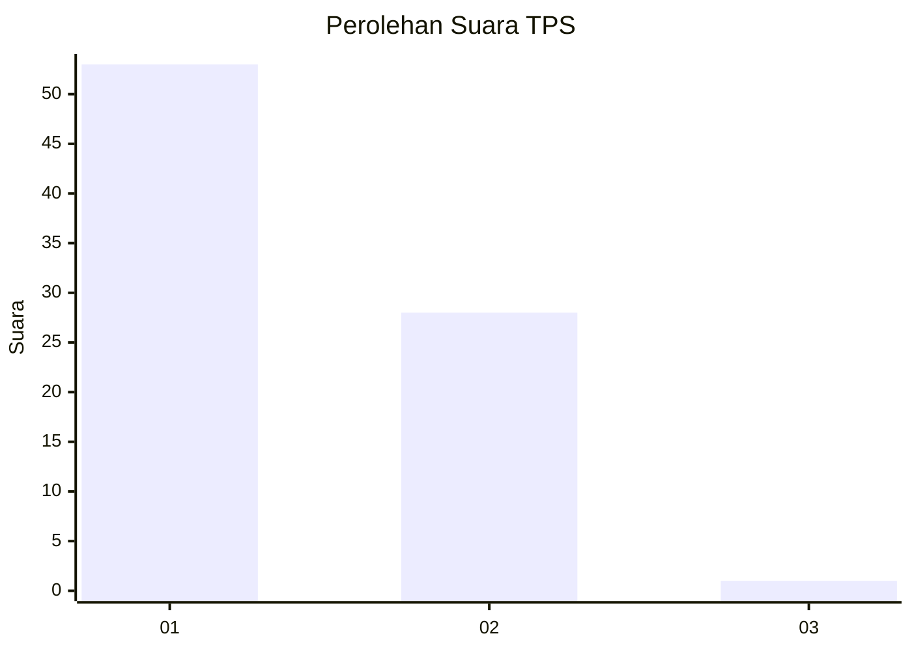
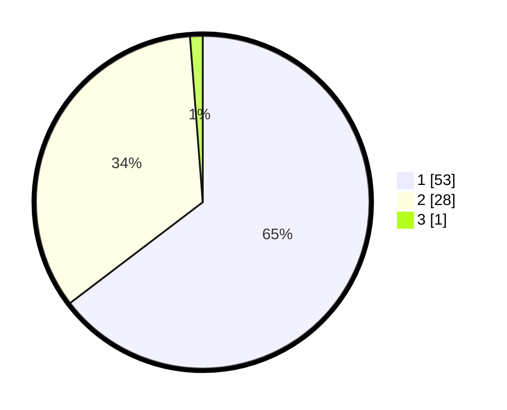

# Hasil

## Grafik

## Tabel

| No. | Nama Paslon    | Suara | Suara (raw) | Persentase |
|:--- |:-------------- | -----:| -----------:| ----------:|
| 1   | ANIES MUHAIMIN | 53    | [53][p-1]   | 64,63      |
| 2   | PRABOWO GIBRAN | 28    | [28][p-2]   | 34,15      |
| 3   | GANJAR MAHFUD  | 1     | [1][p-3]    | 1,22       |

[p-1]: https://github.com/gigit-pemilu/pemilu-2024-13-sumatera-barat/blob/main/pilpres/hitung-suara/sub/13-sumatera-barat/sub/06-agam/sub/02-lubuk-basung/sub/2005-manggopoh/sub/018-tps/sub/paslon-1.txt
[p-2]: https://github.com/gigit-pemilu/pemilu-2024-13-sumatera-barat/blob/main/pilpres/hitung-suara/sub/13-sumatera-barat/sub/06-agam/sub/02-lubuk-basung/sub/2005-manggopoh/sub/018-tps/sub/paslon-2.txt
[p-3]: https://github.com/gigit-pemilu/pemilu-2024-13-sumatera-barat/blob/main/pilpres/hitung-suara/sub/13-sumatera-barat/sub/06-agam/sub/02-lubuk-basung/sub/2005-manggopoh/sub/018-tps/sub/paslon-3.txt

## Foto C Plano

https://sirekap-obj-formc.kpu.go.id/7cad/pemilu/ppwp/13/06/02/20/05/1306022005018-20240215-130915--d5f8b6d7-3681-4dc7-8755-3fa8844bae3f.jpg

https://sirekap-obj-formc.kpu.go.id/7cad/pemilu/ppwp/13/06/02/20/05/1306022005018-20240215-131136--37a901b1-23a8-4a63-ac93-2a38cbe8e6b2.jpg

https://sirekap-obj-formc.kpu.go.id/7cad/pemilu/ppwp/13/06/02/20/05/1306022005018-20240215-131347--aadb3f38-cda4-49a2-b58c-da743c8756df.jpg

## Metadata

| Key        | Value               |
| ---------- | ------------------- |
| Time Stamp | 2024-02-25 12:00:00 |

