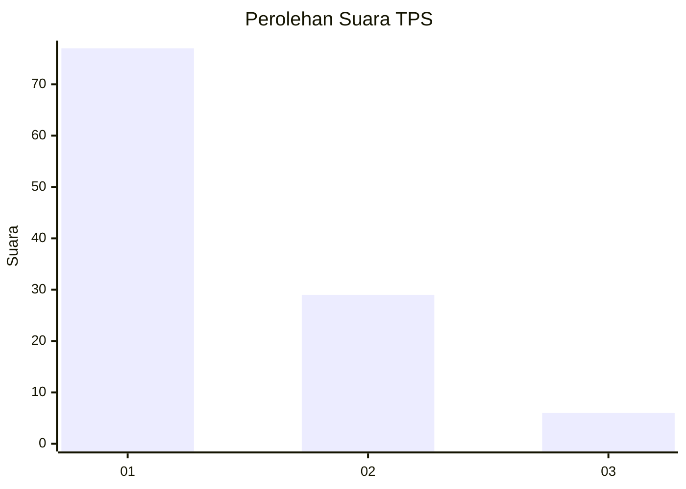
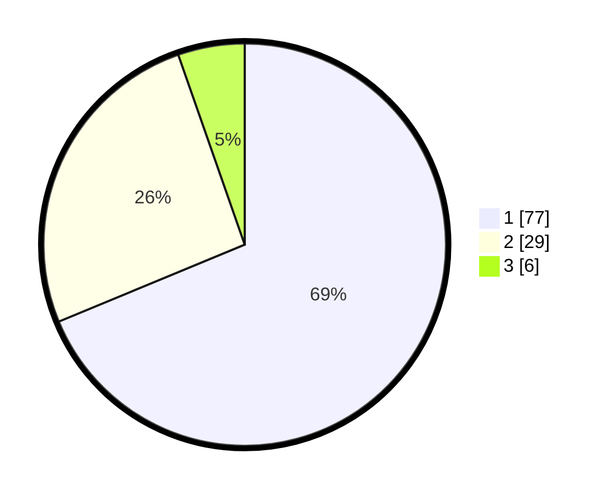

# Hasil

## Grafik

## Tabel

| No. | Nama Paslon    | Suara | Suara (raw) | Persentase |
|:--- |:-------------- | -----:| -----------:| ----------:|
| 1   | ANIES MUHAIMIN | 77    | [77][p-1]   | 68,75      |
| 2   | PRABOWO GIBRAN | 29    | [29][p-2]   | 25,89      |
| 3   | GANJAR MAHFUD  | 6     | [6][p-3]    | 5,36       |

[p-1]: https://github.com/gigit-pemilu/pemilu-2024-13-sumatera-barat/blob/main/pilpres/hitung-suara/sub/13-sumatera-barat/sub/06-agam/sub/02-lubuk-basung/sub/2005-manggopoh/sub/021-tps/sub/paslon-1.txt
[p-2]: https://github.com/gigit-pemilu/pemilu-2024-13-sumatera-barat/blob/main/pilpres/hitung-suara/sub/13-sumatera-barat/sub/06-agam/sub/02-lubuk-basung/sub/2005-manggopoh/sub/021-tps/sub/paslon-2.txt
[p-3]: https://github.com/gigit-pemilu/pemilu-2024-13-sumatera-barat/blob/main/pilpres/hitung-suara/sub/13-sumatera-barat/sub/06-agam/sub/02-lubuk-basung/sub/2005-manggopoh/sub/021-tps/sub/paslon-3.txt

## Foto C Plano

https://sirekap-obj-formc.kpu.go.id/4be3/pemilu/ppwp/13/06/02/20/05/1306022005021-20240215-181457--81de6122-d532-4526-ab1a-bd7b8b14d87d.jpg

https://sirekap-obj-formc.kpu.go.id/4be3/pemilu/ppwp/13/06/02/20/05/1306022005021-20240215-175419--67f021ff-3f1a-4fa7-97a1-9c34743bd2ea.jpg

https://sirekap-obj-formc.kpu.go.id/4be3/pemilu/ppwp/13/06/02/20/05/1306022005021-20240215-031356--215eb951-b301-4e58-8803-e4453216d781.jpg

## Metadata

| Key        | Value               |
| ---------- | ------------------- |
| Time Stamp | 2024-02-24 22:31:28 |

