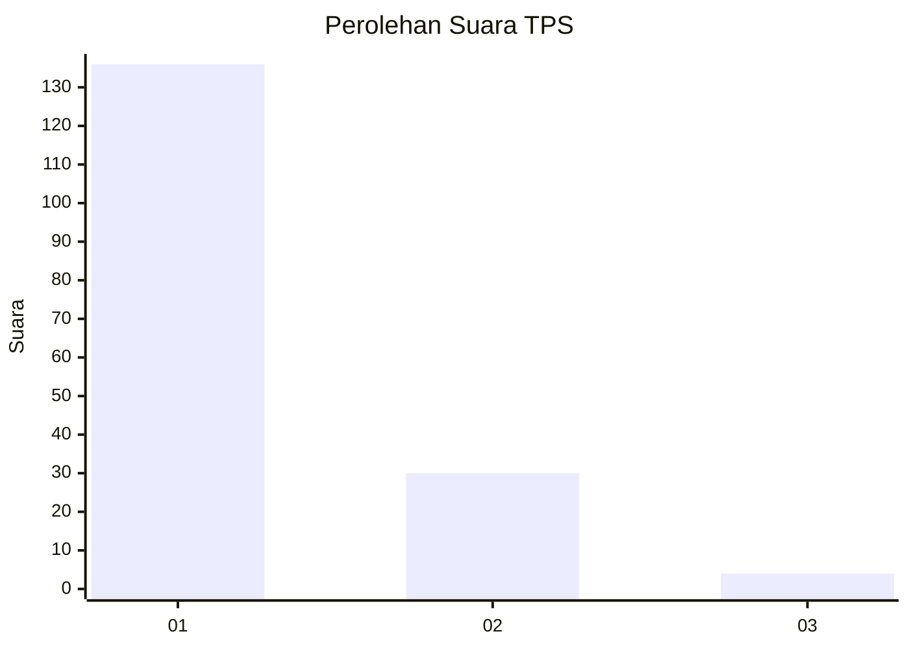
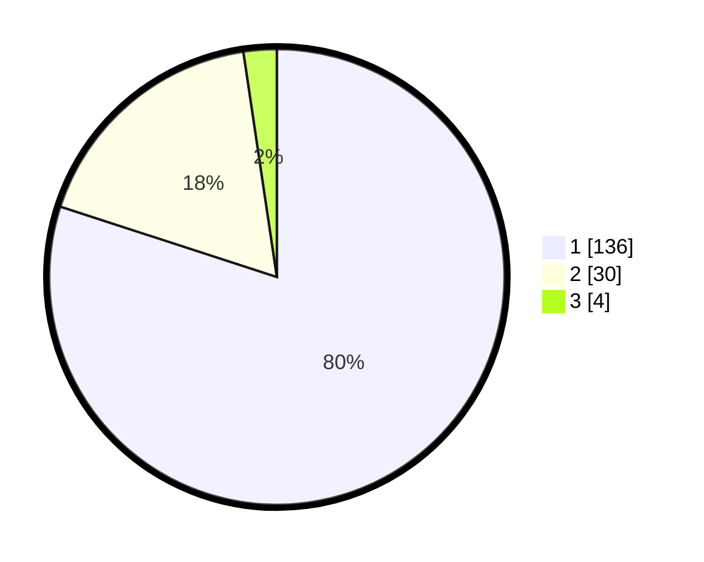

# Hasil

## Grafik

## Tabel

| No. | Nama Paslon    | Suara | Suara (raw) | Persentase |
|:--- |:-------------- | -----:| -----------:| ----------:|
| 1   | ANIES MUHAIMIN | 136   | [136][p-1]  | 80,00      |
| 2   | PRABOWO GIBRAN | 30    | [30][p-2]   | 17,65      |
| 3   | GANJAR MAHFUD  | 4     | [4][p-3]    | 2,35       |

[p-1]: https://github.com/gigit-pemilu/pemilu-2024-13-sumatera-barat/blob/main/pilpres/hitung-suara/sub/13-sumatera-barat/sub/06-agam/sub/02-lubuk-basung/sub/2005-manggopoh/sub/025-tps/sub/paslon-1.txt
[p-2]: https://github.com/gigit-pemilu/pemilu-2024-13-sumatera-barat/blob/main/pilpres/hitung-suara/sub/13-sumatera-barat/sub/06-agam/sub/02-lubuk-basung/sub/2005-manggopoh/sub/025-tps/sub/paslon-2.txt
[p-3]: https://github.com/gigit-pemilu/pemilu-2024-13-sumatera-barat/blob/main/pilpres/hitung-suara/sub/13-sumatera-barat/sub/06-agam/sub/02-lubuk-basung/sub/2005-manggopoh/sub/025-tps/sub/paslon-3.txt

## Foto C Plano

https://sirekap-obj-formc.kpu.go.id/dd75/pemilu/ppwp/13/06/02/20/05/1306022005025-20240215-013703--95f0f091-d325-44f7-b7fb-43c8549349bd.jpg

https://sirekap-obj-formc.kpu.go.id/dd75/pemilu/ppwp/13/06/02/20/05/1306022005025-20240215-004604--eb49e429-8530-4e26-a1e8-62807d15b735.jpg

https://sirekap-obj-formc.kpu.go.id/dd75/pemilu/ppwp/13/06/02/20/05/1306022005025-20240215-013959--b65f749d-2b3f-4f90-9ca9-a1df7b0198fa.jpg

## Metadata

| Key        | Value               |
| ---------- | ------------------- |
| Time Stamp | 2024-02-25 18:00:00 |

