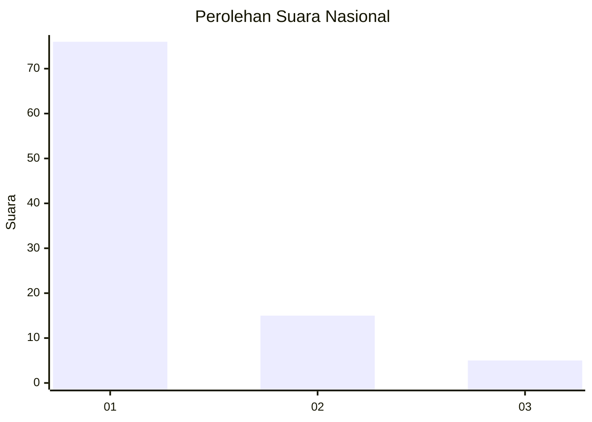
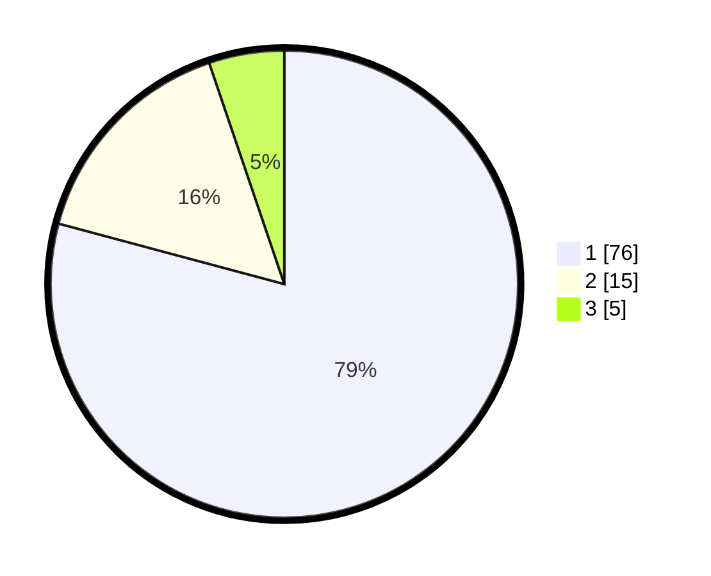

# Hasil

## Grafik

## Tabel

| No. | Nama Paslon    | Suara | Suara (raw) | Persentase |
|:--- |:-------------- | -----:| -----------:| ----------:|
| 1   | ANIES MUHAIMIN | 76    | [76][p-1]   | 79,17      |
| 2   | PRABOWO GIBRAN | 15    | [15][p-2]   | 15,63      |
| 3   | GANJAR MAHFUD  | 5     | [5][p-3]    | 5,21       |

[p-1]: https://github.com/gigit-pemilu/pemilu-2024/blob/main/pilpres/hitung-suara/sub/13-sumatera-barat/sub/06-agam/sub/02-lubuk-basung/sub/2005-manggopoh/sub/026-tps/sub/paslon-1.txt
[p-2]: https://github.com/gigit-pemilu/pemilu-2024/blob/main/pilpres/hitung-suara/sub/13-sumatera-barat/sub/06-agam/sub/02-lubuk-basung/sub/2005-manggopoh/sub/026-tps/sub/paslon-2.txt
[p-3]: https://github.com/gigit-pemilu/pemilu-2024/blob/main/pilpres/hitung-suara/sub/13-sumatera-barat/sub/06-agam/sub/02-lubuk-basung/sub/2005-manggopoh/sub/026-tps/sub/paslon-3.txt

## Foto C Plano

https://sirekap-obj-formc.kpu.go.id/b2be/pemilu/ppwp/13/06/02/20/05/1306022005026-20240215-015138--6035877e-d80f-4384-9c34-483f1f4b7f14.jpg

https://sirekap-obj-formc.kpu.go.id/b2be/pemilu/ppwp/13/06/02/20/05/1306022005026-20240215-010406--5ae3b281-9065-4513-992a-301111f9051a.jpg

https://sirekap-obj-formc.kpu.go.id/b2be/pemilu/ppwp/13/06/02/20/05/1306022005026-20240215-010631--4dfceb50-1c51-44dc-8b63-e7f41c34bccb.jpg

## Metadata

| Key        | Value               |
| ---------- | ------------------- |
| Time Stamp | 2024-02-24 22:31:28 |

